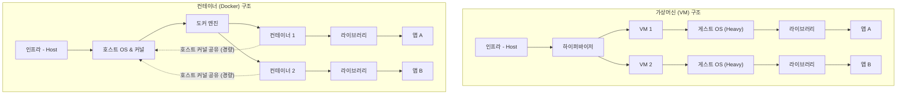

# [Day 1] 1-1. 로컬 환경 준비

## 오늘 배울 내용
- **주제**: 로컬 개발 환경의 문제점과 이를 해결하는 컨테이너 가상화(Docker)의 기초 이해
- **목표**: 
  - 기존 로컬 환경 구축의 만성적 문제 이해
  - 가상머신(VM)과 컨테이너의 차이점 파악
  - 로컬 PC(Windows)에 WSL2와 Docker Desktop 정상 작동 상태 검증

## 💡 쉽게 이해하는 비유 (Analogy)
- **수동 포장 이사 vs 이삿짐 컨테이너 박스**
  - **수동 설치 방식**: 가구와 가전을 포장 없이 트럭에 마구 실어 나르는 것. 트럭이 바뀌거나 짐이 섞이면 전선이 꼬이고(버전 충돌), 부품을 분실(환경변수 유실)하여 가전이 작동하지 않습니다.
  - **컨테이너 방식**: 규격화된 철제 컨테이너 박스 안에 가구와 전선, 도구를 정돈해 넣는 것. 목적지에 도착해 박스 문만 열면 어디서든 100% 동일하게 즉시 작동합니다.

## 1. 기존 개발 환경의 문제점 (1) 설치 지옥
- **설치 지옥 (Install Hell)**
  - 신규 프로젝트 투입 시 JDK, DB, Node.js 등을 개별적으로 다운로드해 설치해야 함.
  - 가이드 문서와 실제 환경이 다르고, 운영체제(Windows, macOS, Linux)마다 설치 경로와 설정이 다름.
  - 환경변수(`PATH`, `JAVA_HOME` 등) 설정 오류로 첫 실행까지 반나절 이상의 시간 낭비 발생.

## 1. 기존 개발 환경의 문제점 (2) 환경 불일치
- **"내 PC에선 잘 되는데 왜 서버에선 안 되지?"**
  - 개발자 환경(Windows/macOS)과 실제 운영 서버(Linux)의 OS 커널 및 라이브러리 차이.
  - 파일 경로 대소문자 구분 규칙 등 미세한 차이로 인해 로컬에서 통과한 코드가 운영 서버에서 에러(Segmentation Fault, FileNotFound)를 내며 중단됨.

## 1. 기존 개발 환경의 문제점 (3) 버전 충돌
- **다중 프로젝트 관리 불가**
  - 기존 프로젝트 A(Java 8, PostgreSQL 11)와 신규 프로젝트 B(Java 17, PostgreSQL 15)를 동시에 띄워야 하는 경우.
  - 한 OS 안에서 동일 소프트웨어의 다중 버전을 기동하고 포트 충돌(예: 5432)을 피하는 것은 매우 번거롭고 실수하기 쉬움.

## 2. 해결책: 가상화 기술의 발전
- **왜 기존 서버 운영 방식이 문제였을까?**
  - 하나의 운영체제(OS) 위에 모든 앱과 DB를 직접 설치하여 서로 간섭하도록 방치했기 때문.
- **과거의 해결책: 가상머신(VM)**
  - 물리 서버 위에 하이퍼바이저를 얹고 가상머신을 띄우는 방식.
  - 하지만 각 VM이 무거운 게스트 OS(Guest OS)를 통째로 포함해야 하므로 비효율적임.

## 가상머신(VM)의 한계
- **자원 낭비**
  - 각 VM마다 OS 커널을 독립적으로 실행하므로 기가바이트(GB) 단위의 디스크 및 메모리가 낭비됨.
- **느린 기동 속도**
  - 가상 OS가 부팅 과정을 마치고 커널을 로드할 때까지 수십 초에서 수 분의 시간 소요.
- **해결책의 방향**
  - 호스트 OS의 커널은 공유하되, 앱의 프로세스 영역만 독립적으로 격리하는 경량 가상화 필요.

## 가상머신(VM) vs 컨테이너(Docker) 구조 비교



## 3. 이것은 무엇인가? 컨테이너 가상화
- **핵심 정의**
  - 컨테이너 가상화는 호스트 OS의 커널을 공유하면서 **프로세스를 논리적으로 격리**하는 기술.
  - 앱과 실행에 필요한 라이브러리를 **하나의 이미지로 패키징**하여 어디서든 동일하게 실행 가능.
  - 가상머신에 비해 리소스 오버헤드가 극히 적고 가벼움.

## 컨테이너 격리의 핵심 원리 (직관적 이해)
- **리눅스 네임스페이스 (Namespace)**
  - 프로세스별로 파일시스템, 네트워크, 프로세스 ID 등을 독립적인 방(원룸)처럼 격리하여 관리.
- **컨트롤 그룹 (Cgroups)**
  - 각 컨테이너가 사용할 수 있는 CPU나 메모리 양을 엄격하게 제한하여 한 컨테이너의 폭주가 다른 컨테이너나 호스트에 영향을 주지 않도록 제어.

## Windows 위에서 리눅스를 돌리는 마법: WSL2
- **WSL2 (Windows Subsystem for Linux 2)**
  - 윈도우 내부에서 경량화된 실제 리눅스 커널을 가상화 형태로 실행하는 기술.
  - 무거운 에뮬레이터 없이 리눅스 명령을 원어민처럼 직접 빠르게 처리하므로 성능이 뛰어남.
  - Windows 환경의 Docker Desktop은 이 WSL2 엔진을 기반으로 리눅스 컨테이너를 가동함.

## 4. 도커 컨테이너의 장점
- **환경 일관성**
  - 로컬 PC에서 빌드하고 검증한 이미지가 빌드/운영 서버로 이동해도 아무런 수정 없이 그대로 작동함.
- **경량성과 속도**
  - 게스트 OS 부팅 과정이 없어 컨테이너가 실행되는 데 **수 밀리초~수 초**밖에 걸리지 않음.
- **뛰어난 이식성**
  - 도커 런타임만 실행 중이라면 물리 서버, 클라우드(AWS, Azure, GCP), 개인 노트북 등 어디서나 동일하게 작동.

## 도커 컨테이너의 단점과 한계
- **보안 격리의 한계**
  - 호스트 OS의 리눅스 커널을 공유하므로, 특정 컨테이너에서 커널 취약점을 공격해 커널 권한을 획득할 경우 다른 컨테이너와 호스트 OS 전체가 위험에 노출될 수 있음.
- **OS 종속적 실행 오버헤드**
  - macOS나 Windows에서 리눅스용 컨테이너를 실행하려면 백그라운드 가상화 엔진(WSL2 등)이 필요하여 고정 메모리 소모가 발생함.
- **상태 보존의 어려움**
  - 컨테이너는 소멸 시 내부 데이터가 함께 사라지는 Stateless 특성을 가짐. 데이터 저장을 위해 호스트 디스크 볼륨과 연결하는 마운트 설정이 필수적임.

## 5. 로컬 개발 환경 준비 및 도구 확인
- **로컬 환경을 준비하기 위한 3단계 프로세스**
  - 1단계: Windows 환경에서 WSL2 설치 및 활성화 검증
  - 2단계: Docker Desktop 설치 및 실행 상태 점검
  - 3단계: 터미널(PowerShell)을 통한 명령 연동 확인

## 실습 1. WSL2 엔진 및 배포판 상태 확인
- **PowerShell(관리자 권한)에서 실행할 명령어**

```powershell
# WSL2 엔진 설치 유무 및 활성화된 리눅스 커널 버전 상태 확인
wsl --status
```
- **체크포인트**: `Default Version: 2`로 표기되어 있는지 반드시 확인합니다.

```powershell
# 로컬 컴퓨터에 기동 중인 가상 배포판 리스트 확인
wsl --list --verbose
```
- **체크포인트**: `docker-desktop` 및 `docker-desktop-data` 배포판의 STATE가 `Running`인지 확인합니다.

## 실습 2. 도커 CLI 및 엔진 버전 확인
- **PowerShell에서 실행할 명령어**

```powershell
# 도커 CLI와 로컬 가상화 데몬의 연결 및 상태 확인
docker version
```
- **체크포인트**:
  - `Client` 및 `Server` 정보가 에러 메시지 없이 정상적으로 반환되는지 확인.
  - Server 연결에 에러가 있다면 Docker Desktop이 켜져 있는지 확인해야 함.

## 실습 3. 도커 컨테이너 동작 테스트
- **PowerShell에서 실행할 명령어**

```powershell
# 도커 컨테이너 기동 테스트 및 네트워크 연결성 자가 진단
docker run --rm hello-world
```
- **체크포인트**:
  - 로컬에 `hello-world` 이미지가 없으면 Docker Hub에서 자동으로 다운로드(Pull)받아 실행함.
  - 화면에 `Hello from Docker!` 문구가 출력되면 성공.

## 💡 강사 팁: WSL2 오류 대처 요령
- **"WSL이 설치되지 않았습니다" 또는 관련 에러 발생 시**
  - Windows 기능 켜기/끄기 메뉴에서 `가상 머신 플랫폼` 기능이 켜져 있는지 점검.
  - PC의 BIOS/UEFI 설정에서 CPU 가상화(Intel VT-x / AMD-V)가 `Enabled` 상태인지 확인.
  - PowerShell에서 `wsl --install`을 실행하여 최신 업데이트 적용.

## 💡 강사 팁: Docker Desktop 설정 및 연동 오류 해결
- **Docker Desktop 환경 설정 확인**
  - Docker Desktop의 우측 상단 톱니바퀴(Settings) 클릭 ➡️ `General` ➡️ `Use the WSL 2 based engine` 체크박스 활성화 확인.
  - `Resources` ➡️ `WSL Integration` 메뉴에서 사용 중인 리눅스 배포판과의 연동 스위치가 켜져 있는지 확인.
