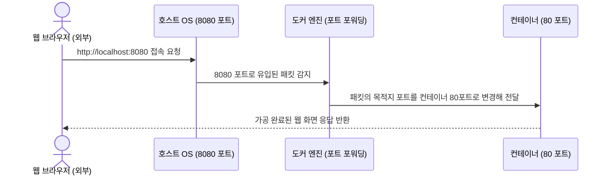

# [Day 1] 1-2. 컨테이너 실행

## 오늘 배울 내용
- **주제**: Docker 컨테이너의 실행 원리, 생명주기(Lifecycle) 및 네트워크 포트 매핑 이해
- **목표**:
  - 호스트 OS에서 직접 프로세스를 실행할 때의 포트 충돌 및 관리 문제 이해
  - 컨테이너 생명주기와 Foreground/Background 모드 구분
  - 포트 포워딩(Port Forwarding)을 통한 외부 통신 경로 확보
  - Docker CLI 명령어로 컨테이너 구동, 모니터링, 정지, 삭제 수행

## 💡 쉽게 이해하는 비유 (Analogy)
- **독립된 샌드박스 방과 전용 창문**
  - **단일 방에 여러 사람**: 칸막이 없이 메가폰을 들고 말하는 것과 같음. 목소리가 겹쳐 소통이 꼬이고(포트 충돌), 문제 발생 시 범인(좀비 프로세스)을 찾기 어렵습니다.
  - **독립된 방(컨테이너)과 창문(포트 매핑)**: 완벽하게 방음이 되는 방에 한 사람씩 배치하고, 외부와 대화할 수 있는 전용 창문(포트 매핑)을 뚫어주어 서로 간섭 없이 통신하게 만듭니다.

## 1. 기존 프로세스 실행의 문제점 (1) 포트 충돌
- **포트 충돌의 악몽 (Address already in use)**
  - 하나의 PC에서 이미 Nginx가 80번 포트를 점유하고 있는 상황.
  - 다른 프로젝트 테스트를 위해 또 다른 웹 서버를 80번 포트로 띄우면 포트 충돌 오류가 나며 실행에 실패함.
  - 해결하려면 매번 설정 파일을 찾아 포트를 다르게 수정해야 하는 번거로움 발생.

## 1. 기존 프로세스 실행의 문제점 (2) 리소스 관리
- **좀비 프로세스와 수동 리소스 회수**
  - 백그라운드로 띄워둔 Spring Boot나 Node.js 프로세스가 터미널을 닫아도 백그라운드에 그대로 상주하여 메모리를 지속 점유하는 현상.
  - 종료하기 위해 OS의 PID 조회 명령(`ps`, `netstat`)을 거쳐 강제 종료 명령(`kill -9`, `taskkill`)을 수동으로 입력해 주어야 하는 피로감.

## 1. 기존 프로세스 실행의 문제점 (3) 찌꺼기 잔존
- **파일시스템 오염 및 흔적 잔존**
  - 특정 소프트웨어를 설치해 간단히 테스트한 후 프로그램을 삭제(Uninstall)하더라도, OS의 레지스트리나 설정 캐시 폴더 등에 불필요한 흔적이 고스란히 남아 시스템이 점점 무거워짐.

## 2. 왜 컨테이너 격리 실행인가?
- **호스트 운영체제의 기본 설계적 한계**
  - 호스트 OS는 기본적으로 네트워크 포트와 파일시스템 디렉터리를 가동되는 모든 프로세스가 공유함.
- **해결을 위한 3대 격리 요구사항**
  - **네트워크 격리**: 프로세스마다 독자적인 가상 IP와 포트 영역을 부여받음.
  - **독립 파일시스템**: 독립된 루트 폴더만 마운트해 사용하고, 삭제 시 흔적이 남지 않음.
  - **단일 통제 프로토콜**: CLI 명령어 하나로 프로세스의 생성과 소멸을 완벽히 통제.

## 3. 이것은 무엇인가? 컨테이너 실행
- **핵심 정의**
  - 컨테이너 실행이란 애플리케이션을 외부와 차단된 독립 공간에 가두어 가동하는 것.
  - 컨테이너는 호스트와 직접적인 포트 충돌 없이 구동되며, 지정한 통로(포트 포워딩)를 통해서만 외부 브라우저나 클라이언트와 통신이 가능함.

## 컨테이너의 6단계 생명주기 (Lifecycle)
- **손님의 식당 방문 과정에 비유**
  - **Create**: 컨테이너 격리 룸 준비 (예약)
  - **Start**: 컨테이너 가동 시작 (입장)
  - **Running**: 메인 프로세스가 활성화되어 동작 중 (식사 중)
  - **Paused**: 임시로 실행을 멈추고 자원 대기 (잠시 자리 비움)
  - **Stopped**: 정상/비정상 프로세스 정지 상태 (식사 완료)
  - **Deleted**: 컨테이너 격리 룸 완전 제거 및 청소 (테이블 정리)

## 포트 포워딩 (Port Forwarding) 이란?
- **정의**
  - 호스트의 특정 물리 포트(Port)로 들어오는 패킷을 컨테이너 내부의 가상 포트로 넘겨주는(전달하는) 경로 설정 기술.
- **포지셔닝**
  - 컨테이너 내부 IP는 사설 대역이므로 외부(호스트 포함)에서 직접 연결할 수 없음.
  - 외부에서 접속할 수 있는 호스트의 관문(창문)을 뚫고, 내부 컨테이너 포트와 이어주는 이정표 역할을 함.

## 포트 포워딩 연결 흐름 예시
- **Nginx 웹 서버 구동의 예시**
  - 외부 브라우저 접속 주소: `http://localhost:8080` (호스트의 8080 포트)
  - 도커 포트 매핑 규칙: `8080:80` (호스트 8080 ➡️ 컨테이너 내부 80)
  - 최종 목적지: Nginx 컨테이너 내부 80 포트에서 실행 중인 웹 서버 프로세스

## 포트 포워딩 네트워크 패킷 경로 (간소화)



## Foreground vs Background 실행
- **Foreground (전면 실행)**
  - 터미널을 점유하며 실시간 로그가 화면에 즉시 출력됨.
  - 터미널을 종료하거나 `Ctrl + C`를 누르면 구동 중인 프로세스도 함께 종료됨.
- **Background / Detached (백그라운드 실행, `-d` 옵션)**
  - 컨테이너가 실행된 후 즉시 터미널 제어권을 반환하며 백그라운드에서 조용히 실행됨.
  - 터미널 창을 닫아도 컨테이너는 정상 기동 상태를 유지함 (실무 표준 방식).

## 컨테이너 종료 코드 (Exit Code) 해석
- **Exit Code (퇴사 사유서)**
  - 컨테이너 내부 프로세스가 멈췄을 때 남기는 결과 코드 값.
  - **`0`**: 정상 종료 (에러 없이 할 일을 마치고 무사 퇴근)
  - **`1`**: 애플리케이션 자체 런타임 에러 발생
  - **`137`**: 메모리 초과(OOM) 또는 강제 종료 신호(`kill -9`)에 의한 비정상 정지
  - **`139`**: 메모리 세그멘테이션 오류(Segmentation Fault)

## 4. 컨테이너 실행의 장점
- **포트 충돌의 원천 배제**
  - 호스트 OS 포트가 무엇이든 간에, 여러 컨테이너를 띄우고 호스트 포트를 각각 다르게 매핑하면(`8081:80`, `8082:80` 등) 충돌 없이 동시에 기동 가능.
- **샌드박스 격리성**
  - 컨테이너 내부에서 악성 파일 오염이나 꼬임이 발생하더라도 컨테이너 삭제 명령 한번이면 단 1초 만에 깔끔하게 초기화됨.

## 컨테이너 실행의 단점 및 주의점
- **간접적인 내부 디버깅**
  - 독립된 가상 영역에 갇혀 있으므로 로그를 바로 보거나 파일 구조를 확인하려면 별도의 명령어(`docker logs`, `docker exec`)를 수행해야 함.
- **임시성 데이터**
  - 기본적으로 컨테이너를 삭제하면 내부 데이터는 모두 휘발됨. 데이터 보존을 위해서는 스토리지 마운트 설정(Volume)이 필연적으로 수반되어야 함.

## 5. 실습: 컨테이너 실행 명령어
- **PowerShell에서 실행할 기본 구동 명령어**

```powershell
# Nginx 웹 서버 컨테이너를 백그라운드(-d)로 실행하고 호스트 포트 8080과 컨테이너 포트 80을 연결(-p)
# --name 옵션으로 컨테이너의 이름을 고유하게 지정
docker run -d -p 8080:80 --name my-webserver nginx
```
- **주요 옵션**:
  - `-d`: 백그라운드 기동 (Detached)
  - `-p <호스트포트>:<컨테이너포트>`: 포트 포워딩
  - `--name <이름>`: 컨테이너 식별 이름 지정

## 실습: 상태 조회 및 실시간 로그 확인
- **PowerShell에서 실행할 명령어**

```powershell
# 현재 실행 중인 활성 컨테이너 리스트 및 포트 정보 확인
docker ps

# 정지된 컨테이너까지 포함하여 전체 목록 및 종료 상태(Exit Code) 확인
docker ps -a

# 백그라운드로 작동하는 컨테이너의 표준 출력을 화면에 실시간 지속 스트리밍(-f)
docker logs -f my-webserver
```

## 실습: 실행 중인 컨테이너 내부 침투
- **PowerShell에서 실행할 명령어**

```powershell
# Nginx 컨테이너의 격리 공간 내부로 들어가서 대화형 리눅스 셸(bash) 실행
docker exec -it my-webserver bash
```
- **주요 옵션**:
  - `-it`: 대화형 키보드 입력 및 터미널 화면 연동 유지
  - `bash`: 컨테이너 내부에서 실행할 셸 프로그램

## 실습: 컨테이너 정지 및 완전 삭제
- **PowerShell에서 실행할 명령어**

```powershell
# 실행 중인 컨테이너에 정상 종료 시그널을 보내어 기동 정지
docker stop my-webserver

# 정지된 컨테이너를 제거하여 격리 파일시스템을 완전히 청소
docker rm my-webserver
```
- **주의**: 실행 중인 컨테이너는 바로 `docker rm`으로 지울 수 없으며, 반드시 `stop` 후 지우거나 강제 옵션 `-f`를 주어야 합니다.

## 💡 강사 팁: 포트 충돌 자가 검증 및 해결법
- **"Port is already allocated" 오류 발생 시**
  - 호스트 PC의 해당 포트(예: 8080)를 다른 애플리케이션이 이미 사용 중인 상태.
  - Windows PowerShell에서 아래 명령어로 8080 포트를 점유 중인 PID 확인:
    ```powershell
    netstat -ano | findstr 8080
    ```
  - 작업 관리자에서 해당 프로세스를 찾아 종료하거나, 아래와 같이 포트 맵을 겹치지 않는 포트로 우회 변경하여 실행:
    ```powershell
    docker run -d -p 9090:80 --name my-webserver nginx
    ```
