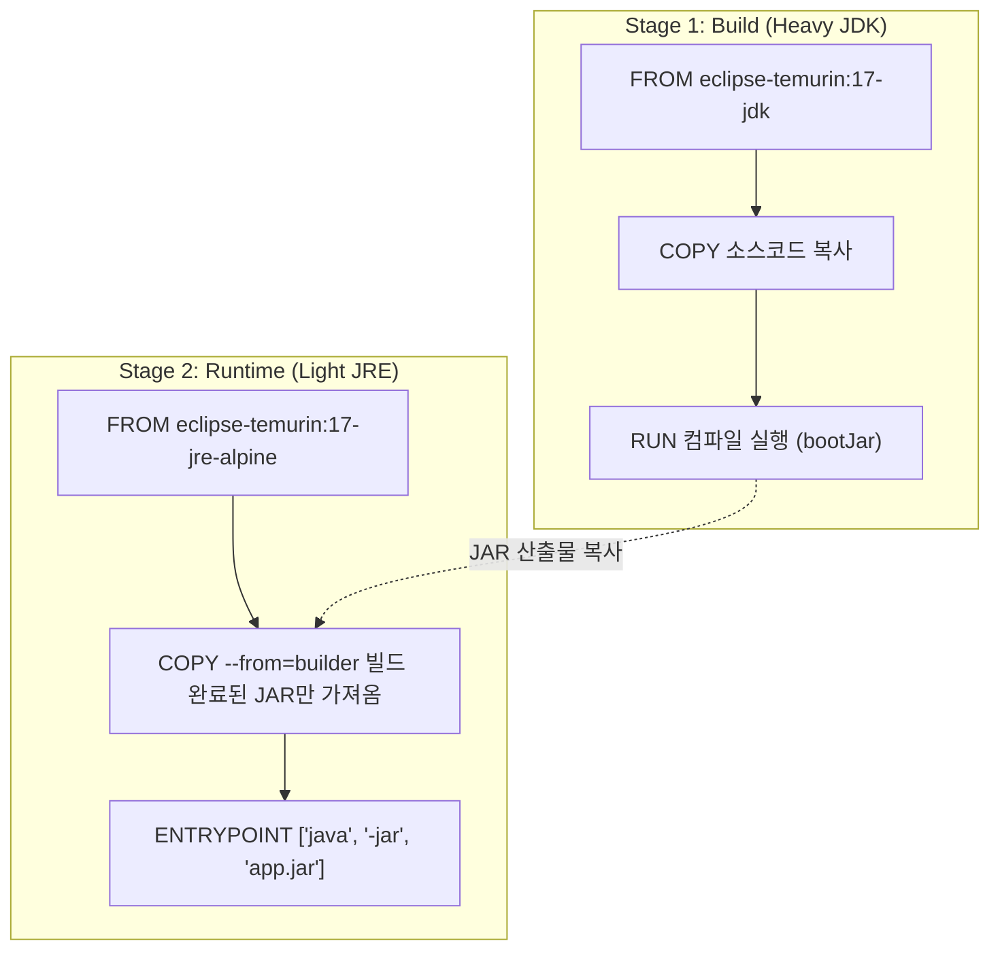

# [Day 1] 1-3. 이미지 빌드

---

## 오늘 배울 내용
- **주제**: Dockerfile을 통한 이미지 빌드, 레이어 캐싱 원리 및 이미지 크기 최적화(Multi-Stage Build)
- **목표**:
  - 수작업 배포의 단점과 인프라 코드화(IaC)의 가치 체득
  - Dockerfile 지시어(FROM, RUN, COPY, ENTRYPOINT, CMD) 역할 이해
  - 빌드 캐싱 최적화 방법 습득
  - 멀티 스테이지 빌드를 적용한 경량 실행 이미지 생성

---

## 💡 쉽게 이해하는 비유 (Analogy)
- **밀키트 조리 설명서와 미리 손질해둔 채소 상자**
  - **수동 배포**: 매번 요리책을 보며 마트에 가고 재료를 다듬어 조리하는 것. 만드는 이의 버릇에 따라 요리 맛(작동 결과)이 달라짐.
  - **Dockerfile**: 완성된 요리를 급속 동결하는 '자동 밀키트 포장 설명서'. 버튼만 누르면 100% 동일한 밀키트(이미지)가 나옵니다.
  - **레이어 캐싱**: 미리 다듬어 보관해둔 채소 상자. 씻고 써는 공정이 이전과 동일하면 새로 작업하지 않고 캐시된 채소 상자를 바로 사용하여 조리 시간을 획득함.

---

## 1. 기존 배포의 문제점 (1) 매뉴얼 노후화
- **수동 배포 매뉴얼 위키 문서의 한계**
  - "1단계: OS 패키지 업데이트, 2단계: Java 설치 및 환경변수 지정, 3단계: 특정 디렉토리 생성 및 권한 설정, 4단계: JAR 업로드..."
  - 수십 개의 수동 프로세스 입력 중 오타가 나거나 단 하나라도 누락하면 배포가 즉각 깨짐.
  - 소프트웨어가 버전업될 때 문서가 업데이트되지 않으면 배포 실패의 늪에 빠짐.

---

## 1. 기존 배포의 문제점 (2) 복제 불가능한 서버
- **눈사람 서버 (Snowflake Server)**
  - 특정 서버를 수년간 긴급 수동 핫픽스, 라이브러리 추가 등으로 관리하다 보면 서버 상태가 유일무이해짐.
  - 기존 서버와 100% 동일한 상태를 지닌 확장 서버를 추가로 띄우는 것이 수작업으로는 사실상 불가능함.
  - 결국 장애 복구 및 확장이 힘든 극도의 불안정성 초래.

---

## 2. 해결책: 인프라의 코드화 (IaC)
- **Infrastructure as Code (IaC)**
  - 애플리케이션 실행 환경을 텍스트 파일(Dockerfile)로 작성하여 소스 코드와 함께 Git으로 형상 관리함.
- **이미지의 불변성 (Immutability)**
  - 빌드된 이미지는 수정 불가능한 스냅샷.
  - 변경이 필요하면 이미지를 직접 고치지 않고, Dockerfile을 수정한 뒤 이미지를 새로 굽는 방식을 고수함.

---

## 스마트한 빌드 방식: 레이어 캐싱
- **증분 빌드 (Incremental Build)**
  - 소스 코드가 단 한 줄 바뀌었을 뿐인데 JDK나 무거운 라이브러리를 처음부터 다시 다운로드하는 것은 비효율적.
  - 도커는 빌드 단계를 여러 레이어로 쪼개어 캐싱하고, 변경이 발생하지 않은 단계는 이전 빌드 결과를 즉시 재사용함.

### 3. 이것은 무엇인가? Docker 이미지 빌드
- **정의**
  - Dockerfile에 선언된 텍스트 명령어를 기반으로 애플리케이션의 격리 실행 환경(이미지)을 빌드해내는 과정.
  - 각 빌드 명령어는 이미지의 독립된 디스크 층(Layer)으로 쌓여 관리됨.

---

## 이미지 레이어와 Union File System
- **투명한 셀로판지 겹치기**
  - Docker 이미지는 여러 개의 읽기 전용(Read-Only) 레이어로 구성됨.
  - 각 빌드 명령어마다 그림이 하나씩 그려진 투명 셀로판지가 층층이 쌓여 하나의 완성된 그림(최종 이미지 파일시스템)이 만들어짐.
  - 여러 이미지가 동일한 베이스 레이어(예: Alpine Linux OS)를 지니면, 디스크와 메모리를 물리적으로 공유해 용량을 아낌.

---

## 빌드 캐시 무효화 (Cache Invalidation)의 규칙
- **순차적인 영향 구조**
  - Dockerfile의 빌드 명령어 중 특정 단계가 변경되면, **그 단계와 그 뒤의 모든 단계는 캐시가 무효화**되어 처음부터 새로 빌드됨.
  - 따라서 자주 바뀌는 내용(예: 애플리케이션 소스 코드 복사)은 Dockerfile의 하단에 배치하고, 잘 안 바뀌는 내용(예: 라이브러리 다운로드)은 상단에 배치하는 것이 최적화의 핵심 규칙.

---

## 지시어 구분: RUN vs CMD vs ENTRYPOINT
- **`RUN`**
  - **빌드 타임**에 실행되어 이미지를 만들 때 파일시스템에 반영됨 (예: 라이브러리 설치, 패키지 컴파일).
- **`ENTRYPOINT`**
  - **런타임**에 컨테이너가 뜰 때 무조건 고정으로 실행되는 메인 명령어 (예: `java -jar`).
- **`CMD`**
  - 런타임에 실행되는 기본 명령어 및 인자값. 컨테이너 실행 시 외부 입력값에 의해 쉽게 덮어써질 수 있음.

---

## 이미지 다이어트: 멀티 스테이지 빌드
- **공장과 쇼룸의 물리적 분리**
  - 애플리케이션 빌드에는 JDK, Gradle 등 많은 빌드 도구가 필요해 용량이 커짐.
  - 최종 서비스 기동에는 가벼운 JRE와 최종 컴파일 완료된 JAR 파일 하나만 있으면 됨.
  - **Multi-Stage Build**: 무거운 빌더 스테이지에서 컴파일을 끝마치고, 가벼운 실행 전용 스테이지에 최종 결과물(JAR)만 복사하여 이미지 크기를 획기적으로(수백 MB ➡️ 수십 MB) 줄이는 기술.

---

## 멀티 스테이지 빌드 흐름도



---

## 4. Docker 이미지 빌드의 장점
- **환경 이력 추적**
  - OS 패치 수준, JDK 버전 등이 모두 파일 코드로 기록되어 버전 제어(Git) 및 이전 상태 롤백이 쉬움.
- **용량 최적화**
  - 레이어 공유 아키텍처 덕분에 수십 개의 이미지 버전이 있어도 물리 디스크 소모가 매우 적음.

### Docker 이미지 빌드 시 주의점 (1) 캐시 병목
- **순서 잘못 짜면 빌드 병목 발생**
  - 소스 코드를 먼저 복사하고 라이브러리를 다운로드받는 형태로 작성하면, 소스 코드가 1줄만 수정되어도 뒤에 있는 라이브러리를 매번 새로 받아오게 됨.
  - 반드시 라이브러리를 먼저 캐싱하고 소스를 복사하는 흐름으로 선언해야 함.

---

## Docker 이미지 빌드 시 주의점 (2) 레이어 파편화
- **무분별한 RUN 명령어 사용 방지**
  - `RUN` 지시어마다 고유의 레이어(디스크 물리 파일)가 생성됨.
  - `RUN apt-get update`와 `RUN apt-get install`을 한 줄(`&&`)로 묶지 않고 줄바꿈하여 각각 적으면, 삭제된 임시 파일까지 레이어에 그대로 영구 적층되어 이미지 크기가 부풀어 오름.

---

## 5. 실습: Spring Boot Dockerfile (1) 빌드 스테이지
- **실무형 `Dockerfile` 앞단: 컴파일 부분**

```dockerfile
# 1단계: 빌드 전용 임시 스테이지 (builder)
FROM eclipse-temurin:17-jdk-jammy AS builder
WORKDIR /build

# 빌드 캐싱 최적화: 의존성 정의 파일만 먼저 복사
COPY gradlew .
COPY gradle gradle
COPY build.gradle settings.gradle .

# 의존성 패키지 캐싱 빌드 (소스 복사 전에 라이브러리 레이어만 먼저 구워둠)
RUN ./gradlew dependencies --no-daemon

# 실제 소스 코드 복사 (이후 단계부터는 코드 수정 시 캐시가 무효화됨)
COPY src src

# 실제 jar 패키징 수행 (테스트 단계는 생략)
RUN ./gradlew bootJar --no-daemon
```

---

## 실습: Spring Boot Dockerfile (2) 실행 스테이지
- **실무형 `Dockerfile` 뒷단: 경량 구동 부분**

```dockerfile
# 2단계: 실행 전용 최종 배포 스테이지 (runtime)
FROM eclipse-temurin:17-jre-alpine
WORKDIR /app

# builder 스테이지에서 생성된 최종 jar 바이너리만 선택 복사
# JDK 및 소스 코드 찌꺼기가 없어 이미지가 극도로 경량화됨
COPY --from=builder /build/build/libs/*.jar app.jar

# 환경 변수 선언
ENV SPRING_PROFILES_ACTIVE=prod

# 포트 안내 명시
EXPOSE 8080

# Exec Form 방식을 사용해 java 프로세스를 직접 실행
ENTRYPOINT ["java", "-jar", "app.jar"]
```

---

## 실습: Docker 이미지 빌드 명령어
- **PowerShell에서 실행할 이미지 빌드 명령어**

```powershell
# 1. 특정 이름과 태그(-t)를 지정하여 이미지 빌드
# 맨 뒤의 점(.)은 Dockerfile이 있는 현재 디렉토리를 의미합니다
docker build -t todo-app:1.0 .

# 2. 코드 수정 후 버전을 올려 2차 빌드 실행하여 빌드 속도 및 'CACHED' 레이어 작동 확인
docker build -t todo-app:1.1 .
```

---

## 실습: 이미지 빌드 이력 확인
- **PowerShell에서 실행할 이미지 디스크 분석 명령어**

```powershell
# 빌드 완료된 이미지의 전체 크기 및 로컬 보관 상태 확인
docker images

# 이미지의 레이어별 명령어 및 크기 생성 이력(history) 추적
docker history todo-app:1.0
```
