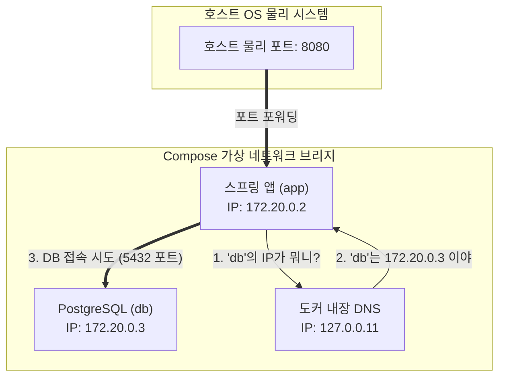

# [Day 1] 1-4. Docker Compose

---

## 오늘 배울 내용
- **주제**: Docker Compose를 통한 다중 컨테이너 연동(Spring Boot + PostgreSQL), 가상 네트워크 이름 기반 통신 및 의존성 제어
- **목표**:
  - 다중 컨테이너 수동 관리의 불편함 및 가변 IP 접속 문제 이해
  - 사용자 정의 가상 네트워크 내에서 호스트네임(Service Name)을 통한 통신 원리 습득
  - `compose.yml` 파일을 이용한 멀티 컨테이너 일괄 기동 및 환경 설정
  - DB 헬스체크 기반의 안전한 실행 순서 제어

---

## 💡 쉽게 이해하는 비유 (Analogy)
- **아파트 전용 인터폰 시스템**
  - **수동 연결**: 옆집(DB) 친구에게 전화를 걸기 위해 매번 가변 휴대전화 번호(임시 IP)를 물어보고 수동으로 갱신하는 것. 번호가 바뀌면 대화가 즉각 단절됩니다.
  - **Docker Compose**: 컨테이너들을 하나의 '아파트 단지(프로젝트)'로 묶고 전용 인터폰망(가상 네트워크)을 개설하는 것. 복잡한 폰 번호 대신 기계에 등록된 이웃 이름(`db`, `app`) 버튼만 누르면 내장 DNS 교환기가 알아서 실시간 IP로 즉시 통화를 이어줍니다.

---

## 1. 다중 컨테이너 환경의 문제점 (1) 가변 사설 IP
- **가변 사설 IP 변경에 따른 설정 수정 지옥**
  - 도커 데몬은 컨테이너가 가동되는 순서대로 사설 IP(예: `172.17.0.2`...)를 동적 할당함.
  - DB를 먼저 띄운 뒤 `inspect` 명령으로 IP를 찾아내어 Spring Boot 설정의 DB URL을 매번 수동으로 수정해야 함.
  - DB에 장애가 나서 컨테이너를 재시작해 IP가 바뀌는 순간, Spring 앱은 끊임없이 연결 오류를 내며 좀비 상태가 됨.

---

## 1. 다중 컨테이너 환경의 문제점 (2) 기동 순서 문제
- **레이스 컨디션 (Race Condition)**
  - Spring Boot가 켜질 때 즉시 DB 포트로 접속을 시도하여 스키마를 검증함.
  - DB 컨테이너가 구동 중이더라도, 데이터베이스 엔진이 완전히 부팅을 끝내지 않았다면 Spring Boot는 접속에 실패하고 바로 다운됨.
  - 기존에는 DB 기동 로그를 수동으로 끝까지 지켜본 후에야 Spring 실행 명령을 터미널에 수동 입력해야 했음.

---

## 2. 왜 Docker Compose인가?
- **파편화된 네트워크 격리의 한계 극복**
  - 기본적으로 컨테이너들은 아무런 통신 링크가 없는 독립된 네트워크 영역에서 작동함.
  - 여러 개의 컨테이너가 톱니바퀴처럼 연동되어 구동되어야 하는 복잡한 개발 스택을 한 장의 명세 문서로 코딩하여 제어하기 위함.

### 해결책 (1) 사용자 정의 가상 네트워크
- **도커 사용자 정의 브리지 네트워크**
  - 컨테이너가 임시 사설 IP에 의존하지 않음.
  - 오직 고정된 **서비스 호스트 이름(Service Name)**으로 서로를 언제든 호출하여 찾아갈 수 있도록 내부에 가상 도메인 네임 서버(DNS) 교환기를 생성하여 연동함.

---

## 해결책 (2) YAML 기반 선언적 관리
- **`compose.yml` 명세 파일**
  - 다중 컨테이너의 이미지 버전, 포트 바인딩, 볼륨 마운트, 네트워크 연결, 환경변수 정보를 단 하나의 YAML 텍스트 문서로 명세화함.
  - 명령어 한 줄로 다중 서비스 스택 전체를 일괄 기동하고 안전하게 통제할 수 있게 됨.

### 3. 이것은 무엇인가? Docker Compose
- **정의**
  - 다중 컨테이너 도커 애플리케이션을 정의하고 실행하기 위한 도구.
  - 개발, 테스트, 스테이징 등 서로 다른 호스트 환경에서도 완전하게 동일한 멀티 컨테이너 환경을 순식간에 복제해 가동할 수 있도록 지원함.

---

## 내장 DNS를 통한 이름 기반 서비스 탐색
- **서비스 이름 기반 통신**
  - Docker Compose 네트워크 내부의 컨테이너들은 서로를 호스트네임으로 식별하여 접근함.
  - 예를 들어, Spring App이 `jdbc:postgresql://db:5432/tododb`로 연결을 시도하면, 도커 내장 DNS 교환기(`127.0.0.11`)가 `db`라는 이름을 PostgreSQL 컨테이너의 실시간 사설 IP로 변환하여 통신 링크를 열어줌.

---

## Docker Compose 네트워크 아키텍처 예시



---

## depends_on의 한계와 Healthcheck
- **`depends_on`만 사용했을 때의 한계**
  - 단순히 대상 컨테이너(DB)의 '프로세스가 켜졌는가'만 보고 다음 컨테이너(App)를 실행함.
  - DB가 완전히 초기화되어 통신을 수락할 준비가 되지 않았음에도 App이 켜져서 다운되는 에러 발생.
- **해결책**
  - `healthcheck` 속성으로 DB 컨테이너가 통신을 받을 수 있는 상태(Healthy)인지 실시간 진단하고, App은 DB 상태가 `service_healthy`가 될 때까지 실행을 정교하게 대기함.

---

## 4. Docker Compose의 장점
- **사설 IP 추상화**
  - 실시간으로 IP가 매번 변경되어도 불변의 이름(`db`)을 호스트네임으로 사용하므로 통신 장애 리스크가 전무함.
- **단일 스택 코드화 및 버전 관리**
  - 다중 서비스 연동 명세가 파일 하나에 들어가므로 전체 개발팀이 Git을 통해 동일한 로컬 실행 환경을 완벽히 동기화해 사용 가능.

---

## Docker Compose의 단점과 한계
- **단일 호스트의 한계 (Single Host Limitation)**
  - Docker Compose는 오직 **단일 물리 서버(혹은 내 PC 한 대)** 위에서만 작동함.
  - 여러 대의 실물 서버로 트래픽을 분산하고 분산 가동되는 수십 개의 컨테이너를 로드밸런싱하는 것은 불가능함.
  - ➡️ 다중 노드 통제를 위해 향후 배우게 될 **Kubernetes**로의 기술적 전향이 필요한 경계선.

---

## 5. 실습: compose.yml 구조 분석 (네트워크 및 볼륨)
- **가상 네트워크 및 Named Volume 명세**

```yaml
version: '3.8'

networks:
  # 프로젝트 전용 격리 가상 네트워크 선언
  todo-net:
    driver: bridge

volumes:
  # DB 영속성 보존을 위한 Named Volume 선언
  pgdata:
```

---

## 실습: compose.yml 구조 분석 (db 서비스)
- **PostgreSQL 서비스 선언 및 헬스체크 정의**

```yaml
services:
  db:
    image: postgres:15-alpine
    container_name: todo-postgres
    environment:
      POSTGRES_DB: tododb
      POSTGRES_USER: todo-user
      POSTGRES_PASSWORD: todo-password
    ports:
      - "5432:5432"  # 호스트에서 DB 접속을 확인하기 위한 포트 노출
    volumes:
      - pgdata:/var/lib/postgresql/data
    networks:
      - todo-net
    # DB 구동 준비 완동 여부를 확인하는 자가 진단
    healthcheck:
      test: ["CMD-SHELL", "pg_isready -U todo-user -d tododb"]
      interval: 5s
      timeout: 5s
      retries: 5
```

---

## 실습: compose.yml 구조 분석 (app 서비스)
- **Spring Boot 서비스 선언 및 의존 조건**

```yaml
  app:
    image: todo-app:1.0
    container_name: todo-springboot
    environment:
      # 가변 IP 대신 서비스 호스트네임 'db'를 그대로 활용해 연결
      SPRING_DATASOURCE_URL: jdbc:postgresql://db:5432/tododb
      SPRING_DATASOURCE_USERNAME: todo-user
      SPRING_DATASOURCE_PASSWORD: todo-password
    ports:
      - "8080:8080"
    networks:
      - todo-net
    depends_on:
      db:
        # db 서비스가 실행되는 것뿐 아니라 healthcheck 진단결과가 healthy가 될 때까지 실행을 대기함
        condition: service_healthy
```

---

## 실습: Docker Compose 일괄 기동
- **PowerShell에서 실행할 제어 명령어**

```powershell
# 1. 작성된 compose.yml 구성을 바탕으로 백그라운드 일괄 실행
# (자동으로 네트워크 및 볼륨이 확보되며 DB 헬스체크 대기가 실행됨)
docker compose up -d

# 2. 실행된 연동 컨테이너 스택의 포트 상태 및 헬스체크 결과(healthy) 확인
docker compose ps
```

---

## 실습: 다중 컨테이너 통합 로그 확인
- **PowerShell에서 실행할 실시간 로그 분석 명령어**

```powershell
# 1. 스프링 앱과 DB 컨테이너에서 뿜어져 나오는 로그를 터미널 화면에 합쳐서 실시간 스트리밍
docker compose logs -f

# 2. 특정 서비스(예: app)의 로그만 지정해서 필터링 조회
docker compose logs -f app
```

---

## 실습: 컨테이너 스택 일괄 종료 및 리소스 청소
- **PowerShell에서 실행할 회수 명령어**

```powershell
# 1. 연동 동작 중인 컨테이너들을 안전하게 중지 및 완전 삭제
# 이 명령은 Compose가 생성한 격리 가상 네트워크 장비까지 깔끔하게 제거함
docker compose down

# 2. 볼륨에 저장된 영구 데이터(DB 테이블 등)까지 일괄 청소하려는 경우 (데이터 전면 삭제 주의!)
docker compose down -v
```
