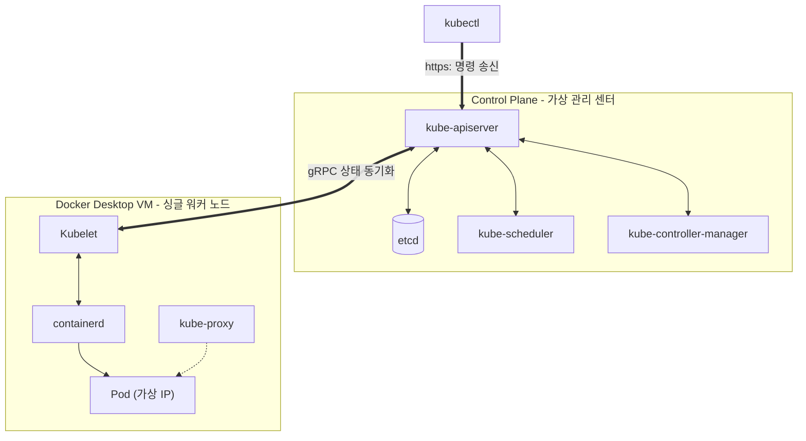

# [Day 1] 1-5. Kubernetes 로컬 준비

## 오늘 배울 내용
- **주제**: Kubernetes의 탄생 배경, 아키텍처(Control Plane vs Worker Node) 및 로컬 환경 활성화 방법
- **목표**:
  - 단일 Docker 환경의 물리적 복제 및 오케스트레이션 한계 이해
  - 컨트롤 플레인(Control Plane)과 워커 노드(Worker Node)의 역할 구분
  - Docker Desktop 내장 Kubernetes 엔진 활성화 및 상태 검증
  - `kubectl` 명령어로 클러스터 기본 정보 및 시스템 Pod 조회

## 💡 쉽게 이해하는 비유 (Analogy)
- **자율 주행 무인 화물선과 중앙 통합 관제센터**
  - **Docker Compose**: 단일 부두(내 컴퓨터) 내에서 작은 화물차 몇 대를 직접 통제하는 현장 지휘관.
  - **Kubernetes**: 바다에 흩어져 있는 수십, 수백 대의 무인 화물선(서버 노드)을 원격으로 총괄 통제하는 **중앙 통합 관제센터**.
  - **장애 상황**: 화물선 하나가 좌초(서버 다운)되면, 관제센터가 즉시 다른 정상 화물선으로 화물(컨테이너)을 긴급 이삿짐 옮기듯 옮겨 항로를 자동 조율함.
  - **로컬 K8s**: 개인 PC 안에 이 거대한 관제센터의 미니 가상 테스트룸을 만드는 것.

## 1. 단일 컨테이너 환경의 한계 (1) 수동 복구
- **새벽의 수동 장애 복구 작업**
  - 서비스 운영 도중 특정 서버의 메인보드나 디스크가 다운되면 그 위에서 작동하던 모든 애플리케이션 컨테이너가 일사천리로 중단됨.
  - 관리자가 밤중에 깨어나 원격 터미널(SSH)을 통해 살아있는 다른 서버를 수동으로 찾은 뒤, `docker run` 명령어로 컨테이너를 직접 되살려야 함.
  - 복구되는 동안의 매출 손실과 다운타임이 불가피함.

## 1. 단일 컨테이너 환경의 한계 (2) 자원 불균형
- **동적 자원 스케줄링의 부재**
  - 특정 서버에는 접속자가 몰려 CPU가 100%에 달하고 메모리 부족(OOM)으로 터지는데, 옆에 있는 다른 서버는 자원의 90%가 텅 빈 상태로 남는 자원 불균형 현상이 쉽게 발생함.
  - 관리자가 주기적으로 이를 감시하면서 수동으로 컨테이너를 재배치하는 데에는 한계가 존재함.

## 1. 단일 컨테이너 환경의 한계 (3) 분산 네트워킹
- **분산 로드밸런싱 설정 갱신 문제**
  - 가용성을 위해 여러 물리 서버 노드에 동일한 Spring Boot 컨테이너 10개를 띄웠을 때.
  - 트래픽을 분산해 주는 외부 로드밸런서(L4 스위치나 Nginx)에 등록된 컨테이너 사설 IP 목록을 컨테이너가 켜지고 꺼질 때마다 수동으로 추적해 편집 및 리로드해 주어야 함.

## 2. 왜 Kubernetes(오케스트레이션)인가?
- **상태 조율 루프 (Reconciliation Loop)**
  - 단일 도커 환경은 인프라의 현재 상태를 감시하고 목표 상태(예: "항상 컨테이너 3개 가동")와 대조해 스스로 고치는 자가 치유 능력이 없음.
- **오케스트레이션(Orchestration)**
  - 여러 대의 컴퓨터 자원을 단일 가상 자원 풀로 추상화하여, 배포, 확장, 장애 복구, 네트워킹을 지능적으로 자동화하는 플랫폼.

## 오케스트레이션의 핵심 (1) 분산 스케줄링
- **자동 자원 분배**
  - 개발자가 "Spring App을 실행해 줘"라고 시스템에 요청하면.
  - 스케줄러가 여러 서버 노드들의 실시간 CPU/메모리 잔여량을 즉각 평가한 뒤, 가장 여유 있고 적합한 최적의 서버 노드로 컨테이너를 자동으로 배치하여 가동함.

## 오케스트레이션의 핵심 (2) 자가 치유 (Self-Healing)
- **선언적 상태 유지**
  - 개발자가 "이 컨테이너의 복제본(Replica)은 항상 3개여야 한다"고 매니페스트에 선언해 두면.
  - 쿠버네티스는 24시간 실시간 감시 감지 루프를 돌며, 컨테이너 중 하나가 죽는 즉시 1초 내로 새로운 대체 컨테이너를 빈 노드에 알아서 다시 띄움.

## 3. 이것은 무엇인가? Kubernetes
- **정의**
  - 컨테이너화된 애플리케이션의 자동 배포, 스케일링, 관리를 제공하는 오픈소스 컨테이너 오케스트레이션 플랫폼.
  - 로컬 개발 환경부터 하이브리드 클라우드 환경까지 동일한 방식으로 인프라를 다루고 제어할 수 있는 표준 API 인터페이스를 제공함.

## 클러스터의 심장: 컨트롤 플레인
- **컨트롤 플레인 (Control Plane)**
  - 클러스터 전체를 총괄 통제하는 중앙 관리 센터(두뇌).
  - **`kube-apiserver`**: 모든 명령을 받고 전파하는 REST API 관문.
  - **`etcd`**: 클러스터 내 모든 설정 및 상태 데이터가 들어있는 신뢰성 높은 분산 DB.
  - **`kube-scheduler`**: Pod를 어떤 노드에 배치할지 결정하는 스케줄러.
  - **`kube-controller-manager`**: 지속적으로 자가치유 루프를 도는 감시 통제실.

## 현장 대리인: 워커 노드
- **워커 노드 (Worker Node)**
  - 실제 컨테이너(파드)들이 올라가 일하는 작업용 물리/가상 서버.
  - **`Kubelet`**: 컨트롤 플레인의 명령을 받아 컨테이너 실행 상태를 관리 및 보고하는 현장 관리인.
  - **컨테이너 런타임 (`containerd`)**: Kubelet의 지시를 받아 실제 컨테이너를 구동하는 엔진.
  - **`kube-proxy`**: 각 노드 내부에서 통신 및 로드밸런싱 규칙을 가동하는 통신 관리자.

## 로컬 K8s 싱글 노드 내부 통신/제어 아키텍처



## Kubernetes의 장점
- **고가용성과 자가치유**
  - 노드가 죽으면 작동하던 Pod들을 정상 노드로 자동 이주시킴.
- **무중단 롤링 배포**
  - 수작업 없이 구버전 Pod를 하나씩 내리고 신버전 Pod를 띄워 서비스 중단 시간이 전혀 없는 배포를 기본 지원함.
- **풍부한 생태계**
  - 클라우드 네이티브의 글로벌 표준으로 자리매김하여 수많은 오픈소스 도구와 호환됨.

## Kubernetes의 단점 및 로컬 리소스 비용
- **로컬 실행 비용의 부담**
  - 로컬 PC에서 K8s를 기동하면 API 서버, etcd, proxy, DNS 등 관제 컴포넌트가 동시에 다수 가동되어야 함.
  - 이로 인해 최소 CPU 2~4코어, 메모리 4GB의 상시 소모가 발생함. 저사양 노트북 환경에서는 부하 및 발열의 원인이 됨.

## 5. 실습: Docker Desktop Kubernetes 활성화
- **Docker Desktop 설정**
  - 1단계: Docker Desktop ➡️ 설정(톱니바퀴) ➡️ `Kubernetes` 메뉴 이동.
  - 2단계: `Enable Kubernetes` 체크박스 체크.
  - 3단계: `Apply & restart` 버튼 클릭 후 가동 완료까지 대기 (백그라운드에서 VM 가동 및 관제 패키지 세팅을 수행하므로 2~5분 정도 소요됨).

## 실습: Kubernetes CLI(kubectl) 버전 검증
- **PowerShell에서 실행할 명령어**

```powershell
# 설치된 쿠버네티스 클라이언트 CLI 버전 검증
# (버전 정보가 에러 없이 반환되는지 확인합니다)
kubectl version --client
```

## 실습: 가상 클러스터 노드 상태 확인
- **PowerShell에서 실행할 명령어**

```powershell
# 로컬 가상 클러스터 노드가 준비 완료 상태(Ready)인지 확인
kubectl get nodes
```
- **체크포인트**:
  - Docker Desktop 환경인 `docker-desktop` 단일 노드가 STATUS: `Ready` 상태로 조회가 되는지 검증합니다.

## 실습: 기본 시스템 관리 파드 상태 확인
- **PowerShell에서 실행할 명령어**

```powershell
# 클러스터 운영 관리를 위해 kube-system 네임스페이스 영역에 기동 중인 기본 시스템 파드 목록 조회
kubectl get pods -n kube-system
```
- **체크포인트**:
  - `apiserver`, `etcd`, `proxy`, `coredns` 등의 주요 컴포넌트들이 `Running` 상태인지 감시.

## 실습: 현재 클러스터 접속 정보 확인
- **PowerShell에서 실행할 명령어**

```powershell
# 현재 kubectl CLI가 가리키고 있는 클러스터 접속 정보(Context) 확인
kubectl config current-context
```
- **체크포인트**:
  - 반환값이 `docker-desktop`으로 표시되는지 확인하여 윈도우 환경이 정상 연동되었는지 확인.

## 💡 강사 팁: connection refused 에러 대처법
- **"The connection to the server localhost:6443 was refused" 발생 시**
  - 백그라운드에서 API Server가 아직 etcd와의 데이터 싱크를 맞추느라 완전히 켜지지 않은 상태. 1~2분 대기 후 다시 시도해 볼 것.
  - 계속 동일 에러가 지속된다면 Docker Desktop ➡️ `Reset Kubernetes Cluster`를 클릭해 클러스터 상태를 초기화 후 재구동하십시오.
