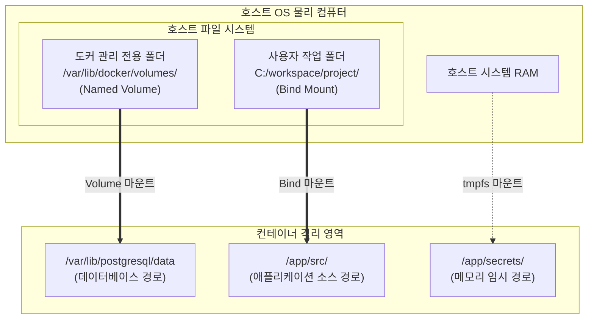

# [Day 1] 1-6. 데이터 보존과 볼륨 마운트

---

## 오늘 배울 내용
- **주제**: Docker 컨테이너의 데이터 휘발성 극복(Named Volume & Bind Mount) 및 컨테이너 CPU/메모리 자원 제어
- **목표**:
  - 컨테이너 삭제 시 발생하는 데이터 유실 현상 이해
  - Named Volume, Bind Mount, tmpfs 마운트의 차이점 및 사용처 파악
  - 볼륨 마운트를 이용한 데이터 영속성 확보
  - 컨테이너의 최대 CPU/메모리 사용량을 제한하여 안정성 확보

---

## 💡 쉽게 이해하는 비유 (Analogy)
- **삭제식 화이트보드와 중요한 메모 포스트잇**
  - **화이트보드 (컨테이너 내부)**: 쓰고 지우기 편리하지만 영구 보관이 안 됨. 컨테이너를 교체(`rm` 후 `run`)하는 것은 칠판 지우개로 판서를 싹 지우는 것과 같습니다. 열심히 기록한 데이터(DB, 로그)도 함께 날아갑니다.
  - **포스트잇 마운트 (볼륨 마운트)**: 중요 데이터를 칠판에 직접 쓰지 않고, 벽 뒤 안전한 유리 보관함(호스트 디스크)에 둔 뒤 칠판에 링크해 쓰는 것. 칠판을 신형으로 바꾸거나 지워도 유리 보관함의 오리지널 메모는 안전하게 유지됩니다.

---

## 1. 데이터 미보존 시의 문제점 (1) 데이터 유실
- **컨테이너 삭제 시 누적 데이터의 완전 유실**
  - PostgreSQL 컨테이너를 띄우고 다량의 DB 테이블과 비즈니스 데이터를 등록해 둠.
  - 이후 환경 설정 수정이나 버전 업데이트를 위해 컨테이너를 삭제(`docker rm`)하는 순간, 컨테이너 가상 쓰기 레이어에 기록되었던 모든 물리 데이터가 1초 만에 초기화되어 영구 유실됨.

---

## 1. 데이터 미보존 시의 문제점 (2) 설정 초기화
- **반복되는 설정 파일 수정 작업**
  - Nginx나 Spring Boot 설정 파일(`nginx.conf`, `application.yml`)을 조정하기 위해 기동 중인 컨테이너에 침투하여 파일을 직접 수정함.
  - 이후 컨테이너를 재시작하거나 재생성하면 원래 이미지 상태로 원복되므로 수정한 모든 환경 설정 정보가 흔적 없이 사라짐.

---

## 2. 왜 데이터 영속화 레이어가 필요한가?
- **Stateless(무상태) 컴포넌트로의 도커 설계**
  - 도커 컨테이너는 언제든지 쉽게 버리고 새로 띄울 수 있는 소모품이어야 함.
  - 따라서 컨테이너의 라이프사이클과 데이터 저장 영역을 완전히 격리하여 독립적인 생명주기를 부여해야 함.

---

## 컨테이너 내부 가상 파일시스템의 한계
- **쓰기 레이어 (Writable Layer)**
  - 컨테이너가 가동되는 동안 임시 파일 쓰기를 제공하는 얇은 레이어.
  - 이 레이어는 컨테이너 프로세스가 종료 및 삭제되는 순간 물리적으로 함께 자동 파괴됨.
  - 호스트 OS 디스크의 고정된 영역에 데이터를 연결(Mount)하여 영구 보존성을 확보해야 함.

### 3. 이것은 무엇인가? 볼륨 마운트
- **정의**
  - 컨테이너가 삭제되어도 보존해야 하는 데이터를 호스트 OS 디스크의 안전한 특정 구역에 따로 떼어놓고 컨테이너와 연결(Mount)하는 기술.
  - 컨테이너가 기동될 때 지정된 물리 디렉토리를 가상 드라이브처럼 매핑해 사용함.

---

## 도커 스토리지의 3가지 마운트 방식
- **Named Volume (볼륨 마운트)**
  - 도커 엔진이 호스트 디스크의 전용 격리 공간(`/var/lib/docker/volumes/`)을 스스로 관리. 초보자가 다루기 안전하며 추천됨.
- **Bind Mount (바인드 마운트)**
  - 호스트의 실제 임의 절대 경로를 컨테이너 내부 경로와 1대1 매핑. 로컬 소스 코드 연동 등에 유리.
- **tmpfs Mount**
  - 디스크가 아닌 호스트 RAM 메모리 영역에 임시 격리. 보안 토큰 등 임시 민감 정보 저장용.

---

## Named Volume vs Bind Mount 비교

| 비교 항목 | Named Volume | Bind Mount |
| :--- | :--- | :--- |
| **관리 주체** | 도커 엔진이 직접 영역 통제 | 사용자가 호스트 경로 직접 지정 |
| **호스트 경로** | 자동 결정 (도커 관리 구역) | 임의 절대 경로 지정 필요 (`C:/workspace`) |
| **이식성** | 매우 높음 (인프라 독립적) | 낮음 (호스트 경로가 바뀌면 에러) |
| **주요 용도** | 데이터베이스 영속성 유지 | 로컬 개발 코드 실시간 핫스왑(Hot Swap) |

---

## 볼륨 마운트의 물리적 연동 구조



---

## 4. 볼륨 마운트의 장점
- **안전한 데이터 격리**
  - 이미지 업데이트를 위해 컨테이너를 수십 번 삭제하고 재기동하더라도 누적된 데이터베이스 기록은 전혀 훼손되지 않음.
- **실시간 소스 코드 동기화**
  - 로컬 프로젝트 폴더를 바인드 마운트 해두면, IDE에서 코드를 저장하는 즉시 컨테이너에 반영(Hot Swap)되어 빌드를 새로 돌리지 않고 테스트 가능.

---

## 볼륨 마운트 사용 시 주의점
- **호스트 의존성 증대 (바인드 마운트의 한계)**
  - 바인드 마운트는 호스트의 특정 절대 경로를 명시하므로, 다른 팀원의 PC나 클라우드 서버로 배포 시 해당 경로가 없으면 컨테이너 실행이 에러로 실패함.
  - 이식성을 고려하여 운영 환경에서는 Named Volume을 주로 사용함.

### 컨테이너 자원 제어의 중요성
- **자원 독점 방지의 필요성**
  - 기본적으로 컨테이너는 호스트의 CPU와 메모리 자원을 제한 없이 최대한 당겨 쓸 수 있음.
  - 특정 컨테이너가 버그로 인해 무한 루프를 돌거나 메모리 누수가 발생하면, 호스트 서버 전체가 다운되는 재앙으로 이어짐.
  - 이를 방지하기 위해 컨테이너별 자원 한계선 설정을 필수 수행해야 함.

---

## 메모리 제한과 OOM Killer
- **OOM (Out Of Memory) Killer**
  - 호스트 OS는 메모리가 고갈되면 시스템 전체 붕괴를 막기 위해 메모리를 과도하게 쓰는 프로세스를 강제로 사살(Kill)함.
  - 도커 컨테이너 기동 시 최대 자원 한계를 명시하면 제한을 위반하는 즉시 해당 컨테이너만 안전하게 사살(Exit Code 137)하여 호스트를 보호함.

---

## 5. 실습: Named Volume 생성 및 적용
- **PowerShell에서 실행할 데이터 보존 실습**

```powershell
# 1. 도커 엔진이 관리하는Named Volume 영구 저장소 생성
docker volume create todo-db-volume

# 2. 생성한 볼륨을 PostgreSQL 컨테이너 내부 데이터 디렉토리와 연동해 실행
# (컨테이너를 지워도 볼륨 데이터는 호스트에 영구 보존됩니다)
docker run -d -p 5432:5432 --name todo-db -v todo-db-volume:/var/lib/postgresql/data postgres:15
```

---

## 실습: Bind Mount를 통한 호스트 파일 연동
- **PowerShell에서 실행할 실시간 파일 연동 실습**

```powershell
# 1. 호스트의 특정 경로 설정 파일을 컨테이너 내부 특정 경로에만 꼭 찝어서 1대1 매핑 기동
# (호스트 측 파일을 메모장 등으로 수정하면 컨테이너 내부에도 즉시 반영됩니다)
docker run -d -p 8080:8080 --name todo-app -v g:/workspace/config/application.properties:/app/config/application.properties todo-app:1.0
```

---

## 실습: 컨테이너 자원 제어 실행
- **PowerShell에서 실행할 CPU 및 메모리 제한 기동**

```powershell
# 컨테이너의 최대 메모리를 256MB, CPU 사용량을 1코어로 엄격 제한하여 구동
docker run -d --name my-heavy-app --memory="256m" --cpus="1.0" todo-app:1.0
```
- **체크포인트**: 컨테이너가 256MB를 넘어설 경우 자동으로 종료(Exit Code 137)되는 구조를 확보하여 호스트를 보호함.

---

## 실습: 도커 볼륨 리스트 및 상세 분석
- **PowerShell에서 실행할 볼륨 점검 명령어**

```powershell
# 1. 현재 로컬 컴퓨터에 생성된 도커 볼륨 목록 확인
docker volume ls

# 2. 특정 볼륨의 호스트 상 물리 디스크 실제 매핑 경로 정보 확인 (Mountpoint 경로 추적)
docker volume inspect todo-db-volume
```

---

## 💡 강사 팁: 볼륨 제거 시 주의사항
- **고립된 볼륨(찌꺼기) 정리**
  - `docker rm <컨테이너>`로 컨테이너를 지워도, 매핑되어 있던 Named Volume은 자동으로 삭제되지 않고 디스크에 계속 남아 자원을 차지함.
  - 안전한 정리를 위해 컨테이너가 없는 상태에서 볼륨을 직접 삭제해야 함:
    ```powershell
    docker volume rm todo-db-volume
    ```
  - 사용하지 않는 고립된 볼륨 전체를 한 번에 청소하려면 아래 명령 사용:
    ```powershell
    docker volume prune
    ```
