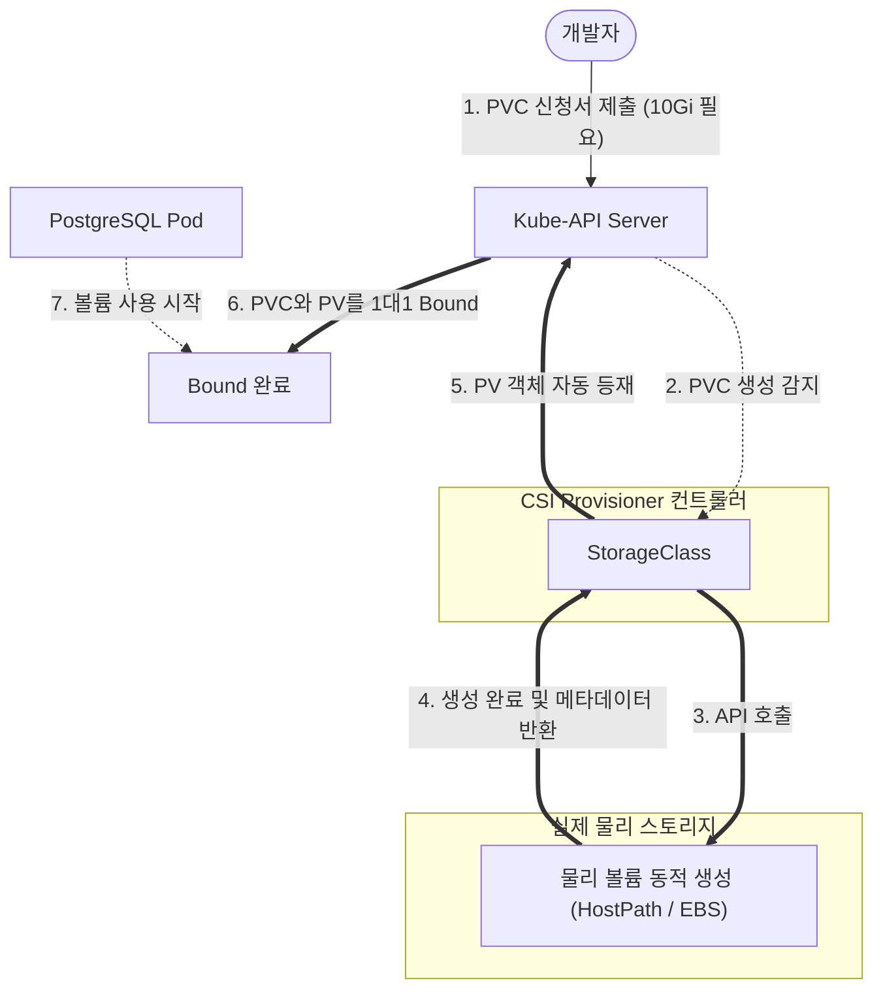

# [Day 2] 2-2. 스토리지와 PVC

## 오늘 배울 내용
- **주제**: Kubernetes 스토리지 추상화 아키텍처(PV, PVC, StorageClass) 및 데이터 영속화 방법
- **목표**:
  - `hostPath` 방식의 물리 호스트 종속성 한계와 이식성 저해 문제 이해
  - PersistentVolume(PV)과 PersistentVolumeClaim(PVC)의 역할 분리 파악
  - StorageClass를 통한 클라우드/로컬 볼륨의 동적 프로비저닝 이해
  - PVC를 생성하고 Pod에 연결하여 영구 데이터베이스 저장소 확보

## 💡 쉽게 이해하는 비유 (Analogy)
- **규격화된 아파트 입주 신청서와 실제 아파트 방 할당**
  - **수동 매핑 (Docker의 hostPath)**: 입주자가 직접 아파트 도면을 보고 빈방의 물리적 주소(호스트 절대 경로)를 하드코딩해 입주하는 것. 건물주가 바뀌거나 구조가 변경되면 주소가 어긋나 입주가 불가능해짐.
  - **PVC (입주 희망 신청서)**: 개발자가 "10기가 용량의 방이 필요해"라고 요건만 담은 신청서를 제출하면.
  - **PV (실제 아파트 방)**: 관리소(K8s)가 요건에 딱 맞는 실물 디스크(PV)를 자동으로 준비해 열쇠를 쥐어주는(Bound) 방식. 인프라의 환경이 바뀌어도 신청서 양식은 100% 동일하게 재사용 가능함.

## 1. 기존 디스크 매핑의 문제점 (1) 이식성 파괴
- **물리 하드웨어 경로 종속의 단점**
  - 로컬 환경(Docker Desktop Windows)에서는 `C:\postgres\data`에 마운트해 개발했으나.
  - 리눅스 테스트 서버로 옮길 때는 `/data/postgres`로 YAML의 경로 코드를 고쳐야 하고.
  - AWS 클라우드 환경으로 가서는 EBS 볼륨 ID(`vol-0abcd1234`)를 매니페스트에 직접 하드코딩해서 뜯어고쳐야 함.
  - 서버를 옮길 때마다 매니페스트를 수동 수정해야 하므로 실수 및 리소스 낭비가 큼.

## 1. 기존 디스크 매핑의 문제점 (2) 데이터 미아
- **쿠버네티스 자율 이사(Pod Scheduling)의 위협**
  - 파드(Pod)가 노드 A에서 작동하다가, 노드 A 하드웨어 장애 등으로 인해 쿠버네티스가 파드를 건강한 노드 B로 자동 강제 이주(Rescheduling)시켰을 때.
  - `hostPath` 마운트를 썼다면 노드 B의 물리 디스크에는 노드 A에 축적해 둔 데이터 파일이 존재하지 않음.
  - 결국 데이터베이스가 빈 껍데기로 초기화되거나 마운트 경로 권한 에러로 실행이 중단됨.

## 2. 왜 K8s 스토리지 추상화가 필요한가?
- **느슨한 결합 (Decoupling)의 지향**
  - 애플리케이션 배포 설정(YAML)이 특정 물리 호스트 서버의 디스크 기종 및 경로 정보와 결합되면 이식성이 크게 훼손됨.
- **물리 인프라의 블랙박스화**
  - 개발자는 저장 공간의 하드웨어 세부 사양이나 연결 프로토콜을 몰라도 되며, 오직 "필요한 용량"과 "읽기/쓰기 권한"만 명세하여 스토리지를 활용할 수 있어야 함.

## 3. 이것은 무엇인가? PV와 PVC
- **PersistentVolume (PV)**
  - 실제 스토리지 하드웨어(AWS EBS, 로컬 디스크 등)를 가리키는 클러스터 내의 물리적 볼륨 객체 (인프라 관리자의 영역).
- **PersistentVolumeClaim (PVC)**
  - 개발자가 "용량은 얼마가 필요하고, 어떻게 읽고 쓸 것인가"를 작성해 제출하는 스토리지 자원 요청 신청서 (개발자의 영역).
  - K8s 스토리지 엔진은 제출된 PVC와 규격이 일치하는 PV를 1대1 매핑하여 연결(Bound)해 줌.

## 스토리지 표준화: CSI
- **Container Storage Interface (CSI)**
  - 쿠버네티스가 다양한 벤더의 스토리지(AWS, GCP, Ceph, NFS 등)를 동일한 프로토콜로 다룰 수 있게 해주는 표준 인터페이스 규격.
  - 일종의 '스토리지 공용 USB 포트'와 같아서, 어떤 제조사의 외장 드라이브를 꽂아도 쿠버네티스는 동일한 명령으로 통제함.

## PVC의 3가지 접근 모드 (Access Modes)
- **ReadWriteOnce (RWO)**
  - 단일 노드(서버 1대)에 의해서만 읽기/쓰기 형태로 마운트 가능 (데이터베이스 등 대부분의 상태 저장 솔루션 표준).
- **ReadOnlyMany (ROX)**
  - 여러 노드가 동시에 읽기 전용으로 마운트 가능.
- **ReadWriteMany (RWX)**
  - 물리적으로 서로 다른 노드에 가동되는 여러 파드가 동시에 읽고 쓰기 가능 (NFS 등 전용 네트워크 파일시스템이 구비되어야 함).

## StorageClass와 동적 프로비저닝
- **수동 프로비저닝의 비효율**
  - 과거에는 개발자가 PVC를 내밀 때마다 관리자가 서버 디스크를 준비해 수동으로 PV 객체를 만들어 등록해야 했음.
- **동적 프로비저닝 (Dynamic Provisioning)**
  - **StorageClass (SC)**라는 스토리지 제작 룰을 정의해 두면.
  - 사용자가 PVC를 제출하는 순간, StorageClass가 클라우드 API를 자동으로 찔러 물리 볼륨을 사출하고 이에 대응되는 PV 객체까지 실시간으로 알아서 매핑 및 생성해 줌.

## 볼륨 회수 정책 (Reclaim Policy)
- **볼륨의 반납 및 회수 처리 방식**
  - PVC를 삭제하여 사용하던 저장 공간을 반납할 때의 행동 룰.
  - **`Delete`** (기본값): PVC가 제거되면 대응하던 PV와 실제 클라우드의 물리 볼륨 데이터까지 싹 지워 청소함 (동적 프로비저닝 시 기본 선택).
  - **`Retain`**: PVC가 삭제되어도 PV 및 데이터는 지우지 않고 보존함. 다음 사람이 재사용하거나 복구하기 위해 수동 관리가 필요할 때 사용함.

## 스토리지 동적 프로비저닝 및 마운트 흐름



## 스토리지 추상화의 장점
- **YAML 이식성 완성**
  - 스토리지 클래스를 사용하면 호스트 절대 경로나 EBS ID가 배포 YAML에서 제거되므로, 로컬 환경에서 쓰던 매니페스트 파일을 수정 없이 상용 EKS 클러스터에도 그대로 투척해 배포 가능함.
- **파드 독립적 영속성**
  - 파드 컨테이너가 에러로 터져 삭제되고 부활해도, 데이터가 들어있는 볼륨(PV)은 보존되어 있어 신규 파드가 뜨는 즉시 알아서 재연결됨.

## 스토리지 추상화의 한계
- **다중 노드 공유 쓰기(RWX)의 어려움**
  - 클라우드의 표준 블록 스토리지(EBS 등)는 단일 서버에만 꽂을 수 있어 기본적으로 `RWO` 모드만 지원함.
  - 여러 노드에 걸쳐 대규모 스케일아웃되는 웹 서버들이 로그를 동일한 폴더에 공유하여 쓰려면, NFS나 EFS 같은 별도의 고가 공유 파일시스템을 구성해야 해서 난이도가 상승함.

## 5. 실습: postgres-pvc.yaml 작성
- **실무형 PVC 신청서 매니페스트 예시**

```yaml
apiVersion: v1
kind: PersistentVolumeClaim
metadata:
  name: postgres-pvc
  namespace: todo-app
spec:
  # 클러스터 내의 로컬 개발용 동적 스토리지 클래스 지정
  # (Docker Desktop의 기본 hostpath 스토리지 클래스 사용)
  storageClassName: hostpath
  accessModes:
    - ReadWriteOnce  # 단일 노드 읽기/쓰기 모드 선언 (DB 권장)
  resources:
    requests:
      storage: 10Gi  # 10기가바이트 용량 요청
```

## 실습: PVC 적용 및 상태 조회
- **PowerShell에서 실행할 스토리지 바인딩 명령어**

```powershell
# 1. 작성된 PVC 매니페스트를 클러스터에 선언형으로 적용
kubectl apply -f postgres-pvc.yaml

# 2. 신청서(PVC)와 자동 생성된 물리 볼륨(PV)의 연결 상태 검증
# (STATUS 항목이 'Bound' 상태인지 반드시 확인합니다)
kubectl get pvc,pv -n todo-app
```

## 실습: 스토리지 클래스 목록 확인
- **PowerShell에서 실행할 클러스터 스토리지 스펙 확인 명령어**

```powershell
# 현재 클러스터가 보유하고 있는 StorageClass 리스트 및 동적 볼륨 제공자 정보 확인
# (Docker Desktop에서는 기본적으로 'hostpath' 가 default로 잡혀있습니다)
kubectl get storageclass
```

## 실습: 볼륨 바인딩 실패 시 원인 진단
- **PowerShell에서 실행할 PVC 상세 점검 명령어**

```powershell
# PVC 신청서가 Pending(대기) 상태에 머무르며 Bound가 안 될 때 상세 에러 이벤트 추적
kubectl describe pvc postgres-pvc -n todo-app
```
- **주요 원인**: 존재하지 않는 `storageClassName`을 지정했거나, 요청 용량(`requests.storage`)이 노드의 허용 디스크 잔량을 초과한 경우.

## 실습: Pod 매니페스트 내 PVC 마운트 설정
- **PostgreSQL Deployment 내에 PVC를 매핑하는 설정법 예시**

```yaml
spec:
  containers:
    - name: postgres
      image: postgres:15-alpine
      volumeMounts:
        # 2단계: 컨테이너 내부의 저장 디렉토리에 스토리지 탑재
        - name: db-storage
          mountPath: /var/lib/postgresql/data
  volumes:
    # 1단계: 선언한 PVC 신청서 이름을 볼륨 소스로 가져옴
    - name: db-storage
      persistentVolumeClaim:
        claimName: postgres-pvc
```

## 💡 강사 팁: PVC 삭제 및 데이터 보존 정책
- **PV와 실제 데이터의 잔존 관리**
  - StorageClass의 Reclaim Policy가 `Delete`인 경우, `kubectl delete pvc postgres-pvc`를 실행하면 연결된 PV와 디스크 내부의 DB 파일이 함께 자동 파괴됨.
  - 만약 운영 환경에서 실수로 PVC를 지웠을 때 대형 참사를 예방하려면, StorageClass의 회수 정책을 반드시 `Retain`으로 수정하거나, 사전에 백업 스케줄링을 활성화해야 함.
