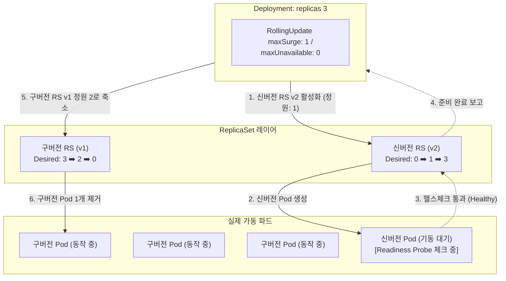

# [Day 2] 2-3. Deployment와 고가용성 배포

---

## 오늘 배울 내용
- **주제**: Kubernetes Deployment와 ReplicaSet의 관계, 무중단 배포(Rolling Update) 전략 및 롤백 기동
- **목표**:
  - 파드(Pod) 단독 배포의 한계와 고가용성 유지의 필요성 이해
  - ReplicaSet을 통한 선언적 복제본 관리 이해
  - 롤링 업데이트 동작 방식과 Readiness Probe를 이용한 배포 안전장치 설계
  - `rollout` 명령어로 배포 상태 모니터링 및 즉시 롤백 제어

---

## 💡 쉽게 이해하는 비유 (Analogy)
- **펑크 난 조원을 대체하는 예비 조장**
  - **파드 단독 배포**: 조원을 딱 한 명만 두고 비상 연락망이 없는 조별 과제. 그 조원이 잠적하거나 아프면(파드 고장) 발표는 즉각 실패함.
  - **Deployment (예비 조장)**: "우리 조 인원은 항상 3명이어야 해!"라고 선언(`replicas: 3`)하여 한 명이 실신해 퇴장(파드 다운)하는 즉시 예비실에서 동일한 조원(파드)을 가동해 3명을 채워냄.
  - **롤링 업데이트**: 조원을 교체(버전업)할 때도 3명을 일시에 자르지 않고, 한 명씩 신형 조원으로 교체해 발표 흐름이 끊기지 않도록 차례대로 조율함.

---

## 1. 파드 단독 배포의 문제점 (1) 자가 치유 불능
- **물리적 노드 크래시 시 복구 불능**
  - 파드가 가동 중이던 특정 서버 노드가 하드웨어 고장이나 전원 차단으로 꺼진 상황.
  - K8s 마스터 노드는 노드 다운을 인지하지만, 단독으로 생성된 파드(`kind: Pod`)는 노드와 함께 소멸할 뿐 다른 노드에서 복구되지 않음.
  - 관리자가 모니터링 경보를 보고 수동으로 생성 명령어를 다시 칠 때까지 서비스 다운 상태가 지속됨.

---

## 1. 파드 단독 배포의 문제점 (2) 서비스 중단
- **애플리케이션 버전 교체 시 필수 다운타임 발생**
  - 자바 소스 코드를 업데이트하여 1.0 이미지에서 2.0 이미지로 교체하려는 상황.
  - 파드 단독 배포 환경에서는 기존 1.0 파드를 수동으로 지우고(`kubectl delete pod`), 새 2.0 파드가 생성되어 기동(JVM 로드)될 때까지 패킷을 받지 못하는 배포 공백(Downtime)이 반드시 발생함.

---

## 2. 왜 Deployment가 필요한가?
- **파드(Pod) 자체의 기능적 한계**
  - 파드는 단순히 컨테이너를 가동하는 일회성 물리 프로세스에 불과함.
  - 여러 복제본을 유지하고 통제하거나, 노드 장애 시 다른 서버로 대피(Eviction)시키는 고가용성 제어 능력이 결여되어 있음.
  - 이에 따라 다중 파드 복제 대수를 상시 유지하고 점진적 교체를 지휘하는 중간 관리자가 반드시 필요함.

---

## 3. 이것은 무엇인가? Deployment와 ReplicaSet
- **ReplicaSet (복제본 지휘관)**
  - 지정한 복제본 개수(`replicas`)와 실제 구동되는 파드 수를 실시간 비교 감시하며 파드의 생성과 삭제를 관리하는 조율 컨트롤러.
- **Deployment (배포 사령관)**
  - ReplicaSet을 하위 지휘관으로 거느리며 버전 변경 시의 롤아웃 전략(무중단 롤링 업데이트)과 배포 이력(Revision)을 바탕으로 한 롤백(Undo)을 조율하는 최상위 배포 관리자.

---

## 파드 인식의 핵심: Label Selector
- **라벨 매칭 원리**
  - ReplicaSet은 파드의 이름을 일일이 관리하지 않음.
  - 파드에 붙은 태그인 라벨(`matchLabels: app=todo-app`)을 기준으로 내 소유의 파드를 실시간 카운팅함.
  - 만약 해당 라벨을 지닌 파드가 부족하면 설계서(Template)에 맞춰 새로운 파드를 생성하고, 초과하면 임의의 파드를 삭제하여 정수를 맞춤.

---

## 두 가지 배포 롤아웃 전략
- **재생성 전략 (Recreate)**
  - 기존 구버전 파드 복제본을 **전부 일시에 강제 종료**한 후, 신버전 파드들을 한꺼번에 새로 띄움.
  - 배포가 진행되는 과도기 동안 서비스 중단 시간(Downtime)이 길게 발생함.
- **롤링 업데이트 전략 (RollingUpdate)**
  - 구버전 파드를 하나씩 점진적으로 내리면서 신버전 파드를 띄워 교체함.
  - 배포 중에도 트래픽을 계속 처리하여 중단 시간 없는 배포(Zero Downtime) 구현.

---

## 롤링 업데이트의 핵심 옵션
- **`maxSurge` (최대 허용 증분 수)**
  - 배포 도중 기존 replicas 정원 대비 임시로 **동시에 초과 생성할 수 있는 파드의 최대 개수** (예: 정원 3개, surge 1 ➡️ 일시적으로 최대 4개 가동 허용).
- **`maxUnavailable` (최대 비가용 수)**
  - 배포 도중 정원 대비 **작동 불능 상태에 빠져도 되는 파드의 최대 개수** (예: unavailable 0 ➡️ 배포 중에도 건강한 파드가 최소 3개 작동 중임을 보장).

---

## 배포 대참사 방어책: Readiness Probe
- **Readiness Probe (준비 완료 상태 진단)**
  - 컨테이너 기동 후, 스프링 부트 톰캣 엔진이 완전히 구동 완료되었는지 진단(예: `/actuator/health` 경로 호출)하는 K8s 장치.
  - 이 검증을 통과하지 못한 신버전 파드는 준비 완료되지 않은 것으로 간주해 서비스 주소록(Endpoints)에 등록하지 않고 대기시킴.
  - Readiness가 없다면, 미완성 신버전 파드가 뜨자마자 트래픽이 유입되어 사용자에게 에러를 뿜는 참사가 일어남.

---

## Deployment 롤링 업데이트 시 ReplicaSet 교체도



---

## Deployment의 장점
- **무중단 운영 보장**
  - 서비스 정지나 점검 화면 없이도 평일 업무 시간 중에 즉시 대고객 서비스 소스 코드를 교체 가능.
- **초고속 원클릭 롤백**
  - 배포 완료 후 오류 발견 시, 클릭 한 번 또는 명령어 한 줄로 1초 만에 배포 이전의 안전한 정상 버전으로 상태를 되돌림.

### Deployment의 단점 및 제약
- **일시적인 하드웨어 리소스 점유 증가**
  - 롤링 업데이트 진행 도중에는 구버전과 신버전의 파드들이 동시에 공존하여 가동되므로, 일시적으로 노드의 메모리 및 CPU 자원이 설계 정량보다 많이 소비됨.
- **배포 대기 시간의 발생**
  - 신버전 파드의 Readiness Probe 검증 대기 시간이 개별 적용되므로 배포 전체 완료까지 일정 시간 지연이 유발됨.

---

## 5. 실습: app-deployment.yaml 분석 (1)
- **Deployment 기본 정보 및 롤링 업데이트 전략 선언**

```yaml
apiVersion: apps/v1
kind: Deployment
metadata:
  name: todo-app
  namespace: todo-app
spec:
  replicas: 3
  strategy:
    type: RollingUpdate
    rollingUpdate:
      maxSurge: 1        # 배포 중 임시로 목표값 대비 1개 더 생성 허용
      maxUnavailable: 0  # 배포 도중 구버전 파드는 최소 3개 유지 보장 (무중단)
  selector:
    matchLabels:
      app: todo-app      # ReplicaSet이 관리 대상으로 삼을 라벨 셀렉터
```

---

## 5. 실습: app-deployment.yaml 분석 (2)
- **파드 템플릿 정보 및 Readiness Probe 설정**

```yaml
  template:
    metadata:
      labels:
        app: todo-app    # 생성될 파드에 부착할 라벨
    spec:
      containers:
        - name: app
          image: social-archive/todo-app:1.0
          ports:
            - containerPort: 8080
          # 스프링 톰캣 준비 완료 판정을 위한 진단기 설정
          readinessProbe:
            httpGet:
              path: /actuator/health
              port: 8080
            initialDelaySeconds: 15  # 자바 부팅 완료를 위해 15초 대기 후 체크
            periodSeconds: 5         # 5초 간격으로 반복 진단
```

---

## 실습: Deployment 배포 적용 및 상태 조회
- **PowerShell에서 실행할 배포 기동 명령어**

```powershell
# 1. 작성된 Deployment 및 롤링 업데이트 명세 적용
kubectl apply -f app-deployment.yml

# 2. 배포된 Deployment, 그에 의해 생성된 ReplicaSet, 실제 구동 파드 리스트 일괄 점검
kubectl get deployment,replicaset,pods -n todo-app
```

---

## 실습: 롤링 업데이트 상태 모니터링
- **PowerShell에서 실행할 실시간 배포 진행 상황 확인 명령어**

```powershell
# 신버전 배포 시, 롤링 업데이트 과정 중 파드가 교체되는 상황 실시간 화면 추적
kubectl rollout status deployment/todo-app -n todo-app
```

---

## 실습: 배포 히스토리 및 이력 리비전 확인
- **PowerShell에서 실행할 배포 버전 대장 조회 명령어**

```powershell
# 배포한 기록 대장(Revision) 리스트 및 적용 이력 확인
# (etcd에 세이브포인트 형태로 히스토리가 적층되어 보존됩니다)
kubectl rollout history deployment/todo-app -n todo-app
```

### 실습: 직전 정상 버전으로 즉각 롤백
- **PowerShell에서 실행할 비상 롤백 명령어**

```powershell
# 배포된 신버전에 에러를 감지했을 때, 즉시 배포를 취소하고 1초 만에 직전 리비전으로 강제 복원
kubectl rollout undo deployment/todo-app -n todo-app
```
