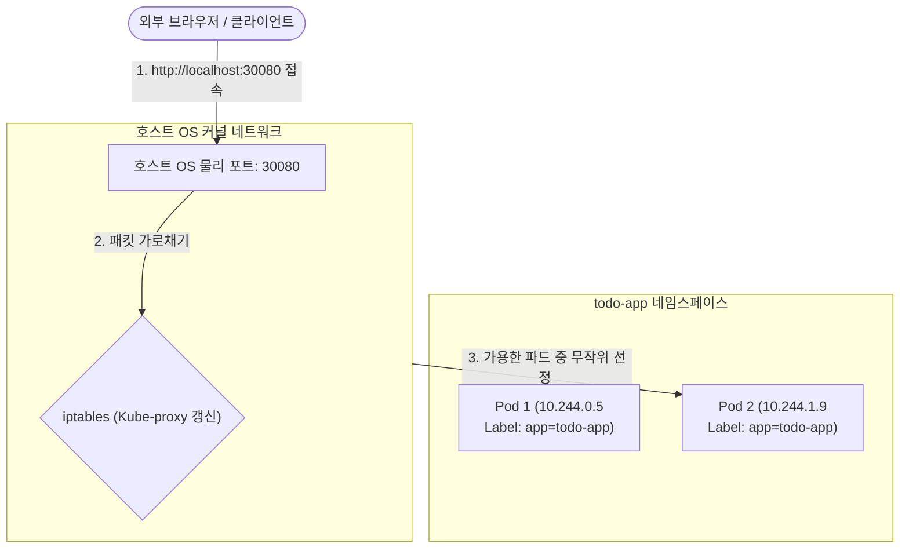

# [Day 2] 2-4. 네트워크 서비스와 로드밸런싱

## 오늘 배울 내용
- **주제**: Kubernetes 서비스(Service) 객체, 포트 속성(port, targetPort, nodePort) 및 트래픽 로드밸런싱
- **목표**:
  - 파드(Pod)의 일시적 가변 IP 직접 호출 시의 통신 두절 문제 이해
  - 대표 가상 IP(ClusterIP)를 통한 내부 통신 및 로드밸런싱 이해
  - 포트 매핑 3요소(port, targetPort, nodePort)의 기능 파악
  - NodePort 서비스를 생성하여 외부 브라우저에서 내 앱으로 접속 통로 개설

## 💡 쉽게 이해하는 비유 (Analogy)
- **상담원 자리가 매일 바뀌는 고객센터의 대표번호**
  - **파드 IP 직접 호출**: 고객에게 상담원 개별 전화번호(사설 IP)를 알려주는 것. 상담원이 자리를 비우거나 퇴사하여 번호가 바뀌면 전화를 걸 방법이 없어짐.
  - **K8s 서비스 (대표번호)**: 상담원들의 이름표(라벨)를 바라보는 **'영구 불변 대표전화번호'**. 상담원이 교체되어 내선 번호가 바뀌어도 시스템이 근무 중인 상담원에게 안전히 연결(로드밸런싱)해 줌.
  - **NodePort**: 회사 외벽에 손님용 연결 통로를 뚫어, 외부 고객(클라이언트)도 외부 포트(`30080`)로 걸면 즉시 대표번호 상담망으로 연동해 주는 장치.

## 1. 파드 IP 직접 호출의 문제점 (1) IP 변경
- **롤링 배포 및 파드 복제본 재생성 시 주소 소멸**
  - 스프링 백엔드 파드 혹은 외부 서비스가 특정 파드의 가상 IP(`10.244.0.12`)를 직접 바라보고 호출하는 상황.
  - 백엔드가 배포 업데이트로 인해 재생성되면 기존 IP는 사라지고 새로운 IP(`10.244.1.88`)가 임의 배정됨.
  - 호출자 측 소스 코드나 환경변수의 IP 설정을 매번 수정하고 컨테이너를 재시작해야 하는 끔찍한 수작업 지옥에 처함.

## 1. 파드 IP 직접 호출의 문제점 (2) 외부 접근 차단
- **클러스터 외부 네트워크에서의 접근 불가**
  - 파드가 할당받는 가상 IP(예: `10.244.x.x`)는 K8s CNI 가상 네트워크 내부에서만 서로 라우팅할 수 있는 철저한 내부 전용 주소.
  - 클러스터 외부의 일반 인터넷 사용자나 호스트 PC(Windows) 브라우저에서는 이 가상 대역으로 통신 패킷을 전달할 방법이 전혀 없음.

## 2. 왜 Kubernetes 서비스(Service)가 필요한가?
- **파드의 일시성(Ephemeral) 극복**
  - 파드는 수시로 꺼지고 켜지는 휘발성 자원이므로 주소가 영구히 유지되지 않음.
- **클러스터 경계선 관문 개방**
  - 내부 보안망 장벽을 허물고 호스트 OS나 외부 인터넷망에서 안전하게 내부 파드 집합에 트래픽을 안내할 공용 입구가 필요함.

## 3. 이것은 무엇인가? Kubernetes 서비스
- **정의**
  - 수시로 변경되는 파드들의 IP를 라벨 셀렉터로 동적 추적하여, 변하지 않는 **단 하나의 대표 가상 IP(ClusterIP) 및 도메인을 제공하는 L4 가상 로드밸런서**.
  - 트래픽이 대표 IP로 유입되면, 실시간 활성화된 대상 파드 복제본들 중 하나를 무작위로 선택해 패킷을 골고루 분산 전송함.

## 포트 매핑의 3총사 명확한 구분
- **`port` (서비스 포트)**
  - 클러스터 내부에서 대표 가상 IP(ClusterIP)를 통해 호출할 때 사용하는 포트.
- **`targetPort` (타깃 포트)**
  - 실제 파드 컨테이너 내부에서 구동 중인 앱 프로세스(예: 톰캣 8080)의 포트.
- **`nodePort` (노드 포트)**
  - 외부 클라이언트가 모든 물리 노드의 외부 IP를 통해 직접 접근할 수 있도록 열어주는 호스트의 물리 포트 (허용 범위: 30000 ~ 32767).

## Kube-proxy의 가상 IP 조율 역할
- **Kube-proxy**
  - 각 워커 노드마다 가동되며 가상 IP(ClusterIP) 통신망을 실질적으로 구축하는 네트워크 관리자.
  - 마스터 노드에서 서비스가 생성되거나 파드 IP가 바뀔 때마다, API Server를 감시하여 노드의 커널 패킷 포워딩 규칙(iptables)을 1초 주기로 자동 업데이트함.
  - 이를 통해 대표 IP로 향하는 패킷을 커널 레벨에서 초고속으로 실시간 파드 IP로 목적지 주소 변환(DNAT) 처리함.

## 내부 DNS(CoreDNS)와 도메인 해석
- **CoreDNS**
  - 클러스터 내부 전용의 '114 전화번호부' 역할을 수행하는 Pod.
  - K8s 내에서 서비스가 생성되면 서비스 이름과 대표 가상 IP를 자동으로 장부에 등록함.
  - 이제 파드들은 대표 IP 번호를 외울 필요 없이, `http://todo-app` 이라는 서비스 이름을 호출하는 것만으로 DNS 해석을 거쳐 안정적인 통신을 보장받음.

## 서비스 노출 형태 3가지
- **`ClusterIP` (기본값)**
  - 클러스터 내부 통신 전용. 외부에는 전혀 노출되지 않는 고정 대표 가상 IP 제공.
- **`NodePort`**
  - ClusterIP를 기본 포함하며, 추가로 모든 노드의 특정 물리 포트(3만번대)를 개방하여 외부 접속 통로를 열어줌.
- **`LoadBalancer`**
  - 클라우드 공급자(AWS, GCP 등)의 실제 외부 로드밸런서 장비(ELB 등)를 동적 생성하여 안정적인 외부 공인 IP를 매핑해 줌.

## L4 서비스의 한계와 L7 Ingress
- **L4 가상 로드밸런서 (Service)의 한계**
  - 단순히 IP와 Port 번호(겉봉투)만 보고 패킷을 전달하므로 주소 경로 기반 분기가 불가능함.
  - 서비스 개수가 늘어날 때마다 NodePort 3만번대 포트를 일일이 낭비해야 하므로 비효율적.
- **L7 Ingress**
  - 단 하나의 공용 포트(80/443)를 열고, 유입된 HTTP 패킷의 내부 헤더(URL 경로, 도메인 이름)까지 읽고 판단하여 정확한 서비스 객체로 분기 배달하는 지능형 비서 역할.

## NodePort 외부 접속 및 내부 라우팅 흐름



## Kubernetes 서비스의 장점
- **안정적인 고정 주소 제공**
  - 파드들이 배포 업데이트로 인해 끊임없이 삭제 및 생성되어 가상 IP가 백번 바뀌어도, 서비스의 도메인(`todo-app`)은 영구 고정이므로 통신 코드 수정이 전혀 필요 없음.
- **네이티브 커널 성능**
  - 소프트웨어 프록시 서버를 추가로 가동하는 무거운 방식이 아닌, OS 커널 수준의 포워딩 엔진을 활용하므로 네트워크 자원 오버헤드가 극히 적음.

## Kubernetes 서비스의 단점과 한계
- **NodePort 사용 시의 보안 노출 및 포트 관리 부담**
  - 각 서비스마다 고유한 3만번대 포트를 선점하므로 자원 낭비가 큼.
  - 노드의 물리적 포트를 외부망에 다이렉트로 완전 개방해야 하므로, 인프라 보안 공격 노출 면적(Attack Surface)이 넓어져 상용망에서는 가급적 Ingress를 통해 단일 입구로 제한해야 함.

## 5. 실습: app-service.yaml 구조 분석
- **실무형 NodePort 서비스 매니페스트 설정법**

```yaml
apiVersion: v1
kind: Service
metadata:
  name: todo-app
  namespace: todo-app
spec:
  type: NodePort  # 외부 접속 허용 모드 선택
  selector:
    app: todo-app  # 이 라벨을 지닌 파드들을 주소록(Endpoints)에 동적 등록
  ports:
    - name: http
      port: 8080      # 클러스터 내부용 대표 ClusterIP 가상 포트
      targetPort: 8080 # 실제 파드 내부 톰캣 서버 포트
      nodePort: 30080  # 외부에서 물리 접속할 호스트의 포트 (30080)
```

## 실습: 서비스 매니페스트 배포 및 조회
- **PowerShell에서 실행할 서비스 생성 명령어**

```powershell
# 1. 작성된 서비스 매니페스트 파일 적용
kubectl apply -f app-service.yml

# 2. 생성된 가상 CLUSTER-IP 주소 및 외부 노드포트(30080) 매핑 현황 검증
kubectl get service todo-app -n todo-app
```

## 실습: 서비스 연결 엔드포인트 확인
- **PowerShell에서 실행할 파드 매칭 여부 점검 명령어**

```powershell
# 서비스가 라벨 셀렉터로 찾아내 연결한 실제 가용한 파드 가상 IP 주소록 상세 확인
kubectl get endpoints todo-app -n todo-app
```
- **체크포인트**: 만약 ENDPOINTS 항목이 `<none>`이거나 비어있다면, Deployment의 파드 라벨과 Service의 selector가 서로 불일치하여 연결이 차단된 상태임.

## 실습: 외부 포트를 통한 최종 통신 검증
- **PowerShell에서 실행할 외부 연동 확인 명령어**

```powershell
# Windows 호스트 터미널에서 30080 포트를 통해 API 요청을 찔러 최종 기동 상태 검증
curl.exe http://localhost:30080/todos
```
- **체크포인트**: 브라우저 주소창에 `http://localhost:30080/todos`를 입력해 웹 JSON 응답이 화면에 출력되는지 확인 가능.

## 💡 강사 팁: Endpoints 누락 에러 대처법
- **"Endpoints가 비어있고 외부 접속이 안 됩니다" 해결 절차**
  - 1단계: `kubectl get pods -n todo-app --show-labels` 실행하여 현재 구동 중인 파드의 라벨이 `app=todo-app`인지 확인.
  - 2단계: `app-service.yml` 내부 `spec.selector.app`에 설정된 매칭 텍스트가 파드 라벨과 대소문자까지 완전 일치하는지 비교 검토.
  - 3단계: 파드의 기동 상태가 `Running`인지 확인 (파드가 비정상 크래시 상태면 엔드포인트에서 임시 자동 제외됨).
