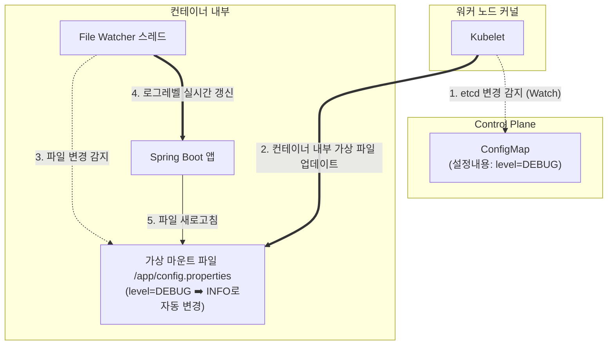

# [Day 2] 2-5. 설정 분리와 ConfigMap/Secret

---

## 오늘 배울 내용
- **주제**: 애플리케이션 환경 설정 정보의 외부화(ConfigMap) 및 민감한 자격 증명(Secret) 관리
- **목표**:
  - 설정 정보를 이미지/코드에 포함했을 때 발생하는 비효율과 보안 리스크 이해
  - 12-Factor App의 Config 설계 원칙 이해
  - ConfigMap과 Secret을 이용한 데이터 주입 방식(환경변수 vs 볼륨 마운트) 이해
  - YAML 명세서를 작성하고, 배포된 자격 증명을 평문으로 복호화하는 명령어 실습

---

## 💡 쉽게 이해하는 비유 (Analogy)
- **스마트폰 본체와 분리형 충전 케이블 및 특수 케이스**
  - **수동 용접 방식**: 충전 케이블과 폰케이스를 본체에 쇠로 용접해 버리는 것. 충전 콘센트나 국가 규격이 바뀌면(개발망 ➡️ 운영망) 스마트폰 본체 회로를 다 뜯어고쳐 새로 제조(이미지 재빌드)해야 합니다.
  - **분리형 케이블과 외장 케이스**: 폰 본체(애플리케이션 이미지)는 단 하나로 유지하고, 환경에 따라 일반 설정 케이블(ConfigMap)을 꽂거나, 중요 생체 칩이 든 암호 키 케이스(Secret)를 외부에 탈부착하는 방식으로 여러 환경에 적응시킵니다.

---

## 1. 하드코딩의 문제점 (1) 반복적인 빌드
- **값 변경을 위한 무겁고 낭비적인 빌드-배포 반복**
  - 테스트 환경 DB 비밀번호(`dev1234`)를 운영용(`prod9999`)으로 변경하기 위해 소스코드 내 YAML 파일을 직접 고쳐 쓰고.
  - Git 커밋 후 Gradle 컴파일 빌드를 다시 돌리고, 무거운 도커 이미지를 새로 구워(Build) 저장소에 업로드해야 함.
  - 텍스트 단 한 줄의 값 수정을 위해 기가바이트의 용량과 수십 분의 소중한 시간이 낭비됨.

---

## 1. 하드코딩의 문제점 (2) 보안 사고
- **자격 증명 노출로 인한 대형 해킹 보안 리스크**
  - 개발 편의성을 위해 데이터베이스 비밀번호, 클라우드 Access Key, API 인증 토큰을 코드 파일에 그대로 작성해 둠.
  - 이 프로젝트의 Git 저장소가 직원의 실수로 퍼블릭(공개)으로 전환되거나 해커에게 유출되는 순간, 1초 만에 자격 증명이 털려 회사 서버 자원 탈취 및 데이터 유출 등 파산 리스크를 겪게 됨.

### 2. 왜 코드와 설정의 분리가 필요한가?
- **12-Factor App (Config 원칙)**
  - 애플리케이션의 순수 실행 코드(바이너리)와 인프라의 환경 설정 매개변수를 완전히 떼어놓아 격리해야 함.
  - 컴파일 완료되어 구워진 앱 이미지는 **환경에 상관없이 단 하나만 생성(불변성)**되어야 하며, 실행 시점에 목적지에 맞는 설정을 외부에서 주입해 주어야 함.

---

## Build ➡️ Release ➡️ Run 의 라이프사이클
- **빌드 (Build)**
  - 컴파일된 순수 애플리케이션 실행 파일(이미지)을 굽는 단계.
- **릴리즈 (Release)**
  - 구워진 이미지와 실행될 환경(개발, 스테이징, 운영)에 맞는 설정값(ConfigMap/Secret)을 결합하여 조립하는 단계.
- **실행 (Run)**
  - 조립된 패키지를 실제 클러스터 메모리에 올려 컨테이너 프로세스로 구동하는 단계.

---

## 3. 이것은 무엇인가? ConfigMap과 Secret
- **ConfigMap**
  - 패스워드나 인증 키가 아닌, 일반적인 텍스트 형태의 환경 설정값(포트, DB 주소, 로그 레벨 등)을 저장하는 K8s 오브젝트.
- **Secret**
  - 패스워드, SSH 키, API 토큰 등 암호가 유지되어야 하는 보안 민감 데이터를 저장하여 메모리 레벨에서 관리하는 K8s 오브젝트 (Base64로 1차 인코딩되어 저장됨).

---

## 설정값의 두 가지 주입 방식
- **환경변수 주입 방식**
  - Pod 기동 시 컨테이너의 OS 환경변수로 값을 할당함.
  - 가장 간편하게 사용되나, 설정값을 수정하더라도 파드가 재시작되지 않으면 변경사항이 업데이트되지 않는 단점이 있음.
- **볼륨 마운트 주입 방식**
  - 설정값을 컨테이너 내부의 특정 가상 텍스트 파일(예: `/app/config/application.yml`)로 매핑하여 주입함.

---

## 볼륨 마운트와 실시간 갱신 (Hot-Reload)
- **컨테이너 무재시작 설정 갱신**
  - 볼륨 마운트 방식을 사용할 때.
  - 마스터 노드에서 ConfigMap의 텍스트 설정 내용을 수정하면.
  - Kubelet이 이를 백그라운드에서 감지하여 컨테이너가 가동 중인 내부 볼륨의 파일 내용을 실시간으로 덮어써 줌.
  - 애플리케이션이 이 파일의 변경사항을 다시 읽어 들이도록 구현(File Watcher 등)되어 있다면, **파드를 단 한 번도 껐다 켜지 않고 실시간으로 설정을 갱신**할 수 있음.

---

## 볼륨 마운트 핫리로드 동작 구조



---

## Base64 인코딩의 오해
- **Base64는 암호화(Encryption)가 아니다!**
  - Secret 매니페스트에 등록되는 값들은 겉보기에 특이한 문자열로 가려져 있지만, 이는 보안 암호화가 아닌 단순 텍스트 포맷 변환(Base64 Encoding)일 뿐임.
  - 디코딩 명령어 한 번이면 누구나 원래 비밀번호를 평문으로 복구할 수 있으므로, 이 YAML 파일을 깃허브 퍼블릭 저장소에 노출하는 행위는 하드코딩하는 것과 다름없이 위험함.

---

## 설정 외부화의 장점
- **단일 이미지의 다중 배포**
  - 하나의 동일한 빌드 이미지 `todo-app:1.0`을 개발 서버, QA 서버, 운영 서버의 각기 다른 목적지에 던져놓고, 해당 타깃 서버의 ConfigMap만 갈아 끼워 실행할 수 있음.
- **코드와 비밀 정보의 분리**
  - 개발 팀 내에서도 실제 운영 데이터베이스의 핵심 마스터 패스워드를 알지 못하게 소스를 관리할 수 있어 인적 보안 통제가 강화됨.

---

## 설정 외부화 시 주의점
- **`CreateContainerConfigError` 원인**
  - Deployment 설정 내에서 ConfigMap이나 Secret의 이름을 지정해 주입하려 했으나.
  - 해당 ConfigMap 리소스를 클러스터에 미리 만들어 배포해 두지 않았거나, 이름에 오타가 났을 때 발생함.
  - 컨테이너 생성 단계에서 환경 변수를 바인딩하지 못해 기동이 중단되는 안타까운 에러.

---

## 5. 실습: app-configmap.yaml 분석
- **실무형 일반 설정 ConfigMap 매니페스트 구조**

```yaml
apiVersion: v1
kind: ConfigMap
metadata:
  name: app-config
  namespace: todo-app
data:
  # 스프링 부트 소스에서 외부 주입으로 받아들일 환경 변수 이름들 명세
  SPRING_DATASOURCE_URL: "jdbc:postgresql://postgres:5432/tododb"
  LOGGING_LEVEL_ORG_HIBERNATE: "SQL"
```

---

## 5. 실습: app-secret.yaml 분석
- **실무형 비밀 정보 Secret 매니페스트 구조**

```yaml
apiVersion: v1
kind: Secret
metadata:
  name: db-secret
  namespace: todo-app
type: Opaque
data:
  # 'todo-user' 문자를 Base64로 인코딩한 결과 값 기입
  SPRING_DATASOURCE_USERNAME: dG9kby11c2Vy
  # 'todo-password' 문자를 Base64로 인코딩한 결과 값 기입
  SPRING_DATASOURCE_PASSWORD: dG9kby1wYXNzd29yZA==
```

---

## 실습: 설정 및 비밀 리소스 배포 적용
- **PowerShell에서 실행할 설정맵 배포 명령어**

```powershell
# 1. 작성된 설정 정보 ConfigMap 배포
kubectl apply -f app-configmap.yaml

# 2. 작성된 중요 데이터베이스 시크릿 배포
kubectl apply -f app-secret.yaml
```

### 실습: 배포된 설정 및 시크릿 리소스 확인
- **PowerShell에서 실행할 리소스 목록 점검 명령어**

```powershell
# 네임스페이스 내에 정상 등재되어 기동 상태를 준비 중인 목록 조회
kubectl get configmap,secret -n todo-app
```

---

## 실습: Base64 시크릿 강제 복호화 테스트
- **PowerShell에서 실행할 복호화 검증 명령어**

```powershell
# Base64가 암호화가 아닌 단순 인코딩임을 증명하기 위해, 
# db-secret 오브젝트의 비밀번호 데이터를 평문 문자열로 끄집어내는 디코딩 명령
kubectl get secret db-secret -n todo-app -o jsonpath="{.data.SPRING_DATASOURCE_PASSWORD}" | %{[System.Text.Encoding]::UTF8.GetString([System.Convert]::FromBase64String($_))}
```
- **체크포인트**: 디코딩 수행 시 화면에 `todo-password` 평문이 선명히 반환되는지 확인.

---

## 💡 강사 팁: 실제 보안이 엄격한 환경의 Secret 관리
- **상용 서비스 운영의 Secret 모범 방식**
  - GitOps 환경에서 Secret YAML 파일을 Git에 암호화하지 않고 보관하는 것은 불가능함.
  - 이를 해결하기 위해 Git에 올릴 때는 Vault나 SealedSecret 같은 전용 도구를 사용해 암호화해 두고, K8s 내부에서 복호화해 사용함.
  - 또는 AWS Secrets Manager나 HashiCorp Vault 같은 외부 전문 금고 솔루션을 클러스터와 다이렉트 API 연동하여 주입받는 것이 실무 표준임.
