# [Day 2] 2-6. 장애 진단과 모니터링

## 오늘 배울 내용
- **주제**: Kubernetes 장애 진단 3단계 루틴(describe, logs, events), 파드 비정상 상태 코드 분석 및 헬스 프로브
- **목표**:
  - 파드 기동 실패 시 발생하는 문제(Pending, CrashLoopBackOff 등) 분석
  - 종료 코드(Exit Code)를 기반으로 한 일차적 원인 유추
  - 3단계 장애 진단 명령어(`describe` ➡️ `logs` ➡️ `events`) 활용법 습득
  - `k9s` 대시보드를 연동한 초고속 리소스 디버깅 요령 파악

## 💡 쉽게 이해하는 비유 (Analogy)
- **종합병원 3단계 정밀 환자 검진**
  - **무작정 리부팅**: 열이 펄펄 끓는 환자에게 검진도 없이 무조건 해열제만 들이부어 병을 악화시키는 돌팔이 처방.
  - **`describe` (환자 진료 차트)**: 환자의 골격이 잘 맞는지, 외관에 상처(Status)가 없는지 외부 스펙 정독.
  - **`logs` (환자의 속마음 상담)**: 환자가 내뱉는 입(컨테이너 표준 출력 로그)을 통해 내장 질환(자바 코드 에러) 경청.
  - **`events` (주변 CCTV 블랙박스)**: 의사와 간호사(Kubelet)가 환자에게 언제 어떤 주사(배포 명령)를 놨는지 주변 정황을 역추적해 외부 요인을 색출함.

## 1. 인프라 장애 발생 시의 문제점
- **무작정 시도하는 땜질식 복구 도박과 시간 낭비**
  - 파드가 안 뜰 때 원인을 규명하기보다 "YAML 들여쓰기를 지웠다 다시 쓰기", "소스코드 뒤적이기", "컴퓨터 재부팅 및 미니쿠베 재설치" 등 소모적 행동 반복.
  - 단순 오타나 권한 문제 하나를 해결하기 위해 반나절 이상의 업무 시간을 허무하게 날리며 다운타임이 하염없이 늘어나는 대형 손실 유발.

## 2. K8s 장애 진단 루틴의 필요성
- **다차원적인 레이어의 복합적 에러 발생**
  - 분산 환경에서의 에러는 단지 자바 코드 에러뿐만이 아님.
  - 컨테이너 리소스 고갈, 네트워크 정책 차단, 의존 설정 누락 등 다양한 인프라 층에서 동시 유발됨.
- **RCA(Root Cause Analysis) 수립**
  - 에러가 났을 때 계층적으로 범위를 좁혀나가 10초 이내에 정확히 에러 본체를 타격하기 위한 표준 행동 지침이 필요함.

## MTTR (평균 장애 복구 시간) 단축
- **MTTR (Mean Time To Resolution)**
  - 장애가 발생한 시점부터 서비스가 정상 복구될 때까지의 평균 소요 시간.
  - 인프라 가시성 도구와 명확한 3단계 진단 규칙을 숙달하면, 장애 분석 시간을 획기적으로 줄여 서비스 손실을 막음.

## 3. 이것은 무엇인가? 3대 장애 진단 도구
- **`describe` (설계 지표 진단)**
  - 리소스의 상세 명세, 실시간 상태 변수, 컨테이너 종료 사유 분석.
- **`logs` (프로세스 로그 추적)**
  - 컨테이너 내부 톰캣/스프링이 출력하는 콘솔 런타임 에러 분석.
- **`events` (사건 기록 역추적)**
  - 스케줄링 배치 실패, 볼륨 마운트 에러 등 K8s 시스템 장치들의 최근 활동 사건 추적.

## 파드 기동 실패 대표 상태 3종
- **`Pending`**
  - 노드의 CPU/메모리 자원이 부족하거나, 마운트할 PVC 바인딩이 안 되어 파드가 둥둥 떠다니며 배치되지 못하는 상태 (주로 `describe`로 해결).
- **`ImagePullBackOff`**
  - 도커 이미지명이 틀렸거나, private 저장소 로그인 권한이 없어 이미지를 다운로드하지 못하는 상태 (주로 `describe`로 해결).
- **`CrashLoopBackOff`**
  - 파드는 정상 배치되었고 이미지도 받아왔으나, 기동하는 순간 자바 코드 에러나 환경변수 누락으로 컨테이너 프로세스가 즉시 사망한 상태 (주로 `logs`로 해결).

## 종료 코드 (Exit Code)를 통한 단서 포착
- **컨테이너 사망 직전의 유언**
  - **`Exit Code 1`**: 자바 소스코드 컴파일 에러, DB 커넥션 실패 예외 등 애플리케이션 자체 버그로 사망.
  - **`Exit Code 137`**: 설정한 메모리 제한 한도를 초과하여 호스트 OS OOM Killer에 의해 강제 사살됨.
  - **`Exit Code 139`**: 메모리 보호 구역 침범에 따른 세그멘테이션 오류.

## K8s 자율 진단 3대 프로브 (Probe)
- **`Startup Probe` (부팅 진단)**
  - 앱이 완전히 켜질 때까지 Liveness/Readiness 진단을 유예해 주는 진단기 (기동 시간이 긴 무거운 레거시 자바 앱 지원).
- **`Liveness Probe` (생사 감시)**
  - 컨테이너가 켜진 후 살아있는지 상시 감시하며, 실패 시 해당 파드를 즉각 재시작(Restart)시켜 자동 심폐소생함.
- **`Readiness Probe` (준비 완료 진단)**
  - 서비스 개시 준비 완료 판별. 실패 시 파드를 서비스 대상(Endpoints)에서 일시 제외하여 에러 트래픽 유입을 예방함.

## 3대 프로브(Probe) 상호작용 타임라인

```mermaid
gantt
    title K8s 헬스체크 프로브 구동 타임라인
    dateFormat  X
    axisFormat %s
    
    section 앱 부팅 상태
    JVM 부팅 및 초기화 (0~15s)   :active, boot, 0, 15
    실제 서비스 가동 상태 (15s~) :after boot, 45
    
    section Startup Probe
    부팅 검사 (실패 가능 대역)   :crit, startup_check, 0, 15
    최종 헬스 통과 (성공)         :done, startup_ok, 15, 16
    
    section Liveness Probe
    작동 대기 (부팅 중 작동 안함) :active, live_wait, 0, 15
    생사 상시 감시 (실패 시 Pod 재시작) :live_run, 15, 45
    
    section Readiness Probe
    작동 대기 (부팅 중 작동 안함) :active, ready_wait, 0, 15
    준비 상태 상시 검증 (실패 시 트래픽 격리) :ready_run, 15, 45
```



## 실무 최고 가시성 도구: k9s 디버깅
- **k9s**
  - 복잡한 CLI 명령어를 외워 타격하지 않고, 터미널 인터페이스 상에서 방향키와 엔터, 단축키만으로 파드 목록을 즉시 조회.
  - 에러가 난 파드에 포커스를 맞추고 `d`를 누르면 `describe`, `l`을 누르면 `logs` 화면으로 1초 만에 진입하여 장애 대응 속도를 극한으로 끌어올림.

## 체계적 장애 진단 루틴의 장점
- **RCA(근본 원인)의 확실한 선별**
  - 계층형으로 문제 영역을 필터링(인프라 ➡️ 컨테이너 ➡️ 자바 코드)하므로 엉뚱한 코드를 고쳐 장애를 더 꼬이게 만드는 부작용 예방.
- **최단 속도 서비스 정상화**
  - 엔지니어의 경험적 직관이 아닌, 시스템이 남긴 명확한 지표(Exit Code, Event)를 근거로 행동하여 기계적이고 빠른 복구 가능.

## 장애 진단의 한계: 텍스트 폭탄
- **터미널 텍스트 스크롤에 따른 정보 과부하**
  - `describe`나 `logs` 명령어는 터미널에 수백 줄의 raw 텍스트 데이터를 한꺼번에 쏟아냄.
  - 초보 엔지니어는 중요 에러 라인을 찾지 못해 혼동에 빠지기 쉬우므로, 쉘 필터 명령어(`findstr`, `grep`) 및 k9s 필터 기능을 활용해 시각적 피로도를 극복해야 함.

## 5. 실습: 장애 진단 1단계 - describe
- **PowerShell에서 실행할 물리 정보 및 상태 점검 명령어**

```powershell
# 아픈 파드의 상세 정보 및 마지막 종료 코드(Exit Code) 분석
# (하단의 State, Last State, Events 영역의 메시지를 우선 정독합니다)
kubectl describe pod <아픈-파드-이름> -n todo-app
```

## 5. 실습: 장애 진단 2단계 - logs
- **PowerShell에서 실행할 내부 로그 정독 명령어**

```powershell
# 컨테이너 내 톰캣이 출력하는 콘솔 표준 출력의 최신 100줄을 읽어 예외(Exception) 추적
kubectl logs <아픈-파드-이름> -n todo-app --tail=100
```
- **팁**: 컨테이너 내부에 여러 개가 들어있는 경우, `-c <컨테이너명>` 옵션을 추가해 대상을 지정해야 합니다.

## 5. 실습: 장애 진단 3단계 - events
- **PowerShell에서 실행할 시스템 최근 사건 역추적 명령어**

```powershell
# 네임스페이스 내에서 일어난 모든 인프라 활동(스케줄링, 마운트, 볼륨 생성 등)을 
# 최근 발생 시간 순서대로 정렬하여 출력
kubectl get events -n todo-app --sort-by=.lastTimestamp
```

## 실습: 정상 기동되지 않는 파드만 추려내기
- **PowerShell에서 실행할 필터링 조회 팁 명령어**

```powershell
# 현재 실행 상태가 "Running"이 아닌 비정상 파드 목록만 터미널 화면에 추출
kubectl get pods -n todo-app | findstr /V "Running"
```

## 💡 강사 팁: 실무 다발 장애 유형 3가지와 해결책
- **1. CPU/Memory 자원 고갈 (`Pending`)**
  - 노드가 감당하지 못하므로 노드 스펙을 올리거나 Deployment의 `resources.requests` 사양을 낮출 것.
- **2. 이미지 다운로드 실패 (`ImagePullBackOff`)**
  - 도커 허브 로그인 자격 증명이 누락되었거나, 이미지명/태그 이름에 오타가 없는지 재차 대조.
- **3. 포트 및 DB 접속 정보 누락 (`CrashLoopBackOff`)**
  - ConfigMap이나 Secret에 적어 넣은 DB URL 주소가 유효한지 검증.

## 💡 강사 팁: Liveness Probe 오설정 방지
- **무한 재시작 루프 탈출법**
  - Liveness Probe 진단 주기나 기동 유예 시간(`initialDelaySeconds`)을 너무 짧게 잡으면, 스프링 부트가 아직 실행 중임에도 K8s가 "죽었다"고 판정해 강제로 재시작을 타격함.
  - 이로 인해 파드가 평생 무한 재시작 상태에 고립됨. 자바 앱 기동 시간을 넉넉히 계산해 유예 시간을 충분히(예: 30초 이상) 확보할 것.
