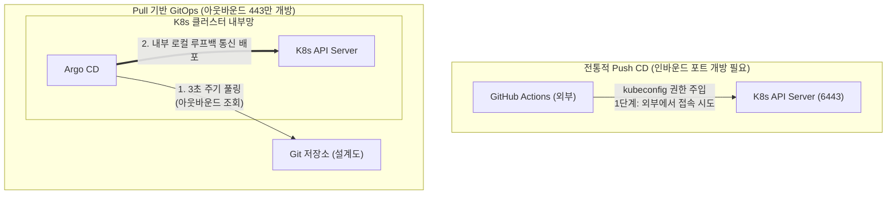

# [Day 3] 3-1. CI/CD 구조와 GitOps 이해

---

## 오늘 배울 내용
- **주제**: CI/CD 파이프라인의 구성, Push vs Pull 배포 모델 차이점, GitOps 선언형 아키텍처 이해
- **목표**:
  - 수동 명령형 배포의 보안/추적성 한계 이해
  - 단일 진실 공급원(SSOT) 및 상태 표류(Configuration Drift) 자가 복구 개념 파악
  - Push 기반 CD와 Pull 기반 CD의 네트워크 방화벽 설계 강점 이해
  - GitOps 적용을 위한 2일차 Kubernetes 핵심 설정 자원 상태 검증

---

## 💡 쉽게 이해하는 비유 (Analogy)
- **수동 레버 조작 공장 vs 설계도 기반 자동 조율 로봇**
  - **수동 배포 (Push)**: 사람이 빌드 파일을 들고 기계실(운영 서버)에 직접 들어가 밸브를 열고 레버(배포 명령어)를 조작하는 것. 단 하나의 판단 실수로 공장 폭발(장애)이 터질 수 있음.
  - **GitOps (Pull)**: 기계실 안에 설계도 자동 조율 로봇(Argo CD)을 상주시키는 것. 사람은 안전한 통제실의 설계도 보관함(Git)에 새 공장 도면(YAML)만 넣어둡니다. 로봇이 3초마다 감시하다가 설계도가 변경되면 즉시 로봇 팔로 기계 밸브를 조율해 현실을 설계도와 일치시킵니다.

---

## 1. 기존 명령형 배포의 문제점 (1) 조작 실수
- **수동 배포 및 환경 실수에 의한 서비스 장애**
  - 개발자가 로컬 PC에서 빌드한 jar 바이너리 파일을 FTP/SCP로 서버에 전송해 덮어쓰는 배포 방식.
  - 실수로 테스트 환경 빌드를 운영 서버에 잘못 업로드하거나, 설정 환경변수 오타를 덮어씌워 운영 서비스가 일시에 뻗어버리는 배포 사고가 잦음.

---

## 1. 기존 명령형 배포의 문제점 (2) 이력 상실
- **구동 버전의 불명확성과 이력 추적 불능 (Black-box Server)**
  - 현재 실제 운영 서버 노드에서 돌아가는 소스코드가 어떤 개발자의 몇 번째 깃 커밋(Commit) 버전인지 역추적하기 어려움.
  - 서비스 장애 발생 시 실제 실행 중인 바이너리 소스의 실체가 모호하므로, 로그를 대조해 디버깅 범위를 좁히는 데에만 아까운 수 시간이 지연됨.

---

## 2. 왜 GitOps 배포 아키텍처가 필요한가?
- **Push 기반 배포 모델의 보안 취약성**
  - 외부 빌드 도구(Jenkins, GitHub Actions 등)에서 방화벽을 뚫고 운영 클러스터 API를 찔러 상태를 강제 주입하는 방식.
  - 클러스터 제어 권한(kubeconfig) 토큰이 외부에 노출될 위험이 큼.
- **인프라 변경 추적의 부재**
  - 저장소의 코드 상태와 실제 클러스터 실행 상태가 정확히 일치하는지 투명하게 검증하기 어려움.

---

## GitOps의 핵심 기둥 (1) Pull 기반 배포
- **Pull-based CD**
  - 외부에서 클러스터를 통제하는 통로를 완전 차단함.
  - 클러스터 내부에 배포 에이전트(Argo CD)를 상주시킨 뒤, 에이전트가 외부의 Git 저장소를 직접 주기적으로 긁어와서(Pull) 스스로를 최신 상태로 업데이트함.
  - 인바운드 방화벽 포트를 개방할 필요가 없어 클러스터 보안이 극대화됨.

---

## GitOps의 핵심 기둥 (2) 단일 진실 공급원
- **Single Source of Truth (SSOT)**
  - 클러스터에 배포될 이상적인 선언형 YAML 매니페스트 파일들을 오직 단 하나의 Git 저장소에서만 통합 관리함.
  - 모든 인프라 변경 및 롤아웃 조작은 오직 Git 커밋 로그(Commit Log)와 코드 리뷰(PR)를 거쳐서만 실행되도록 강제 규정함.

### 3. 이것은 무엇인가? GitOps
- **정의**
  - Git 저장소에 저장된 K8s YAML 매니페스트를 '단일 진실 공급원'으로 보고, 클러스터의 실제 상태를 Git에 선언된 상태와 일치하도록 자동 동기화하는 배포 방법론.
  - 인프라 배포가 마치 소프트웨어 소스 코드의 형상 관리와 완전히 동일한 파이프라인 상에서 수행됨.

---

## Push 방식 CD vs Pull 방식 CD
- **Push 방식**
  - 외부 빌드 도구가 관리자 권한을 쥐고 `kubectl apply -f` 명령어를 클러스터에 강제로 밀어 넣음.
  - 자격 증명 유출 리스크 및 외부 네트워크 인바운드 개방이 강제됨.
- **Pull 방식**
  - K8s 내부의 에이전트가 Git 저장소를 바라보며 아웃바운드로 소스를 조회하고, 로컬 루프백 내부망에서 자체 배포를 수행함.

---

## Argo CD의 자가 치유 (Self-Heal)
- **상태 표류(Configuration Drift) 방어**
  - 누군가 K8s 터미널이나 k9s로 몰래 파드를 강제로 끄거나 사양을 변경하는 등 Git에 기록되지 않은 수동 상태 조작을 감행했을 때.
  - Argo CD는 이를 깃허브 기록과 실시간 비교해 즉각 감지하고, 수동 수정 사항을 가차 없이 날려버리며 Git 설계서 상태로 강제 복원(Self-Heal)시킴.

---

## 단일 진실 공급원(SSOT)의 감사 이력
- **감사 추적성 (Audit Trail)**
  - 인프라 배포의 흔적이 오직 Git Commit 히스토리(누가, 언제, 어떤 내용을 변경해 커밋했는지)에 투명하게 기록됨.
  - 서비스 장애가 터졌을 때, 로그 장부를 뒤질 필요 없이 Git Diff 이력만 열어보면 장애 원인이 된 변경점을 10초 만에 식별해 복구할 수 있음.

---

## 두 배포 아키텍처의 네트워크 구조 비교



---

## GitOps 배포 아키텍처의 장점
- **보안의 완전성**
  - 클러스터 마스터 권한 토큰을 외부 서드파티 CI 서버나 개인 노트북에 보관할 필요가 없어 보안 털림 리스크가 제로가 됨.
- **신속한 재해 복구력 (DR)**
  - 클러스터 전체가 통째로 삭제되는 재난이 발생해도, 신규 클러스터를 파고 Argo CD에 기존 Git 리포지토리 주소만 꽂아주면 단 5분 만에 동일 형상으로 자율 완복됨.

---

## GitOps 배포 아키텍처의 단점
- **단발성 수동 디버깅의 속도 지연**
  - 환경변수 하나를 바꿔서 잘 돌아가는지 클러스터에서 실시간 테스트하고 싶어도, Git 커밋 ➡️ 푸시 ➡️ Argo CD 동기화 대기를 거쳐야 하므로 변경-확인 사이클이 다소 길어짐.
  - **대응책**: 개발 환경 네임스페이스에 한해서만 임시로 자동 동기화(Auto-Sync)를 꺼두고 수동 조작하는 유연한 가이드라인 적용.

---

## 5. 실습: 실무형 CI/CD 역할 경계 정의
- **전체 배포 파이프라인의 연계 설계**
  - 1단계: 개발자가 소스코드 수정 ➡️ Git 개발 리포지토리에 푸시.
  - 2단계: **[CI 단계]** GitHub Actions가 코드 검사, Gradle 빌드 수행 후 Docker 이미지를 생성하여 컨테이너 레지스트리(GHCR)에 업로드.
  - 3단계: **[CD 단계]** 배포 저장소의 K8s YAML 내 이미지 태그를 최신 빌드 번호로 업데이트하여 커밋 ➡️ Argo CD가 동적 Sync 수행.

---

## CI 단계 (지속적 통합)의 세부 흐름
- **소스 빌드와 이미지 패키징 자동화**
  - 개발 소스 저장소의 `.github/workflows/` 내 YAML 워크플로우 명세서에 작성된 명령어들이 Git Push 트리거로 가동됨.
  - 무거운 도커 이미지가 로컬 개발 컴퓨터가 아닌 GitHub 클라우드 빌더 러너에서 안전히 빌드되어 안전 자산으로 입고됨.

---

## CD 단계 (지속적 배포)의 세부 흐름
- **선언적 동기화를 통한 반영 자동화**
  - GitOps CD 도구가 타깃 Git 배포 저장소의 변경사항을 긁어옴.
  - K8s의 선언적 API 엔드포인트에 동기화를 대행 지시하여, 롤링 업데이트 전략에 맞춰 파드 복제본들을 점진 교체 가동함.

### 실습: K8s 네임스페이스 준비 상태 점검
- **PowerShell에서 실행할 환경 검증 명령어**

```powershell
# 3일차 GitOps 실습 시작 전, Argo CD가 감시하고 배포를 진행할 대상 
# 네임스페이스(todo-app)가 클러스터에 준비되어 있는지 확인
kubectl get namespace
```

---

## 실습: 2일차 배포 리소스 존재 유무 확인
- **PowerShell에서 실행할 데이터 연결 자원 점검 명령어**

```powershell
# 3일차 배포가 DB 연결에 성공하기 위해 사전에 등록되어 있어야 하는 
# ConfigMap 및 Secret 리소스가 살아있는지 점검
kubectl get configmap app-config -n todo-app
kubectl get secret db-secret -n todo-app
```
