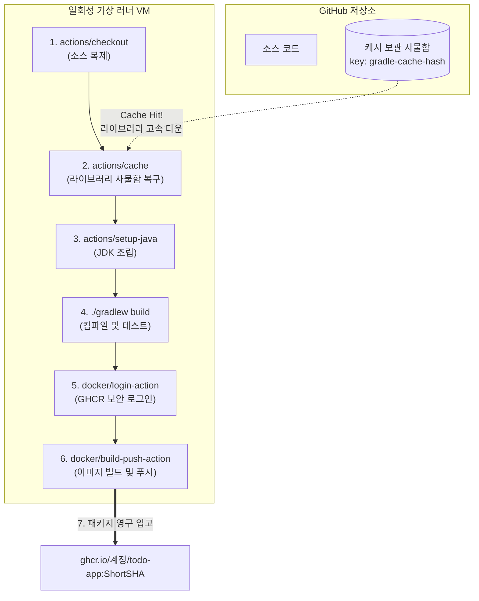

# [Day 3] 3-2. GitHub Actions CI 구성

## 오늘 배울 내용
- **주제**: GitHub Actions를 활용한 빌드/테스트 자동화, Gradle 의존성 캐싱 최적화, Docker 이미지 빌드 및 GHCR 푸시
- **목표**:
  - 수작업 빌드로 인한 휴먼 에러 및 개발 PC 리소스 병목 문제 이해
  - GitHub Actions의 동작 메커니즘(Runner, Workflow, Job, Step) 파악
  - `actions/cache`를 활용한 빌드 속도 개선
  - GITHUB_TOKEN을 통해 보안 자격 증명 유출 없이 GHCR 로그인 및 이미지 배포 자동화

## 💡 쉽게 이해하는 비유 (Analogy)
- **자동 부품 조립 및 출고용 컨베이어 벨트**
  - **수동 빌드**: 작업자가 소스 코드를 직접 검사하고(Test), 페인트칠(컴파일)해 박스 포장(도커 이미지화)한 뒤 창고(Registry)까지 수레로 나르는 것. 바쁘면 검사를 건너뛰어 불량품(버그)을 출고할 위험이 큼.
  - **GitHub Actions (자동 컨베이어 벨트)**: 소스 보관함(Git)에 코드가 들어오면 감지 센서가 작동해 불량을 자동 진단하고, 상자 포장을 완료한 뒤, 보관 창고(GHCR) 선반에 오차 없이 자동 입고시켜 주는 지능형 시스템.

## 1. 기존 수동 빌드의 문제점 (1) 검증 누락
- **테스트 생략에 따른 불량 코드 배포 리스크**
  - 바쁜 일정이나 핫픽스 패치 시, 개발자는 "설마 코드 몇 줄 고쳤는데 문제 되겠어?"라며 로컬 단위 테스트 명령어(`./gradlew test`) 실행을 생략하고 Push하기 쉬움.
  - 이로 인해 검증되지 않은 소스가 배포되어 스프링 컨테이너 기동 오류(Bean 생성 실패 등)를 내며 운영 서버 전체를 중단시키는 참사 유발.

## 1. 기존 수동 빌드의 문제점 (2) 리소스 병목
- **로컬 빌드로 인한 컴퓨터 속도 저하**
  - 자바 소스 컴파일과 도커 이미지 빌드 연산은 개발자 노트북의 CPU와 메모리(RAM)를 100%에 가깝게 혹사시킴.
  - 빌드 및 이미지 패키징이 수행되는 수 분 동안 개발 PC가 버벅거려 다른 개발 업무나 웹 서핑이 불가능하여 개발 집중력 흐름이 단절됨.

## 2. 왜 지속적 통합(CI) 자동화가 필요한가?
- **일회성 격리 빌드 환경 (Ephemeral Runner)의 필요성**
  - 개발자 개별 노트북의 환경(OS 버전, 로컬 JDK 꼬임 등)에 구애받지 않고, 항상 동일한 초기화 스펙을 지닌 깨끗한 임시 VM에서 빌드 검증을 보장해야 함.
- **배포 게이트 가딩의 의무화**
  - 소스코드가 브랜치에 Merge되면 시스템이 강제 트리거되어 테스트를 실행하고, 이 단계가 성공(Green Sign)해야만 도커 이미지가 출고되도록 시스템적으로 배포 관문을 방어해야 함.

## 3. 이것은 무엇인가? GitHub Actions
- **정의**
  - GitHub 저장소 내에서 소프트웨어 개발 워크플로우를 자동화하도록 지원하는 완전 무상태의 이벤트 기반 파이프라인 엔진.
- **기본 개념**
  - **Workflow**: 트리거 이벤트(Push 등)로 가동되는 자동화 설계도.
  - **Job**: 병렬 혹은 순차로 실행되는 작업 단위.
  - **Step**: Job 내부에서 순차적으로 실행되는 쉘 스크립트 또는 Action(플러그인) 실행 단계.

## 일회성 VM Runner와 멱등성
- **Ephemeral Runner**
  - GitHub Actions는 빌드가 트리거될 때마다 클라우드 가상 머신(ubuntu-latest 등)을 동적으로 프로비저닝함.
  - 빌드가 끝나면 해당 VM을 가차 없이 파괴(Discard)하여 찌꺼기 파일을 소멸시킴.
  - 매번 '아무것도 묻지 않은 깨끗한 일회용 도마' 위에서 새로 일을 시작하므로, 이전 빌드가 남긴 부작용으로 인한 오염 에러가 차단됨.

## 보안 정보 보호: Secrets와 마스킹
- **Secrets 관리와 GITHUB_TOKEN**
  - API 키나 비밀번호 등 민감 데이터는 Git에 올리지 않고 GitHub Repository Settings ➡️ Secrets에 등록해 마스킹 처리하여 보관함.
  - 가상 러너에 Secrets를 전달해 실행할 때, 러너 콘솔 창에 해당 값이 부주의하게 노출되어도 화면에는 자동으로 `***` 모자이크 처리됨.
  - 특히 **`secrets.GITHUB_TOKEN`**은 깃허브가 빌드 기동 중에만 임시로 발급해 주는 일회용 관리자 인증 키로, 외부 해킹 시에도 가치가 만료되므로 매우 안전함.

## 빌드 속도 개선: actions/cache
- **임시 가상 환경의 단점 극복**
  - 매번 일회성 가상 머신을 켜면, 빌드 시 필요한 자바 외부 라이브러리(JAR 패키지) 수백 MB를 인터넷에서 처음부터 매번 새로 다운로드해야 해서 느림.
- **Gradle 캐싱 적용**
  - `actions/cache`를 통해 한 번 다운로드한 라이브러리 폴더를 깃허브 클라우드 사물함에 보관함.
  - 다음 빌드가 돌 때 사물함에서 초고속으로 복구하여 빌드 시간을 수 분에서 수 초로 단축시킴.

## 가상 러너의 빌드 공정 및 캐시 구조



## GitHub Actions CI의 장점
- **휴먼 에러 봉쇄**
  - 테스트 코드가 하나라도 실패하면 도커 이미지가 레지스트리에 저장되지 않고 배포 관문이 강제 차단됨.
- **로컬 리소스 프리**
  - 무거운 자바 컴파일 및 도커 이미지 패키징 연산을 깃허브 가상 컴퓨터가 전담하므로, 개발자의 로컬 환경은 항시 쾌적한 반응 속도를 유지함.

## GitHub Actions CI의 단점과 극복
- **라이브러리 추가 시의 캐시 갱신 비용**
  - `build.gradle` 소스 파일에 새로운 라이브러리를 추가하여 캐시 키가 깨지는 순간(Cache Miss).
  - 수백 메가바이트의 신규 의존성 패키지를 싹 새로 다운로드해야 해서 해당 빌드는 다소 오래 걸림.
  - 자주 변경되지 않는 한 대체로 캐시 혜택이 유지되므로 효율적임.

## 5. 실습: ci.yml 구조 분석 (1)
- **트리거 조건 및 가상 러너 선언**

```yaml
name: CI - Spring Boot Build and Containerize

on:
  push:
    branches: [ main ]  # main 브랜치에 push/merge 가 발생할 때 트리거 가동

jobs:
  build-and-push:
    runs-on: ubuntu-latest  # 일회성 최신 우분투 가상 서버 프로비저닝
    permissions:
      contents: read
      packages: write       # GHCR 이미지 업로드를 위한 패키지 쓰기 권한 명시
```

## 5. 실습: ci.yml 구조 분석 (2)
- **소스 다운로드, Java 설정 및 Gradle 캐싱**

```yaml
    steps:
      # 1단계: 러너 가상 서버에 깃허브 소스 코드 클론 복사
      - name: Checkout Source Code
        uses: actions/checkout@v4

      # 2단계: Temurin 17 버전 JDK 환경 구성
      - name: Set up JDK 17
        uses: actions/setup-java@v4
        with:
          java-version: '17'
          distribution: 'temurin'

      # 3단계: Gradle 캐시 저장소 동기화 (빌드 고속화)
      - name: Cache Gradle Packages
        uses: actions/cache@v4
        with:
          path: |
            ~/.gradle/caches
            ~/.gradle/wrapper
          key: ${{ runner.os }}-gradle-${{ hashFiles('**/*.gradle*', '**/gradle-wrapper.properties') }}
          restore-keys: |
            ${{ runner.os }}-gradle-
```

## 5. 실습: ci.yml 구조 분석 (3)
- **소스 컴파일 및 GHCR 업로드 자동화**

```yaml
      # 4단계: Spring Boot JAR 패키징 빌드 및 테스트 실행
      - name: Run Build and Test
        run: |
          cd spring-app
          chmod +x gradlew
          ./gradlew build --no-daemon

      # 5단계: GitHub Container Registry (GHCR) 로그인 (임시 GITHUB_TOKEN 활용)
      - name: Log in to GHCR
        uses: docker/login-action@v3
        with:
          registry: ghcr.io
          username: ${{ github.actor }}
          password: ${{ secrets.GITHUB_TOKEN }}

      # 6단계: 도커 이미지 빌드 및 GHCR 업로드 (깃 SHA 태그 부여)
      - name: Build and Push Docker Image
        uses: docker/build-push-action@v5
        with:
          context: ./spring-app
          push: true
          tags: |
            ghcr.io/${{ github.repository }}:${{ github.sha }}
            ghcr.io/${{ github.repository }}:latest
```

## 워크플로우 런타임 환경의 이해
- **실행 주체의 실체**
  - 가상 러너(`ubuntu-latest`)는 순수한 청정 Linux VM이므로 Docker Daemon이 기본 탑재되어 있음.
  - 이 덕분에 별도의 도커 데몬 구동 절차 없이 `docker/build-push-action` 등을 바로 실행하여 컨테이너 이미지를 구워낼 수 있음.

## GitHub Secrets 설정 방법
- **자격 증명 등록 절차**
  - GitHub 저장소 ➡️ `Settings` ➡️ `Secrets and variables` ➡️ `Actions` 클릭.
  - `New repository secret` 버튼 클릭 후 민감한 정보(예: 외부 서버 암호 등)를 등록해 변수로 활용.
  - 본 실습의 `secrets.GITHUB_TOKEN`은 별도 등록 없이 깃허브 엔진이 알아서 동적 생성해 제공하므로 패스해도 됨.

## GitHub Packages와 GHCR
- **GHCR (GitHub Container Registry)**
  - 깃허브가 제공하는 도커 이미지 보관 및 패키지 창고 서비스.
  - 도커 허브(Docker Hub)와 유사하지만, 깃허브 계정 권한과 긴밀히 연동되며 GitHub Actions 파이프라인에서 토큰 하나로 자유롭게 업로드(Push)/다운로드(Pull)할 수 있어 관리 편의성이 최상임.

## 💡 강사 팁: 빌드 성능 2배 단축 팁
- **`--no-daemon` 옵션의 비밀**
  - 로컬 환경에서는 Gradle 데몬 프로세스가 백그라운드에 상주하며 캐싱 컴파일을 하여 두 번째 빌드부터 빨라짐.
  - 하지만 GitHub Actions 러너 가상 머신은 일회용이므로, 빌드가 끝나면 VM이 파괴되어 어차피 데몬이 상주할 수 없음.
  - 대화형 데몬을 켜두는 것은 가상 환경에서 무의미한 CPU와 메모리 리소스 점유 오버헤드만 일으키므로, 반드시 `--no-daemon` 옵션을 주어 자원 낭비를 절약해야 빌드 안정성이 향상됨.
