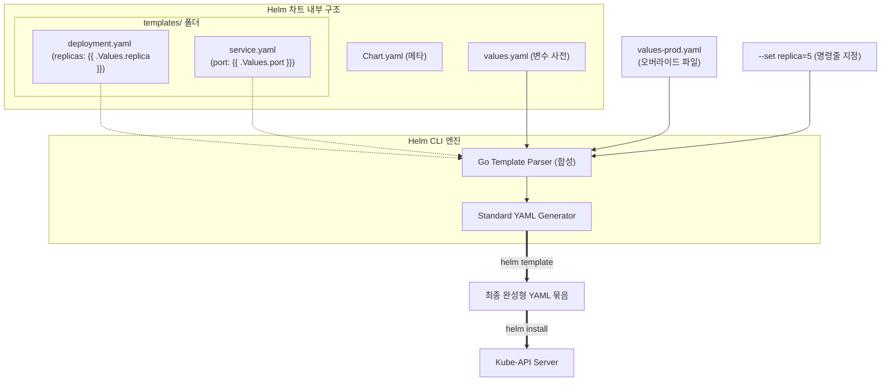

# [Day 3] 3-4. Helm 기본과 차트 구조

## 오늘 배울 내용
- **주제**: Helm 패키지 매니저의 개요, 차트 구조(Chart.yaml, values.yaml, templates), Go 템플릿 문법 및 렌더링 검증
- **목표**:
  - 환경별 YAML 복사-붙여넣기에 의한 인프라 설정 파편화 문제 이해
  - Helm의 3대 핵심 요소(Chart, Repository, Release)의 개념 파악
  - Go Template 문법을 이용한 정적 YAML의 가변 템플릿화 기법 이해
  - `helm template` 명령어로 렌더링된 가상의 최종 매니페스트 사전 검증

## 💡 쉽게 이해하는 비유 (Analogy)
- **이케아(IKEA) 가구 조립 도면과 고객 맞춤 주문 옵션서**
  - **수동 복사 방식**: 빨강, 파랑, 흰색 책상 설계도 3장을 각각 복사해 보관하는 것. 책상 다리 길이를 늘려야 할 때 설계도 3장을 찾아다니며 일일이 수정해야 함.
  - **Helm**: 책상의 뼈대와 조립 방식만 묘사된 공용 이케아 도면(템플릿) 한 장과, 고객의 필요 스펙을 기록하는 옵션 주문서(values.yaml)를 엮는 것.
  - **렌더링**: 주문서에 "파란색, 다리길이 50cm"를 기입해 렌더링 기계에 넣으면 옵션이 합성된 조립 설명서(최종 YAML)가 인쇄되어 나옵니다.

## 1. 기존 복사 배포의 문제점 (1) 설정 파편화
- **Configuration 표류 (Drift)**
  - 거의 모든 구조는 같고 환경변수 몇 줄만 다른 `deployment.yaml` 파일들을 `k8s-dev/`, `k8s-prod/` 등 환경별 디렉터리에 물리적으로 복사해 두고 독자 수동 관리함.
  - 파드의 리소스 제한 메모리 크기를 늘리는 등 인프라 변경이 생겼을 때, 각 폴더를 순회하며 파일들을 일일이 대조해 수동 수정해야 함.
  - 한 곳이라도 빼먹으면 인프라 설정 불일치가 발생해 상용망 다운 장애로 이어짐.

## 1. 기존 복사 배포의 문제점 (2) 리소스 파편화
- **수많은 연계 리소스의 설치/삭제 관리 노고**
  - 웹 서비스 하나를 띄우기 위해 Deployment, Service, ConfigMap, Secret, PVC 등 최소 5개 이상의 YAML 파일이 동시 필요함.
  - 설치를 위해 `kubectl apply -f` 명령을 5번 날려야 하고, 서비스를 삭제할 때도 리소스 목록을 수동 나열하거나 파일명을 대조하며 삭제를 해야 해서 관리가 번거로움.

## 2. 왜 Kubernetes 패키지 매니저(Helm)인가?
- **정적 YAML 설정의 한계 극복**
  - 순수 K8s YAML 파일은 내부에 변수를 선언해 환경에 따라 동적으로 치환하거나, 조건문/반복문 등의 동적 제어가 불가능한 단순 텍스트 파일임.
- **인프라 패키징 및 라이프사이클 통제**
  - 복잡한 K8s 리소스의 관계 묶음을 '차트'라는 단일 패키지 개념으로 관리하여, 일괄적인 생성, 버전 관리, 일괄 철거를 지원하기 위함.

## 정적 YAML의 템플릿화
- **템플릿과 파라미터의 결합**
  - 배포할 인프라의 뼈대(구조)는 템플릿 코드로 작성하고, 런타임에 갈아 끼울 매개변수(복제수, 이미지 주소, 포트 등)는 변수 삽입 구멍으로 남겨둠.
  - 이를 통해 코드의 중복을 완벽히 배제하고 변경 최소화를 실현함.

## 3. 이것은 무엇인가? Helm
- **정의**
  - 쿠버네티스용 패키지 관리 도구. (Linux의 `apt`나 `yum`, Node.js의 `npm`과 유사한 포지션).
  - 여러 YAML 파일을 묶어 패키지(차트)로 관리하고, 이를 클러스터에 설치, 업그레이드, 롤백하는 라이프사이클을 통제함.

## Helm의 3대 핵심 개념
- **Chart (차트)**
  - 쿠버네티스 애플리케이션을 생성하기 위해 필요한 템플릿 파일들의 묶음 패키지 (요리 레시피 패키지).
- **Repository (저장소)**
  - 공유 및 배포 가능한 차트들이 수집되어 보관되는 온라인 도서관 (레시피 보관 도서관).
- **Release (릴리스)**
  - 클러스터 상에 가동되어 실행 중인 구체적인 차트의 인스턴스 (레시피로 실제로 요리해 낸 요리 완성품).

## Helm 차트의 기본 디렉터리 구조
- **기본 폴더 레이아웃**
  - `Chart.yaml`: 차트의 이름, 설명, 패키지 버전 정보가 담긴 메타데이터 파일.
  - `values.yaml`: 템플릿 내에 주입될 기본 변수값들이 모여 있는 변수 사전 파일.
  - `templates/`: 실제 K8s 리소스(Deployment, Service 등)의 Go Template 뼈대 코드가 보관된 폴더.

## Go Template 문법과 변수 매핑
- **Go 템플릿 기본 구문**
  - 이중 중괄호 `{{ }}` 내부가 Helm의 Go 템플릿 구문으로 해석되는 영역.
  - **`{{ .Values.replicaCount }}`**: `values.yaml` 파일 내의 `replicaCount` 값을 가져와 동적 바인딩함.
  - **`{{ .Release.Name }}`**: 설치될 때 Helm이 자동으로 배정해 주는 릴리스 이름을 바인딩함.

## Helm 템플릿 엔진의 렌더링 및 배포 흐름



## Helm 차트의 장점
- **중복 코드 박멸**
  - 하나의 공통 템플릿만 유지하고, 개발/운영 환경의 차이는 values 파일의 오버라이드로 처리해 인프라 명세서 유지보수 오버헤드를 극적으로 아낌.
- **패키지 단위 통제**
  - 5~6개의 K8s 자원을 하나의 Release 객체로 묶어 `helm install`, `helm upgrade`, `helm rollback` 명령어로 원클릭 일괄 제어 가능.

## Helm 차트의 단점
- **템플릿 가독성 저하 및 블랙박스 문제**
  - YAML 내부가 제어 문법과 변수명으로 도배되면 소스 구조를 육안으로만 보고 최종 형상을 유추하기 어려움.
  - 들여쓰기 1칸 오류로도 K8s API 서버가 배포를 통째로 거부하여 디버깅이 까다로움.

## 렌더링 오류 예방: dry-run 및 template 검증
- **사전 시뮬레이션의 중요성**
  - 템플릿 오류가 클러스터에 바로 반영되면 장애가 터질 위험이 큼.
  - **`helm template`**: 실제 설치는 하지 않고, 로컬의 템플릿과 values 파일을 합성해 렌더링 완료된 가상의 최종 YAML 명세를 화면에 출력해 주는 명령어. 배포 전 반드시 실행해 볼 것을 권장함.

## 5. 실습: templates/deployment.yaml 분석
- **실무형 Helm Deployment 템플릿 예시**

```yaml
apiVersion: apps/v1
kind: Deployment
metadata:
  name: {{ .Release.Name }}-app  # 기동 시 부여한 릴리스 이름으로 자동 이름 명명
  namespace: {{ .Values.namespace | default "todo-app" }}
spec:
  # values.yaml 의 replicaCount 변수 동적 주입
  replicas: {{ .Values.replicaCount }}
  selector:
    matchLabels:
      app: {{ .Release.Name }}-app
  template:
    metadata:
      labels:
        app: {{ .Release.Name }}-app
    spec:
      containers:
        - name: app
          image: "{{ .Values.image.repository }}:${{ .Values.image.tag }}"
```

## 실습: Helm CLI 바이너리 설치 검증
- **PowerShell에서 실행할 버전 확인 명령어**

```powershell
# Helm CLI가 시스템 경로(PATH)에 올바르게 잡혀 실행되는지 버전 확인
helm version
```

## 실습: 로컬 템플릿 합성 결과물 사전 렌더링
- **PowerShell에서 실행할 가상 빌드 확인 명령어**

```powershell
# 실제 클러스터에 설치하지 않고, 로컬 차트 폴더를 빌드하여 렌더링 완료된 YAML 명세 출력
# (todo-app은 임의의 가상 릴리스 명칭, 맨 뒤의 경로는 로컬 헬름 차트 폴더의 주소)
helm template todo-app day3/k8s/helm
```

## 실습: 렌더링 결과 내 이미지 명세 필터링
- **PowerShell에서 실행할 치환값 점검 명령어**

```powershell
# 렌더링되어 뿜어져 나오는 최종 YAML 묶음 중에서 'image:'가 포함된 줄만 발췌
# (values.yaml의 repository와 tag가 1.0 형상으로 올바르게 합성되었는지 검증)
helm template todo-app day3/k8s/helm | findstr image:
```

## 실습: 런타임 변수 오버라이드 렌더링 테스트
- **PowerShell에서 실행할 명령어**

```powershell
# 특정 프로파일 values 파일을 명시(-f)하고, 추가로 명령줄 변수 재정의(--set)를 병합 렌더링
# (정원 3개에서 5개로, 이미지 태그가 new태그로 합성되어 인쇄되는지 눈으로 확인)
helm template todo-app day3/k8s/helm -f day3/k8s/helm/values.yaml --set replicaCount=5 --set image.tag=new-tag
```
