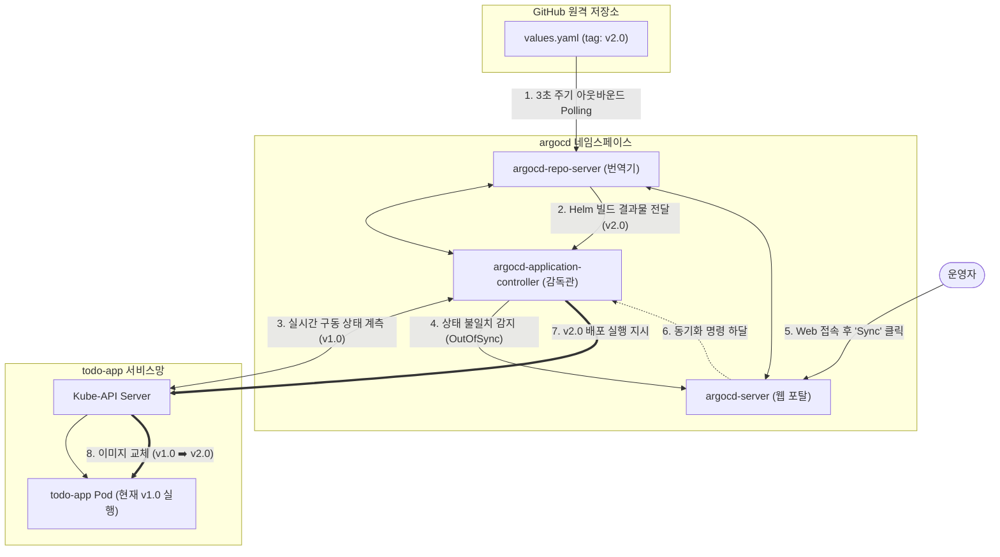

# [Day 3] 3-5. Argo CD 설치 및 앱 등록

---

## today 배울 내용
- **주제**: Argo CD 설치 및 구성, Application CRD 명세, Git 저장소 연동, 웹 UI 포트 포워딩 및 최초 로그인
- **목표**:
  - 수동 명령어 배포 방식의 관리 위협 및 실수 가능성 이해
  - Argo CD의 내부 동작 구조(Repo Server, Application Controller) 파악
  - K8s의 CRD(Custom Resource Definition) 확장 원리와 Application 스펙 이해
  - 포트 포워딩으로 Argo CD 콘솔을 열고 최초 비밀번호를 복호화해 로그인 수행

---

## 💡 쉽게 이해하는 비유 (Analogy)
- **뇌의 생각과 몸의 움직임을 실시간 맞추는 도플갱어 싱크 로봇**
  - **수동 배포**: 뇌(Git 설계도)가 바뀔 때마다 사람이 일일이 손발(파드)에 "움직여라!" 하고 수동 신경 명령(`kubectl apply`)을 발송해야 움직임. 때론 뇌와 몸의 싱크가 깨져 마비되기도 함.
  - **Argo CD**: 뇌와 몸 사이에 연결된 '실시간 신경망 싱크 로봇'. 3초마다 뇌를 스캔해 생각이 바뀌었는데 몸이 정체되어 있으면 '싱크 깨짐(OutOfSync)' 경보를 붉게 켭니다. 그리고 싱크(Sync) 버튼을 누르면 뇌의 생각대로 몸의 근육을 강제 구동해 일치시킵니다.

---

## 1. 기존 배포 방식의 문제점 (1) 수동 피로
- **매 배포 시마다 수반되는 터미널 조작과 위험 노출**
  - 변경 사항 배포 때마다 엔지니어가 직접 터미널을 열어 `kubeconfig` 권한을 불러오고 `helm upgrade` 등의 명령을 수동 쳐야 함.
  - 여러 대의 개발용, 운영용 클러스터 접속 계정 정보가 꼬여있을 때, 개발 명령을 운영 클러스터에 잘못 날려 운영 환경 전체를 덮어쓰는 대형 사고가 자주 터짐.

---

## 1. 기존 배포 방식의 문제점 (2) Drift
- **설계도와 실물 간의 무단 불일치(Drift) 방치**
  - 특정 작업자가 장애 수동 조치를 위해 Git에 적지 않고, 서버 노드에 직접 침투해 파드의 환경변수나 개수를 수동으로 변경함.
  - 이 경우 Git 저장소에 적힌 설계 장부와 실제 물리 서버의 가동 상태가 완전히 어긋나는 **Configuration Drift**가 방치됨.
  - 추후 정상 배포 시 이 수동 땜질 내역이 예고 없이 유실되어 원인 모를 장애 유발.

---

## 2. 왜 Argo CD가 필요한가?
- **자가 Reconcile(조정) 에이전트의 필요성**
  - K8s 내부에서 Git 저장소와 실시간 형상을 비교 감시하며 자동으로 동기화해 주는 에이전트가 없으면, 인프라의 멱등성이 깨짐.
- **인프라 자율 통제 실현**
  - 깃의 명세가 변경되는 순간 스스로를 복제 배포하고, 수동 개입을 감지해 차단하는 지능형 통제관이 필수적임.

### 3. 이것은 무엇인가? Argo CD
- **정의**
  - 쿠버네티스용 선언형 GitOps 지속적 배포(CD) 도구.
  - 지정한 Git 저장소(Source)의 K8s 매니페스트 설계서를 감시하고, 실제 클러스터(Destination) 상태를 100% 동일하게 일치시키도록 배포를 수행하는 지능형 자동화 제어기.

---

## K8s 확장 리소스: Application CRD
- **Custom Resource Definition (CRD)**
  - 사용자가 K8s API 서버에 새로운 형태의 리소스 규격을 정의해 등록하는 기능.
  - Argo CD는 **`Application`** 이라는 커스텀 리소스를 K8s에 주입하여 사용함.
  - `Application` 명세 내부에는 "어떤 Git 저장소 주소의 어느 경로(`source`)를 읽어서, 어느 대상 클러스터의 어느 네임스페이스(`destination`)에 뿌려줄 것인가"를 정의해 둠.

---

## Argo CD의 내부 핵심 요원들
- **`argocd-server`**
  - 외부 사용자가 접속하는 웹 대시보드 UI 포탈 및 REST API 게이트웨이.
- **`argocd-repo-server`**
  - 외부 Git 저장소를 주기적으로 Clone하고, Helm 차트를 최종 배포용 K8s YAML 문서로 렌더링/컴파일해 주는 템플릿 번역가.
- **`argocd-application-controller`**
  - 번역된 YAML 내용과 실제 클러스터 가동 상태를 대조하여, 차이를 보정하고 배포를 강제하는 현장 감독관.

---

## Git 저장소 보안 연동
- **Argo CD가 프라이빗 Git 저장소를 안전하게 읽는 법**
  - **HTTPS 연동**: GitHub personal access token(PAT)을 ID/PW 입력란에 삽입해 접근 권한 획득.
  - **SSH Deploy Key 연동**: 비대칭 키 쌍을 생성하여, 공개 키는 GitHub 레포지토리에 등록하고 개인 키는 Argo CD Credential로 주입해 접근하는 실무형 모범 방식.

---

## Argo CD 자율 조정(Reconcile) 동작 구조



---

## Argo CD의 장점
- **Drift 현상 원천 차단**
  - 누군가 CLI로 파드 개수를 수동으로 바꿔도, 3초 이내에 감지하여 Git에 정의된 정량 상태로 강제 복원(`Self-Heal`)시킴.
- **풍부한 웹 대시보드 UI**
  - 리소스 간의 거대한 연계 트리 구조를 시각화하여, 어떤 리소스가 에러가 났고 헬스 상태가 어떤지 직관적 원클릭 관제 제공.

---

## Argo CD의 단점 및 리소스 요구량
- **클러스터 내부 점유 자원의 부담**
  - Redis, Server, Controller, Repo Server 등 무거운 관제 프로세스가 무려 5~6개씩 동시 상주해야 함.
  - 이로 인해 최소 메모리 1.5GB 이상의 고정 자원이 소모되므로, 로컬 개발 환경(Docker Desktop)의 부담이 일부 증가함.

### 5. 실습: Argo CD 격리 공간 신설
- **PowerShell에서 실행할 격리 네임스페이스 생성 명령어**

```powershell
# Argo CD 관제 툴만을 격리하여 띄울 전용 네임스페이스 신설
kubectl create namespace argocd
```

---

## 5. 실습: 공식 검증 매니페스트 일괄 배포
- **PowerShell에서 실행할 설치 명령어**

```powershell
# Argo CD 공식 안정(stable) 릴리스 매니페스트 다운로드 및 클러스터 적용
# (이 과정에서 다량의 커스텀 리소스 정의와 컨트롤러 파드들이 생성되기 시작합니다)
kubectl apply -n argocd -f https://raw.githubusercontent.com/argoproj/argo-cd/stable/manifests/install.yaml
```

---

## 실습: Argo CD 기동 상태 점검
- **PowerShell에서 실행할 확인 명령어**

```powershell
# argocd 네임스페이스 내부의 파드 목록 및 실행 상태 감시
# (모든 파드가 Running 및 Ready 1/1이 될 때까지 약 1~2분 대기합니다)
kubectl get pods -n argocd
```

---

## 실습: 웹 UI 포트 포워딩 개방
- **PowerShell에서 실행할 포트 터널링 명령어**

```powershell
# 클러스터 내부의 argocd-server 서비스를 내 로컬 PC의 8443 포트로 포워딩 연결
# (실행 후 이 터미널 창은 끄지 않고 유지해야 브라우저 접속이 유지됩니다)
kubectl port-forward svc/argocd-server -n argocd 8443:443
```
- **체크포인트**: 실행 후 웹 브라우저를 열고 `https://localhost:8443` 접속 테스트 (HTTPS 경고는 무시하고 계속 진행 클릭).

---

## 실습: 최초 admin 로그인 패스워드 복호화
- **PowerShell에서 실행할 자격 증명 획득 명령어**

```powershell
# K8s Secret에 base64로 가려진 임시 비밀번호를 해독하여 평문 텍스트로 즉각 반환
kubectl get secret argocd-initial-admin-secret -n argocd -o jsonpath="{.data.password}" | %{[System.Text.Encoding]::UTF8.GetString([System.Convert]::FromBase64String($_))}
```
- **체크포인트**: 출력된 난수 문자열 패스워드 전체를 조심히 복사해 둡니다.

---

## 실습: 웹 UI 로그인
- **콘솔 접속 및 인증**
  - 1단계: 브라우저로 `https://localhost:8443` 진입.
  - 2단계: Username ➡️ `admin` 입력.
  - 3단계: Password ➡️ 이전 단계에서 복사해 둔 평문 비밀번호 문자열 붙여넣기.
  - 4단계: `SIGN IN` 버튼을 클릭하여 Argo CD 첫 화면 진입 완료.

---

## 💡 강사 팁: 포트 포워딩 해제 시 트러블슈팅
- **"포트 포워딩 터미널 창이 꺼져서 접속이 끊겼습니다" 대처법**
  - 터미널을 실수로 닫으면 `localhost:8443` 통로도 즉각 파괴됨.
  - PowerShell 창을 새로 열어 `kubectl port-forward svc/argocd-server -n argocd 8443:443` 명령을 다시 타격해 뚫어주면 즉시 복구됨.
  - 백그라운드에서 실행하고 싶다면 명령어 끝에 `&`를 붙이거나 별도 터미널 탭을 생성해 띄워둘 것.
