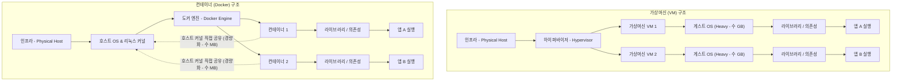

# [Day 1] 이론 강의: 로컬 환경 준비

> 💡 **쉽게 이해하는 비유 (Analogy Box)**
> - **수동 포장 이사 vs 이삿짐 컨테이너 박스**
>   - **수동 설치 방식**은 가구나 가전제품(Java, DB, Node.js)을 포장박스 없이 맨몸으로 이삿짐 트럭(내 PC)에 마구 실어 나르는 것과 같습니다. 트럭이 바뀌거나 다른 집의 짐이 함께 섞여 들어오면 전선이 꼬이고(버전 충돌), 부품을 분실하며(환경 변수 유실), 트럭 내부가 엉망진창이 되어 결국 가전이 작동하지 않게 됩니다.
>   - **컨테이너 방식**은 애초에 규격화된 **철제 컨테이너 박스** 안에 가구와 전선, 도구 일체를 완벽히 정돈하여 잠가두는 것입니다. 이 박스는 트럭이 바뀌든, 배에 싣든, 비행기에 싣든 내부 상태가 100% 동일하게 유지됩니다. 목적지에 도착해서 박스 문만 열면, 내부의 물건들은 아무런 손상 없이 즉시 원래 상태 그대로 가동됩니다.

---

## 1. 없으면 어떤 점이 불편한가?

새로운 프로젝트에 투입되거나 신입 개발자가 팀에 합류할 때 가장 먼저 겪는 관문은 '로컬 개발 환경 구축'입니다. 이 단계에서 다음과 같은 만성적인 불편함이 발생합니다.

* **설치 지옥 (Install Hell)**
  - 개발을 시작하려면 JDK 17, PostgreSQL 15, Node.js 등을 개별적으로 다운로드하여 내 PC에 설치해야 합니다. 블로그나 팀 위키마다 가이드 문서의 작성 시점이 다르고 운영체제(Windows, macOS, Linux)마다 설치 경로와 방법이 상이합니다.
  - 환경변수(`PATH`, `JAVA_HOME` 등) 설정이 꼬이거나 기존에 설치된 다른 버전과 충돌하면서 첫 실행조차 해보지 못하고 반나절에서 수일의 시간을 낭비하곤 합니다.
* **"내 PC에선 잘 되는데 왜 서버에선 안 되지?" (It works on my machine)**
  - 개발자가 사용하는 환경(예: Windows 11 Home 또는 macOS M2/M3)과 실제 운영 서버(예: Ubuntu 22.04 LTS 또는 CentOS 7.9)는 OS 커널, 기본 설치된 C 라이브러리(glibc) 버전, 파일 경로 대소문자 구분 규칙 등이 미세하게 다릅니다.
  - 로컬에서 정상적으로 빌드 및 테스트를 통과한 애플리케이션이 운영 서버에 배포되는 순간, 알 수 없는 세그멘테이션 오류(Segmentation Fault)나 파일 미존재(FileNotFound) 예외를 발생시키며 중단되는 참사가 빈번히 발생합니다.
* **버전 충돌로 인한 다중 프로젝트 관리 불가**
  - 기존 프로젝트(A)의 유지보수를 위해 Java 8과 PostgreSQL 11이 실행 중인 상황에서, 신규 프로젝트(B) 개발을 위해 Java 17과 PostgreSQL 15를 설치해야 하는 경우를 생각해 봅시다.
  - 하나의 운영체제 안에서 동일한 소프트웨어의 다중 버전을 동시에 기동하고 통신 포트 충돌(예: 5432 포트 선점)을 피하면서 깔끔하게 상태를 전환하는 것은 대단히 번거롭고 실수하기 쉽습니다.

---

## 2. 왜 필요할까?

이러한 모든 배포 에러와 생산성 저하는 **하나의 OS 환경 위에 모든 런타임과 라이브러리를 직접 설치하고 서로 간섭하도록 방치했기 때문**에 발생합니다.

과거에는 이를 해결하기 위해 물리 서버 위에 하이퍼바이저(Hypervisor)를 얹고 가상머신(VM)을 띄우는 방식을 사용했습니다. 하지만 VM은 고유한 게스트 OS(Guest OS)를 통째로 포함해야 하므로 다음과 같은 한계를 지녔습니다.
- **기가바이트(GB) 단위의 디스크 및 메모리 낭비**: 각 VM마다 커널을 포함한 OS 복사본이 기동되므로 리소스 낭비가 큽니다.
- **느린 부팅 시간**: OS가 커널을 로드하고 부팅 과정을 마칠 때까지 수십 초에서 수 분이 걸립니다.

따라서 하드웨어를 통째로 가상화하는 무거운 가상머신 대신, **호스트 OS의 커널은 공유하면서 애플리케이션의 프로세스 영역만 물리적으로 완전히 격리하여 하나의 독립된 패키지로 포장하는 효율적인 기술**이 절실히 필요해졌습니다. 이것이 바로 '컨테이너 가상화'가 탄생하고 표준으로 자리 잡은 핵심 이유입니다.

---

## 3. 이것은 무엇인가?

> **핵심 한 줄 요약**:
> *"컨테이너 가상화는 호스트 OS 커널을 공유하며 **프로세스를 논리적으로 격리**하고, 앱과 실행에 필요한 모든 요소를 **하나의 이미지로 패키징하여 어디서나 동일하게 기동**시키는 기술이다."*

<details>
<summary><b>🔍 격리 기술의 핵심: 리눅스 네임스페이스 (Namespace)</b></summary>

컨테이너는 가상머신처럼 하드웨어를 가상화하지 않습니다. 대신 리눅스 커널 내부의 **네임스페이스(Namespace)** 기술을 사용하여 특정 프로세스가 호스트 PC의 다른 자원들을 보지 못하도록 장벽을 세웁니다.
1. **PID 네임스페이스 (Process ID)**: 컨테이너 내부의 프로세스는 호스트의 프로세스 번호 체계와 분리됩니다. 따라서 컨테이너 안의 메인 프로세스는 스스로가 전체 시스템의 독점적인 1번 프로세스(`PID 1`)인 것처럼 인지합니다.
2. **NET 네임스페이스 (Network)**: 컨테이너마다 독립된 가상 네트워크 카드(veth), 고유 IP 주소, 독립된 라우팅 테이블 및 포트 영역을 부여합니다. 이를 통해 호스트 포트와의 충돌 없이 각 컨테이너 내부에서 자유롭게 포트를 바인딩할 수 있습니다.
3. **MNT 네임스페이스 (Mount)**: 컨테이너만의 격리된 파일시스템 마운트 포인트를 구성합니다. 호스트의 루트 파일시스템과 완벽히 격리되어, 컨테이너 내부에서 파일을 생성하거나 지워도 호스트 파일시스템은 안전하게 보호됩니다.
4. **UTS 네임스페이스 (Host Name)**: 컨테이너마다 독립적인 호스트 네임과 도메인 네임을 가질 수 있도록 격리합니다.
5. **IPC 네임스페이스 (Inter-Process Communication)**: 컨테이너 간에 공유 메모리나 세마포어 같은 프로세스 간 통신 자원을 혼용하여 접근하는 것을 물리적으로 격리합니다.
6. **USER 네임스페이스 (User ID)**: 컨테이너 내부의 root 사용자가 실제 호스트 OS의 일반 사용자 권한을 가지도록 매핑하여, 컨테이너가 해킹당하더라도 호스트 OS의 root 권한이 탈취되는 것을 방어합니다.
</details>

<details>
<summary><b>🔍 자원 제어 기술: 컨트롤 그룹 (Cgroups - Control Groups)</b></summary>

네임스페이스가 '눈을 가리는 격리 장벽'이라면, **Cgroups**는 '먹을 수 있는 밥그릇의 크기를 제한하는 기술'입니다.
- 특정 컨테이너가 호스트의 모든 CPU 코어나 가용 메모리(RAM)를 독점해 버리면 호스트 OS가 다운되거나 이웃한 다른 컨테이너들이 굶어 죽는 이른바 '시끄러운 이웃(Noisy Neighbor)' 문제가 발생합니다.
- Cgroups는 프로세스 그룹별로 **사용 가능한 CPU 시간 비율, 메모리 최대 한도, 디스크 I/O 대역폭**을 물리적으로 강제합니다. 메모리 임계치 초과 시에는 해당 컨테이너만 OOM(Out of Memory) Killer에 의해 강제 종료시키며 호스트와 다른 컨테이너의 안정성을 유지합니다.
</details>

<details>
<summary><b>🔍 가상화의 씨앗: 도커 이미지 (Docker Image)</b></summary>

애플리케이션을 구동하기 위한 코드, 런타임 환경, 라이브러리, 환경 설정 파일 등을 읽기 전용(Read-Only) 상태로 묶어둔 템플릿입니다. 이 이미지를 복제하여 실체화하고 메모리에 로드해 실행한 상태가 바로 **컨테이너(Container)**입니다. (이미지는 클래스, 컨테이너는 인스턴스에 대응됩니다.)
</details>

<details>
<summary><b>🔍 Windows 위에서 리눅스를 돌리는 마법: WSL2 (Windows Subsystem for Linux 2)</b></summary>

도커 컨테이너는 본래 리눅스 커널 기반 기술입니다. 따라서 리눅스 커널이 없는 Windows 환경에서 컨테이너를 가동하려면 리눅스 커널이 탑재된 가상 머신이 백그라운드에 구동되어야 합니다.
- **WSL2**는 Microsoft가 Windows 10/11 커널 내부에 탑재한 경량 가상화 기술(Hyper-V 아키텍처 기반)을 통해 실제 리눅스 커널을 수 밀리초(ms) 만에 가동하는 혁신적인 서브시스템입니다.
- Docker Desktop은 이 WSL2 엔진을 백엔드로 삼아, 윈도우 환경에서도 맥OS나 리눅스처럼 네이티브 수준의 컨테이너 기동 속도와 리소스 효율성을 보장해 줍니다.
</details>

### 📊 가상머신(VM) 배포 vs 컨테이너(Docker) 배포 아키텍처 비교



---

## 4. 장점과 단점

### 1) 장점
* **개발 및 운영 환경의 완벽한 일관성**
  - 개발자의 PC에서 빌드하고 정상 검증한 컨테이너 이미지가 빌드 서버, 테스트 서버, 나아가 클라우드 스테이징 및 실운영 서버로 수정 없이 그대로 이동하여 작동합니다. "내 컴퓨터에서는 되는데 서버에서 안 된다"는 고질적인 장애 원인을 근본적으로 도려냅니다.
* **압도적인 경량성과 빠른 기동 속도**
  - 가상머신처럼 게스트 OS를 부팅하는 바이오스(BIOS)나 커널 초기화 과정이 불필요합니다. 컨테이너 내부의 격리된 프로세스가 뜨는 데 걸리는 시간은 일반 프로세스 기동 속도와 다름없는 **단 수 밀리초~수 초** 수준에 불과합니다. CPU와 메모리 오버헤드가 극히 낮아 동일 사양 하드웨어에서 VM보다 10배 이상 많은 애플리케이션을 구동할 수 있습니다.
* **이식성 (Portability)**
  - 온프레미스(물리 서버), 가상 인프라(AWS, Azure, GCP), 혹은 개발자의 랩톱까지 도커 런타임(Docker Runtime)만 정상 기동되고 있다면 어떤 인프라 환경이든 상관없이 동일하게 구동 및 복제가 가능합니다.

### 2) 단점과 한계
* **공유 커널로 인한 보안 격리 한계**
  - 가상머신은 하이퍼바이저에 의해 하드웨어 레벨에서 완전히 격리되는 반면, 컨테이너는 호스트 OS의 리눅스 커널을 공유합니다. 만약 특정 컨테이너 내부에서 커널 취약점을 공략하는 악성 공격이 성공하여 커널 권한을 장악하면, 동일 호스트 상에서 구동 중인 다른 모든 컨테이너와 호스트 OS 전체가 공격자에게 노출될 위험이 존재합니다.
* **OS 종속적 실행 및 오버헤드**
  - 도커 컨테이너는 기본적으로 리눅스 커널용으로 컴파일된 프로세스입니다. 따라서 macOS나 Windows에서 동작시키려면 백그라운드에서 가상화 엔진(WSL2, Hyperkit 등)을 항시 띄워두어야 하므로, 아무리 경량이라 해도 최소한의 고정 메모리 점유 및 디스크 드라이브 마운트 오버헤드가 발생합니다.
* **상태 보존의 어려움 (Stateless 권장)**
  - 컨테이너는 기본적으로 소멸 시 내부 데이터가 함께 휘발되는 임시 프로세스 환경(Episodic/Stateless)입니다. 데이터베이스처럼 파일 쓰기가 유지되어야 하는 상태 저장(Stateful) 서비스를 안전하게 운영하려면, 호스트의 스토리지 시스템과 컨테이너 볼륨을 적절히 마운트하고 백업을 관리해야 하는 추가적인 아키텍처 설계가 요구됩니다.

---

## 5. 어떻게 쓰는가?

로컬 환경(Windows 10/11)에서 도커와 쿠버네티스를 실습하기 위한 첫 준비 단계입니다.

### 1) 로컬 개발 도구 버전 및 연동 확인
Windows 터미널(PowerShell)을 관리자 권한으로 기동한 후, 다음 명령어를 통해 백엔드 엔진인 WSL2와 도커 데스크톱의 연결 상태를 점검합니다.

```powershell
# 1. WSL2 엔진 설치 유무 및 활성화된 리눅스 커널 버전 상태 검증
# (Default Version 항목이 2로 표기되어 있는지 반드시 확인합니다)
wsl --status

# 2. 로컬 컴퓨터에 기동 중인 가상 배포판 리스트 확인
# (Docker Desktop이 생성한 docker-desktop, docker-desktop-data 배포판이 Running 중이어야 합니다)
wsl --list --verbose

# 3. 도커 CLI와 로컬 가상화 데몬의 연결 확인
# (Client 버전과 Server(Engine) 버전 정보가 에러 메시지 없이 정상 반환되는지 점검합니다)
docker version

# 4. 도커 컨테이너 기동 테스트 및 네트워크 연결성 자가 진단
# (로컬에 'hello-world' 이미지가 없다면 Docker Hub 저장소에서 자동으로 Pull 받아 실행 후 정상 문구를 출력합니다)
docker run --rm hello-world
```

### 💡 강사 팁: WSL2 오류 대처 요령
- 만약 `wsl --status` 실행 시 "WSL이 설치되지 않았습니다" 또는 관련 에러가 발생한다면, Windows의 `가상 머신 플랫폼` 기능이 꺼져있을 확률이 높습니다. BIOS/UEFI 설정에서 CPU 가상화(Intel VT-x / AMD-V)가 Enabled 상태인지 확인하고, PowerShell에서 `wsl --install`을 실행하여 최신 업데이트를 적용해야 합니다.
- Docker Desktop 설정창(톱니바퀴) ➡️ `General` ➡️ `Use the WSL 2 based engine` 체크박스가 켜져 있는지 확인하고, `Resources` ➡️ `WSL Integration`에서 대상 배포판 연동이 활성화되어 있는지 점검합니다.
