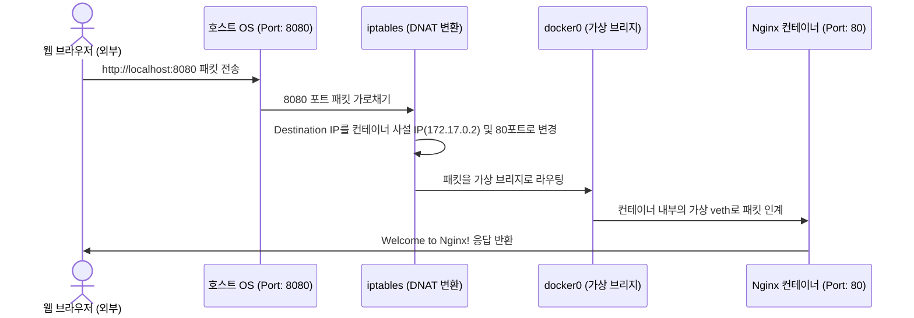

# [Day 1] 이론 강의: 컨테이너 실행

> 💡 **쉽게 이해하는 비유 (Analogy Box)**
> - **독립된 샌드박스 방과 전용 창문**
>   - 내 컴퓨터에 직접 여러 프로그램(Nginx, DB 등)을 그냥 띄우는 것은 한 방에 여러 사람이 칸막이도 없이 들어가 메가폰을 들고 시끄럽게 떠드는 것과 같습니다. 서로 목소리가 겹쳐 소통이 꼬이고(포트 충돌), 한 명이 쓰러지거나 기동에 실패하면 누구 때문에 방 전체가 엉망이 되었는지 원인을 찾기 힘듭니다.
>   - 컨테이너를 실행하는 것은 각각의 사람을 방음이 완벽한 **독립된 방(컨테이너)**에 밀어 넣는 것입니다. 그리고 그 방에 외부와 소통할 수 있는 **전용 창문(포트 매핑)**을 하나씩 뚫어주어, 서로 간섭 없이 오직 창문으로만 안전하게 대화하게 만듭니다.

---

## 1. 없으면 어떤 점이 불편한가?

개발용 웹 서버나 테스트용 데이터베이스를 여러 개 띄워야 할 때 호스트 OS에서 직접 프로세스를 실행하면 아래와 같은 치명적인 불편함을 겪습니다.

* **포트 충돌의 악몽 (Address already in use)**
  - 이미 Nginx가 80번 포트를 쓰고 있는데 다른 프로젝트 테스트를 위해 또 다른 웹 서버를 띄우면 `java.net.BindException: Address already in use` 에러가 나며 실행에 실패합니다.
  - 이를 회피하려면 매번 설정 파일로 들어가 포트 번호를 수동으로 다르게 뜯어고쳐야 하며, 어떤 포트가 내 PC에서 미사용 중인지 검색하는 리소스 낭비가 발생합니다.
* **유령 프로세스와 수동 리소스 회수**
  - 백그라운드로 실행한 node나 spring 부트 프로세스가 터미널 창을 닫은 후에도 호스트 OS 백그라운드에 좀비처럼 살아남아 메모리를 계속 점유하는 경우가 흔합니다.
  - 이를 종료하기 위해 `ps -ef | grep java` 또는 `netstat -ano` 같은 명령어로 PID를 찾아내서 `kill -9 <PID>` 또는 `taskkill /F /PID <PID>`를 일일이 수동으로 입력해 주어야 합니다.
* **파일시스템 오염 (설치 찌꺼기)**
  - 임시 테스트를 마치고 소프트웨어를 삭제(Uninstall)해도 레지스트리, 라이브러리 캐시 폴더, 설정 파일 등이 디스크 구석구석에 남아 시스템을 점차 무겁고 복잡하게 만듭니다.

---

## 2. 왜 필요할까?

호스트 컴퓨터의 운영체제는 기본적으로 **모든 네트워크 인터페이스 포트와 파일시스템 디렉터리를 가동되는 모든 프로세스가 공유하도록 설계**되어 있습니다. 이 공유 모델은 단일 프로그램 운영에는 편리하지만 다중 애플리케이션의 격리에는 극히 불리합니다.

자원 충돌을 방지하고 프로세스를 깔끔하게 통제하기 위해서는 다음과 같은 기술적 요구사항이 충족되어야 합니다.
1. **네트워크 격리**: 프로세스마다 독립적인 포트 영역과 가상 IP 주소를 할당받아, 호스트와의 포트 충돌 우려를 근원적으로 배제해야 합니다.
2. **독립 파일시스템**: 프로세스가 기동될 때 오직 그 프로세스만을 위한 독립된 루트 파일시스템을 마운트하고, 종료 시 그 안에서 생성된 변경 내용이 호스트를 더럽히지 않도록 완전히 자동 폐기할 수 있어야 합니다.
3. **간결한 수명주기 통제**: 프로세스의 시작, 일시중지, 완전 소멸을 통일된 명령 프로토콜(도커 CLI 등)로 정밀하게 제어할 수 있어야 합니다.

---

## 3. 이것은 무엇인가?

> **핵심 한 줄 요약**:
> *"도커 컨테이너 실행은 **애플리케이션을 외부와 차단된 독립 공간에 가두고**, 문지기 역할을 하는 **포트(창문)를 통해서만 안전하게 대화하게 만드는 기술**이다."*

<details>
<summary><b>🔍 컨테이너의 6단계 생명주기 (Lifecycle)</b></summary>

도커 컨테이너는 단순히 '실행 중인 상태'만 존재하는 것이 아닙니다. 도커 엔진은 프로세스의 생성부터 소멸까지를 다음과 같은 정밀한 상태 머신(State Machine)으로 통제합니다.

1. **Created**: 이미지로부터 컨테이너 격리 공간(네임스페이스 및 파일시스템)이 조립되었지만, 내부 메인 프로세스(PID 1)는 아직 기동되지 않은 정지 상태입니다. (`docker create` 명령어에 대응)
2. **Running**: 컨테이너 내부의 메인 프로세스가 활성화되어 동작 중인 상태입니다. 이 메인 프로세스가 살아있는 한 컨테이너는 계속 실행 상태를 유지합니다.
3. **Paused**: 기동 중인 프로세스를 커널 수준에서 일시 중지시킨 상태입니다. CPU 연산 할당은 완전히 중단되지만, 컨테이너가 점유하고 있던 메모리(RAM) 상태는 고스란히 보존됩니다. (`docker pause`로 제어)
4. **Restarting**: 컨테이너가 에러 등으로 종료되었을 때, 재시작 정책(`--restart`)에 의해 도커 엔진이 프로세스를 다시 띄우고 있는 과도기적 상태입니다.
5. **Exited**: 메인 프로세스의 임무가 끝나거나 에러로 인해 실행을 멈춘 상태입니다. 메모리는 모두 해제되지만, 실행 중에 디스크에 썼던 임시 파일과 로그 기록은 여전히 디스크에 보존되어 있어 복구 및 사후 분석이 가능합니다.
6. **Dead**: 컨테이너가 부분적으로 파괴되거나 호스트 OS와의 연결이 끊겨 정상적으로 Exited 되지 못하고 멈춰버린 복구 불가능한 에러 상태입니다.
</details>

<details>
<summary><b>🔍 포트 포워딩 (Port Forwarding) 과 iptables DNAT</b></summary>

격리된 컨테이너는 외부와 완전히 단절된 가상 네트워크 브리지(`docker0`) 영역에서 고유한 사설 IP(예: `172.17.0.2`)를 부여받습니다. 외부(브라우저 등)에서 이 컨테이너로 접속하게 하려면 호스트 OS의 실제 네트워크 카드 포트와 컨테이너 포트를 결합해야 합니다.
- **포트 포워딩 원리**: 도커 데몬은 컨테이너 구동 시 호스트 리눅스 커널의 방화벽 테이블(`iptables`)에 **DNAT(Destination NAT)** 규칙을 자동으로 주입합니다.
- 호스트의 특정 포트(예: 8080)로 유입되는 모든 TCP/IP 패킷의 헤더 정보를 실시간으로 수정하여, 목적지 IP를 컨테이너의 사설 IP(`172.17.0.2`)로, 목적지 포트를 컨테이너 내부 포트(`80`)로 실시간 변환하여 호스트와 컨테이너 간의 네트워크 가교를 완성합니다.
</details>

<details>
<summary><b>🔍 Foreground vs Background (Detached) 모드와 시그널 제어</b></summary>

- **Foreground 모드 (기본값)**: 터미널 창과 컨테이너의 표준 입출력(`stdout`, `stderr`)이 직접 연결됩니다. 터미널에서 `Ctrl+C`를 입력하면 도커 데몬을 통해 컨테이너 내부의 PID 1 프로세스로 `SIGINT` 시그널이 전달되어 프로세스가 정상 종료됩니다. 터미널 세션이 끊기면 프로세스도 함께 소멸합니다.
- **Background 모드 (`-d` 옵션)**: 컨테이너가 호스트의 백그라운드 데몬 프로세스로 기동됩니다. 터미널 창을 닫아도 영향을 받지 않으며, 오직 `docker stop` 명령어를 통해 명시적으로 `SIGTERM` 시그널을 보내야만 안전하게 기동을 종료합니다.
</details>

<details>
<summary><b>🔍 컨테이너 종료 시의 에러 번호 (Exit Code) 해석</b></summary>

컨테이너가 종료되었을 때 `docker ps -a` 명령을 치면 `Exited (N)` 형태의 종료 코드가 표시됩니다. 이 숫자는 장애의 원인을 밝히는 중요한 나침반입니다.
- **Exit Code 0**: 프로그램이 에러 없이 자신의 임무를 완수하고 정상 종료되었음을 뜻합니다.
- **Exit Code 1**: 일반적인 애플리케이션 런타임 에러(예: 자바 예외 발생, 설정 누락 등)로 인해 프로그램이 비정상 종료된 상태입니다.
- **Exit Code 127**: 컨테이너를 실행하기 위해 정의된 명령어(Command)나 바이너리 파일이 컨테이너 내부 이미지 경로에서 존재하지 않을 때 반환되는 코드입니다.
- **Exit Code 137**: 컨테이너가 **강제 종료(SIGKILL)** 되었음을 의미합니다. 대표적으로 호스트 OS의 메모리가 부족하여 커널 OOM(Out Of Memory) Killer가 컨테이너 프로세스를 강제로 사살했을 때 발생합니다.
- **Exit Code 143**: 컨테이너가 **정상적인 종료 요청(SIGTERM)**을 받고 안전하게 종료(Graceful Shutdown) 절차를 수행했음을 의미합니다.
</details>

### 📊 포트 포워딩(Port Forwarding) 작동 메커니즘



---

## 4. 장점과 단점

### 1) 장점
* **자원 독립을 통한 포트 충돌의 완전한 방지**
  - 호스트 OS에서 80 포트를 점유하고 있더라도, 10개의 Nginx 컨테이너를 띄우고 호스트 포트를 `8081:80`, `8082:80`, `8083:80` 등으로 각각 매핑해 주면 아무런 에러 없이 완벽히 병렬 작동합니다.
* **샌드박스 안정성과 간편한 회수**
  - 컨테이너 내부에서 아무리 악의적인 파일 쓰기나 라이브러리 오염이 발생하더라도, `docker rm` 명령어로 컨테이너를 지우면 단 1초 만에 흔적도 남지 않고 깨끗하게 소멸됩니다.

### 2) 단점과 주의점
* **간접적인 디버깅 구조**
  - 프로세스가 독자적인 Namespace 파일시스템에 갇혀 있기 때문에, 실시간 파일 상태나 시스템 자원을 조회하기 위해서는 `docker exec -it <container> bash` 형태로 격리 공간에 명시적으로 침입해야 하므로 작업 공수가 한 단계 추가됩니다.
* **PID 1 프로세스 관리 한계 (Zombie Process)**
  - 컨테이너 내의 메인 프로세스(PID 1)는 본래의 OS처럼 하위 프로세스들의 종료 시그널을 회수하는 이니셜라이징(`init`) 시스템 역할을 제대로 수행하지 못하는 경우가 많습니다. 이로 인해 컨테이너 내부에서 좀비 프로세스가 무한히 증식해 시스템 자원을 갉아먹는 설계 오염이 일어날 수 있습니다.

---

## 5. 어떻게 쓰는가?

가장 널리 사용되는 Nginx 웹 서버 이미지를 바탕으로 컨테이너를 구동하고, 백그라운드 제어 및 모니터링을 진행하는 실무 핵심 명령어 가이드입니다.

```powershell
# 1. Nginx 컨테이너를 백그라운드(-d)로 실행하고 호스트 포트 8080과 컨테이너 포트 80을 연결(-p)
# (--name 옵션으로 컨테이너에 고유한 별칭을 부여합니다)
docker run -d -p 8080:80 --name my-webserver nginx

# 2. 실행 중인 컨테이너 리스트 및 상태 점검 (사설 IP 및 포트 포워딩 현황 확인)
docker ps

# 3. 종료된 컨테이너까지 포함하여 전체 목록 조회 (Exit Code 상태 확인)
docker ps -a

# 4. 백그라운드로 작동하는 컨테이너의 표준 출력을 터미널에 실시간 스트리밍(-f)
docker logs -f my-webserver

# 5. 구동 중인 컨테이너의 네임스페이스 공간으로 침입하여 대화형 셸(bash) 실행
docker exec -it my-webserver bash

# 6. 실행 중인 컨테이너에 정상 종료 시그널(SIGTERM)을 보내어 정지
docker stop my-webserver

# 7. 정지된 컨테이너의 격리 공간 및 임시 파일 완전 폐기
docker rm my-webserver
```

### 💡 강사 팁: 포트 충돌 시 자가 검증 방법
- `docker run` 시 `port is already allocated` 에러가 발생한다면 현재 호스트 PC에서 해당 포트(예: 8080)를 다른 프로그램이 선점하고 있는 상태입니다. 
- Windows에서는 `netstat -ano | findstr 8080` 명령어로 해당 포트를 물고 있는 PID를 확인한 후 작업 관리자에서 종료하거나, `docker run -p 9090:80` 처럼 호스트 포트를 겹치지 않는 다른 값으로 변경하여 즉각 우회하십시오.
