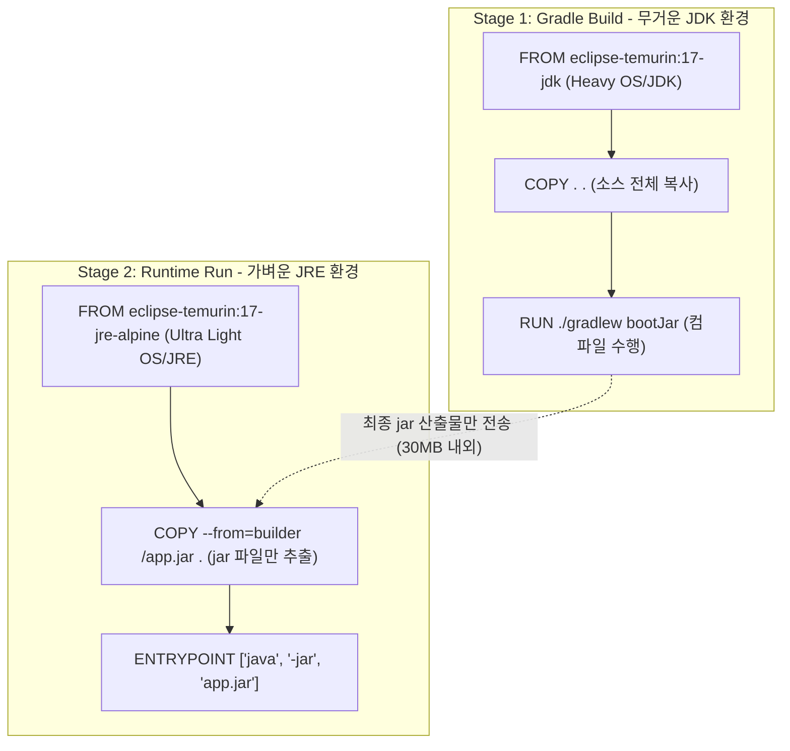

# [Day 1] 이론 강의: 이미지 빌드

> 💡 **쉽게 이해하는 비유 (Analogy Box)**
> - **밀키트 조리 설명서와 미리 씻어둔 채소 상자**
>   - 수동 배포는 요리를 할 때마다 매번 요리책을 정독하며 마트에 가고, 채소를 씻고 껍질을 벗겨 가스레인지 불을 조절해가며 조리하는 것과 같습니다. 매번 조리 시간이 수십 분씩 걸리며, 만드는 사람의 미세한 버릇이나 환경에 따라 요리의 품질(작동 결과)이 쉽게 달라집니다.
>   - **Dockerfile**은 요리를 완성품 형태로 급속 동결하는 '밀키트 자동 포장 설명서'입니다. 이 설명서를 도커 엔진이라는 자동 조달 로봇에 넣으면 1초 만에 완벽한 냉동 밀키트(이미지)가 사출됩니다.
>   - **레이어 캐싱**은 이미 손질이 완료된 채소 상자입니다. 조리법 중 "베이스 소스 끓이기"와 "채소 세척 및 썰기" 단계가 이전 조리 기록과 완전히 같다면, 굳이 채소를 새로 씻지 않고 미리 썰어서 담아둔 채소 상자(캐시 레이어)를 그대로 가져다 냄비에 얹습니다. 이로 인해 전체 조리 시간을 수 초 이내로 단축할 수 있습니다.

---

## 1. 없으면 어떤 점이 불편한가?

전통적인 소프트웨어 배포 아키텍처에서는 새로운 VM이나 물리 서버에 애플리케이션을 구동하기 위해 운영자가 다음과 같은 수작업의 늪을 거쳐야만 했습니다.

* **배포 매뉴얼 위키 문서의 노후화**
  - "1단계: Ubuntu OS의 패키지 매니저를 업데이트한다. 2단계: Java JDK 17을 특정 경로에 압축 해제하고 `JAVA_HOME`을 설정한다. 3단계: 특정 사용자 계정을 생성하고 `/var/app` 폴더를 생성하여 실행 권한을 부여한 뒤 빌드된 jar 파일을 업로드한다..."와 같이 수십 줄의 텍스트로 적힌 매뉴얼을 수동으로 수행합니다.
  - 이 과정에서 명령어 입력 중 오타가 발생하거나, 방화벽 포트 활성화 단계를 단 하나라도 누락하면 전체 배포 파이프라인이 즉각 깨집니다. 게다가 소프트웨어 버전이 올라갈 때 문서가 제때 현행화되지 않으면 잘못된 가이드를 따라 배포 삽질이 무한히 반복됩니다.
* **복제 불가능한 예술 작품 서버 (Snowflake Server)**
  - 특정 서버가 수년간 운영되면서 수동 긴급 핫픽스 패치, 자잘한 라이브러리 업데이트, 수동 OS 설정 튜닝 등이 누적되면, 기존 서버와 100% 동일한 상태를 지닌 자매 서버(Scale-Out 대상)를 추가 빌드하는 것이 통계적으로 아예 불가능해집니다.
  - 이로 인해 서버는 누구도 쉽게 건드릴 수 없는 유일무이한 '예술 작품'으로 전락하고, 장애 발생 시 원인을 파악하기 힘든 복잡성에 직면합니다.

---

## 2. 왜 필요할까?

인프라의 설정 정보와 애플리케이션의 설치 전 과정이 **운영자의 기억이나 위키 텍스트 매뉴얼에만 결합되어 있기 때문**입니다.

이 문제를 극복하려면 소프트웨어를 실행하기 위한 토대(OS 패키지, 설정, 런타임 의존성) 전체를 소스 코드의 형태로 작성하여 깃(Git)에 올리고, 장비에 상관없이 100% 동일한 아티팩트로 만들어낼 수 있는 **IaC(Infrastructure as Code)** 사상이 정착되어야 합니다.
- **이미지의 불변성 (Immutability)**: 빌드된 이미지는 결코 변경할 수 없는 스냅샷이어야 하며, 수정이 필요하면 새로운 이미지를 다시 굽는 방식이어야 합니다.
- **스마트한 증분식 빌드(Incremental Build)**: 변경 사항이 소스 코드 1줄에 불과할 때, 무거운 자바 가상머신이나 OS 패키지를 매번 처음부터 다시 내려받아 새로 설치하지 않고 변경된 결과물만 신속하게 구워내는 **레이어 기반 빌드 캐시 시스템**이 필수적으로 수반되어야 합니다.

---

## 3. 이것은 무엇인가?

> **핵심 한 줄 요약**:
> *"도커 이미지 빌드는 **애플리케이션이 살 방을 꾸미는 모든 과정을 텍스트 설계도(Dockerfile)로 선언**하고, 각 단계를 **독립된 디스크 층(Layer)으로 쌓아 올리며 재사용하는 최적화 빌드 기술**이다."*

<details>
<summary><b>🔍 겹겹이 쌓아 올리는 디스크: Union File System (Overlay2)</b></summary>

도커 이미지는 하나의 거대한 단일 파일이 아닙니다. 여러 개의 읽기 전용(Read-Only) 레이어가 마치 투명한 OHP 필름처럼 차곡차곡 적층된 구조입니다.
- **Union File System (Overlay2)**: 도커는 여러 디렉터리를 하나의 논리적인 루트 파일시스템으로 융합(Union Mount)하여 컨테이너에 제공합니다.
  - 하위 레이어에 동일한 파일이 있더라도 상위 레이어에 새로운 파일이 복사되면 상위 파일이 하위 파일을 덮어쓰고 통합 파일시스템(Merged View)으로 보여줍니다.
- **Copy-on-Write (CoW) 작동 원리**:
  - 이미지를 실행하여 컨테이너가 가동되는 순간, 읽기 전용 레이어 최상단에 **단 하나의 쓰기 가능한 레이어(Container Layer)**가 새로 생겨납니다.
  - 컨테이너 내부에서 기존 파일(예: `/etc/hosts`)을 수정하려고 하면, 도커 엔진은 읽기 전용 레이어에 존재하는 원본 파일을 건드리지 않고, 이를 최상단 쓰기 가능 레이어로 복사(Copy)해 온 뒤에 쓰기(Write) 작업을 수행합니다. 이로 인해 원본 이미지 레이어는 항상 100% 손상 없이 보존되며 다수의 컨테이너가 하나의 이미지를 안전하게 동시 공유할 수 있습니다.
</details>

<details>
<summary><b>🔍 캐시를 무효화하는 도커의 룰 (Cache Invalidation)</b></summary>

도커 빌드 엔진은 `Dockerfile`을 위에서부터 한 줄씩 실행하며 매 줄마다 가상의 컨테이너를 띄우고 임시 쓰기 레이어를 커밋하여 새 레이어를 만듭니다.
- **레이어 캐시 조건**: 빌드를 수행할 때, 이전에 빌드했던 히스토리를 확인하여 `Dockerfile`의 명령어 텍스트 및 관련 파일 상태가 완벽히 동일하면 실제로 명령을 실행하지 않고 기존 레이어를 재사용(`Using cache`)합니다.
- **캐시 브레이크(Cache Break)의 연쇄 효과**:
  - 만약 `COPY` 또는 `ADD` 지시어로 지정된 소스 파일들의 체크섬(Checksum)이 변경되는 등 특정 라인에서 캐시 미스가 발생하면, **그 줄을 포함한 그 하위의 모든 명령어는 이전에 캐시된 레이어가 있더라도 강제로 전체 캐시가 무효화**되어 처음부터 새로 연산 및 다운로드를 수행하게 됩니다.
  - 따라서 변하지 않는 명령어(`FROM`, `RUN apt-get install`)를 상단에 배치하고, 자주 바뀌는 소스 코드 복사(`COPY src/`)는 가장 하단에 배치해야 빌드 시간을 극적으로 줄일 수 있습니다.
</details>

<details>
<summary><b>🔍 RUN vs CMD vs ENTRYPOINT 의 명확한 차이</b></summary>

세 지시어 모두 명령어를 실행하는 역할을 하여 초보자가 가장 혼동하기 쉽습니다. 하지만 그 시점과 목적은 완전히 다릅니다.

1. **RUN (Build-Time)**:
   - **실행 시점**: 이미지 빌드(도커 파일 구울 때) 중 레이어를 생성하는 단계.
   - **목적**: 필요한 패키지를 설치하거나, 빌드를 빌드 타임에 수행하여 완성 파일(jar 등)을 이미지 레이어 안에 영구 보관하기 위함.
2. **ENTRYPOINT (Run-Time - 고정 명령)**:
   - **실행 시점**: 컨테이너가 생성되어 시작될 때.
   - **목적**: 컨테이너가 구동될 때 실행될 **핵심 프로그램의 명령**을 정의합니다. 기본적으로 사용자가 `docker run` 시 명령 인자를 추가하더라도 무너지거나 무시되지 않고 강제 가동됩니다.
3. **CMD (Run-Time - 가변 인자)**:
   - **실행 시점**: 컨테이너가 생성되어 시작될 때.
   - **목적**: 컨테이너 실행 시 디폴트로 수행할 예비 명령이나, `ENTRYPOINT`에 전달할 **기본 파라미터 값**을 기재합니다. 사용자가 `docker run <cmd>`로 뒤에 새로운 명령어를 명시하면 CMD에 적힌 내용은 완전히 덮어써져 무시됩니다.
- **Exec Form vs Shell Form**:
  - **Shell Form (`CMD java -jar app.jar`)**: 명령어 앞에 `/bin/sh -c`가 자동으로 래핑되어 실행됩니다. 이 방식은 OS 환경변수 확장은 가능하나, 호스트가 전송한 `SIGTERM` 종료 시그널이 내부 JVM 프로세스로 전달되지 못해 Graceful Shutdown이 불가능하고 10초 대기 후 강제 사살(SIGKILL)되는 문제가 유발됩니다.
  - **Exec Form (`CMD ["java", "-jar", "app.jar"]`)**: 셸의 개입 없이 지정한 바이너리가 직접 컨테이너의 PID 1 프로세스로 가동됩니다. 시그널 전달이 정상적으로 작동하므로 **실무 운영 환경에서는 무조건 Exec Form 사용을 지향**해야 합니다.
</details>

<details>
<summary><b>🔍 이미지 다이어트 기술: 멀티 스테이지 빌드 (Multi-Stage Build)</b></summary>

일반적으로 Java 애플리케이션을 빌드하려면 JDK 17(용량 약 300MB+), Gradle 컴파일러 도구 등이 이미지 빌드 타임에 필요합니다. 그러나 완성된 `app.jar`를 실제로 실행할 때(런타임)는 가벼운 JRE 17(용량 약 100MB)만 있으면 충분합니다.
- **멀티 스테이지 빌드**: 단일 Dockerfile 안에 여러 개의 `FROM` 절을 선언하여 빌드 단계를 나누는 아키텍처입니다.
  - 첫 번째 스테이지(builder)에서 무겁고 강력한 JDK 도구들을 활용해 컴파일을 완료하고,
  - 두 번째 스테이지에서는 가벼운 경량 OS/JRE만 준비한 뒤, 첫 번째 스테이지의 산출물인 `app.jar` 파일만 `COPY --from` 지시어로 쏙 빼와 최종 이미지를 사출합니다.
  - 이 최적화를 통해 최종 배포용 이미지 용량을 획기적으로 줄여(예: 800MB ➡️ 180MB), 클러스터 네트워크의 배포 병목 현상을 방지합니다.
</details>

### 📊 Dockerfile 빌드 레이어 적층 및 멀티 스테이지 최적화 흐름



---

## 4. 장점과 단점

### 1) 장점
* **인프라 환경의 완전한 코드화 (IaC)**
  - 애플리케이션에 필요한 환경(OS 패치 수준, JDK 릴리즈 등)이 텍스트 코드 문서 형태로 개발 저장소에 관리되므로 형상 관리(Git)를 통해 인프라 변천사를 추적하고 즉시 롤백할 수 있습니다.
* **디스크 절약과 네트워크 전송 속도 향상**
  - 공통 베이스 OS 레이어를 여러 이미지가 완벽하게 공유하므로 수십 개의 이미지 버전을 보관하더라도 실제 디스크 용량 증분치는 미미합니다.

### 2) 단점과 주의점
* **캐시 설계 오염에 따른 빌드 병목**
  - Dockerfile 지시어의 선언 순서를 잘못 설계하면(예: 빌드 라이브러리 다운로드보다 소스 복사를 먼저 수행), 개발자가 코드를 수정할 때마다 의존성 라이브러리를 매번 새로 다운로드하여 빌드 속도가 극도로 처참해지는 원인이 됩니다.
* **불필요한 레이어 파편화**
  - Dockerfile 내의 매 `RUN` 지시어마다 고유한 레이어(새로운 디스크 파일)가 물리적으로 생성됩니다. 따라서 `RUN apt-get update`와 `RUN apt-get install`을 한 줄로(`&&`) 합치지 않고 쪼개어 적으면 이미지 내부에 찌꺼기 파일이 영구 적층되어 이미지 크기가 불필요하게 부풀어 오르는 안티 패턴이 발생합니다.

---

## 5. 어떻게 쓰는가?

의존성 캐싱 최적화와 멀티 스테이지 빌드 기법이 정교하게 구현된 실무형 Spring Boot `Dockerfile` 구조 및 빌드 명령어 템플릿입니다.

### 1) 실무형 `Dockerfile` 템플릿 예시
```dockerfile
# ==========================================
# 1단계: 빌드 전용 임시 스테이지 (builder)
# ==========================================
FROM eclipse-temurin:17-jdk-jammy AS builder
WORKDIR /build

# 캐시 최적화: 의존성 정의 파일만 먼저 복사
COPY gradlew .
COPY gradle gradle
COPY build.gradle settings.gradle .

# 의존성 패키지 캐싱 빌드 (소스 코드 없이 빌드 도구와 라이브러리 레이어만 선제 확보)
RUN ./gradlew dependencies --no-daemon

# 실제 애플리케이션 소스 코드 복사 (이후 단계부터는 코드 수정 시 캐시가 깨짐)
COPY src src

# 실제 jar 패키징 수행 (테스트는 스킵)
RUN ./gradlew bootJar --no-daemon

# ==========================================
# 2단계: 실행 전용 최종 배포 스테이지 (runtime)
# ==========================================
FROM eclipse-temurin:17-jre-alpine
WORKDIR /app

# builder 스테이지에서 생성된 최종 jar 바이너리만 선별 복사 (JDK, Gradle 등 찌꺼기 제거)
COPY --from=builder /build/build/libs/*.jar app.jar

# 환경 변수 선언
ENV SPRING_PROFILES_ACTIVE=prod

# 포트 개방 명시 (문서화 역할)
EXPOSE 8080

# Exec Form을 활용해 자바 프로세스를 PID 1로 직접 가동하여 Graceful Shutdown 지원
ENTRYPOINT ["java", "-jar", "app.jar"]
```

### 2) 빌드 및 검증 명령어 흐름
```powershell
# 1. 특정 태그(-t)를 달아 현재 디렉토리(.)에서 빌드 수행 (최초 빌드 시 빌드 로그 상세 관찰)
docker build -t todo-app:1.0 .

# 2. 소스 코드 수정 후 2차 빌드 실행하여 'CACHED' 레이어 활용도 검증
docker build -t todo-app:1.1 .

# 3. 이미지 내 적층된 레이어 크기 및 생성 이력(history) 추적
docker history todo-app:1.0
```
