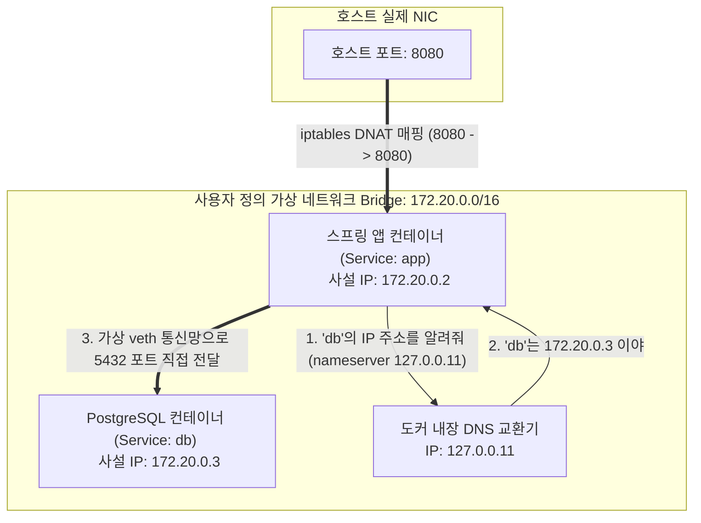

# [Day 1] 이론 강의: Docker Compose

> 💡 **쉽게 이해하는 비유 (Analogy Box)**
> - **아파트 전용 인터폰 시스템**
>   - 수동 연결 방식은 옆집(DB 컨테이너) 친구에게 전화를 걸기 위해 매번 옆집 사람이 가지고 있는 임시 휴대전화 번호(컨테이너가 기동 시 새로 할당받은 가변 사설 IP)를 물어보고 다이어리에 직접 수동으로 적은 다음 전화를 거는 것과 같습니다. 친구가 폰을 껐다 켜서 번호가 바뀌면 전화를 전혀 걸 수 없습니다.
>   - **Docker Compose**는 이 컨테이너들을 하나의 '아파트 단지(프로젝트 스택)'에 몰아넣고 단지 내 **전용 인터폰망(가상 네트워크)**을 개설하는 것입니다. 이제 복잡한 폰 번호 대신 기계에 등록된 이웃 이름인 `db` 또는 `app` 버튼(서비스 명칭)만 누르면, 단지 내 교환원(내장 DNS)이 알아서 현재 실시간으로 활성화되어 있는 IP로 인터폰 통화를 즉시 연결해 줍니다.

---

## 1. 없으면 어떤 점이 불편한가?

실무 애플리케이션은 스프링 부트 서버 하나만 덜렁 떠서 작동하지 않습니다. 뒤쪽의 PostgreSQL 같은 데이터베이스, Redis 캐시 서버, 외부 API 게이트웨이 등 여러 외부 독립 시스템들과 유기적으로 연동되어 기동됩니다.
이러한 다중 컨테이너 환경을 수동 명령어로만 관리하면 다음과 같은 고질적인 문제에 부딪힙니다.

* **가변 사설 IP 변경에 따른 설정 수정 지옥**
  - 도커 데몬은 컨테이너가 켜지는 순서에 따라 사설 IP(예: `172.17.0.2`, `172.17.0.3` 등)를 차례대로 할당합니다.
  - 따라서 DB 컨테이너를 먼저 올린 뒤 `docker inspect` 명령어로 사설 IP 주소를 찾아내고, 스프링 앱 설정 파일(`application.properties`)의 DB 접속 URL 주소인 `jdbc:postgresql://172.17.0.x:5432/...` 부분을 매번 수동으로 고친 후 앱 컨테이너를 올려야 합니다.
  - 만약 DB에 장애가 나서 컨테이너를 재시작하여 IP가 변경되는 순간, 스프링 컨테이너는 기존 IP로 패킷을 계속 보내며 영구적인 데이터베이스 접속 에러(Connection Refused)를 내뿜고 좀비 상태로 변해버립니다.
* **레이스 컨디션(Race Condition)과 기동 순서 수동 제어**
  - 스프링 부트 애플리케이션이 켜질 때, 영속성 프레임워크(JPA 등)는 즉시 PostgreSQL 데이터베이스 포트에 소켓 접속을 시도하여 스키마를 검증합니다. 이때 PostgreSQL 서버 엔진이 아직 완전하게 부팅을 완료하지 않았다면 스프링은 기동에 즉시 실패하며 다운됩니다.
  - 이를 방지하기 위해 강사나 운영자는 눈으로 DB 기동 로그를 한참 모니터링하다가 "PostgreSQL database system is ready to accept connections" 문구가 뜨는 것을 확인하고 나서 비로소 스프링 실행 명령을 직접 터미널에 타격해야 합니다. 컨테이너 개수가 10개 이상으로 늘어나면 이 수동 실행 작업의 난이도는 극도로 상승합니다.

---

## 2. 왜 필요할까?

개별 컨테이너들이 **아무런 통신 링크가 없는 독립된 격리 네트워크 상태로 파편화**되어 작동하고 있으며, 여러 컨테이너 간의 결합 명세와 환경 변수가 물리적인 설계 문서 없이 분산되어 존재하기 때문입니다.

이를 해결하기 위해서는 다음과 같은 기술적 토대가 구축되어야 합니다.
1. **사용자 정의 가상 네트워크 (User-defined Bridge)**: 컨테이너들이 실제 호스트 IP나 가변 사설 IP에 의존하지 않고, 오직 고정된 **서비스 호스트 이름(Service Name)**으로 서로를 언제든 찾아갈 수 있도록 내부적인 도메인 네임 서버(DNS) 교환기가 갖춰진 가상 네트워크가 필요합니다.
2. **다중 컨테이너 오케스트레이션 선언서 (YAML)**: 다중 컨테이너의 포트 바인딩, 네트워크 연결 관계, 볼륨 공유, 환경 변수 주입 정보 및 구동 순서(Dependency) 일체를 한 장의 명세 문서로 코딩하여 명령어 한 줄로 전원 기동 및 회수를 자동화해야 합니다.

---

## 3. 이것은 무엇인가?

> **핵심 한 줄 요약**:
> *"Docker Compose 연동은 **여러 개별 컨테이너들을 하나의 사용자 정의 가상 네트워크로 묶고**, 서비스 명칭으로 **서로를 자동 탐색하여 유기적으로 동작시키는 다중 컨테이너 제어 기술**이다."*

<details>
<summary><b>🔍 사용자 정의 네트워크 vs 기본 브리지 네트워크 (veth pair 동작)</b></summary>

도커가 기본으로 제공하는 `bridge` 네트워크(일명 `docker0`)에 속한 컨테이너들은 서로 사설 IP를 통해서만 통신할 수 있으며, 컨테이너 이름 기반의 통신을 할 수 없습니다.
- **사용자 정의 네트워크 (User-defined Bridge)**: Docker Compose는 실행 시 프로젝트 전용의 독립 네트워크(예: `todo-app_default`)를 자동으로 신설합니다.
  - 이 커스텀 브리지 내에 연결되는 컨테이너들은 가상 이더넷 케이블 인터페이스(veth pair)를 통해 호스트의 가상 브리지 장비에 연결됩니다.
  - 패킷은 컨테이너 안의 `eth0` 인터페이스를 거쳐 호스트 측의 `veth` 인터페이스를 통해 브리지로 전달되며, 이 브리지 영역 내에서만 내장 도커 DNS의 이름 변환 및 내부 통신을 안전하게 수행할 수 있습니다.
</details>

<details>
<summary><b>🔍 내장 DNS (127.0.0.11) 와 resolv.conf 동작 구조</b></summary>

도커 엔진은 사용자 정의 네트워크에 참여하는 모든 컨테이너 내부의 `/etc/resolv.conf` 설정 파일에 DNS 네임서버 주소를 **`nameserver 127.0.0.11`**로 강제 지정합니다.
- **이름 해석 흐름**:
  1. 스프링 앱에서 `jdbc:postgresql://db:5432`로 연결을 시도하면, 컨테이너 내부의 네임스페이스 resolver는 먼저 `127.0.0.11` 주소로 `db`에 대한 IP 조회 요청(DNS Query)을 보냅니다.
  2. 도커 데몬의 루프백 네트워크 엔진이 이 DNS 쿼리 트래픽을 가로채서, 현재 동일 가상 네트워크 내에서 구동 중인 서비스 이름이 `db`인 컨테이너의 실시간 사설 IP(예: `172.20.0.3`)를 도커 내부 컨테이너 상태 테이블에서 매핑하여 즉시 응답해 줍니다.
  3. 이 아키텍처 덕분에 IP 가변성에 구애받지 않고 언제나 `db`라는 영구 도메인 주소로 통신할 수 있습니다.
</details>

<details>
<summary><b>🔍 depends_on의 치명적 한계와 healthcheck를 활용한 레이스 컨디션 해결</b></summary>

많은 개발자들이 `depends_on`을 적용하면 모든 기동 순서 에러가 해결될 것으로 오해합니다.
- **depends_on의 한계**:
  - `depends_on: [ db ]` 설정은 DB 컨테이너 프로세스가 **시작(Start)되는 순간** 스프링 앱 컨테이너를 띄우는 순서만 보장합니다.
  - 하지만 PostgreSQL 프로세스가 실행되어 커널 레벨에서 가동되는 것과, 내부 디스크 구조를 읽고 5432 포트 소켓 연결을 승인할 준비가 완료되는 시점(Ready) 사이에는 수 초의 지연이 존재합니다. 그 지연 시간 사이에 스프링 앱이 먼저 실행되면 여전히 커넥션 예외로 앱이 죽게 됩니다.
- **해결책 (healthcheck 연동)**:
  - DB 서비스 측에 `healthcheck`를 기술하여 `pg_isready` 명령으로 DB 정상 가동을 매초 체크하도록 선언합니다.
  - 스프링 앱의 `depends_on` 명세에 단순 나열이 아닌, **`condition: service_healthy`** 제약을 부여합니다. 이를 통해 도커 엔진은 DB의 헬스체크가 최종 성공 신호(Healthy)를 보낼 때까지 스프링 컨테이너의 기동 자체를 홀딩하고 대기시킵니다.
</details>

### 📊 Docker Compose 네트워크와 이름 기반 서비스 탐색(DNS) 원리



---

## 4. 장점과 단점

### 1) 장점
* **가변 IP의 완벽한 추상화**
  - 설정 코드에서 매번 변하는 사설 IP 주소 대신, 고정된 이름(`db`)만 바라보면 되므로 네트워크 장애 리스크를 근본적으로 차단합니다.
* **단일 파일 기반 멀티 컨테이너 형상 관리**
  - 애플리케이션의 결합 구조(버전, 포트, 볼륨 마운트, 의존성 관계)를 `compose.yml` 파일 하나로 버전 관리(Git)할 수 있어, 개발 팀 전체가 동일한 복합 테스트 환경을 순식간에 복제해 공유합니다.

### 2) 단점과 한계
* **단일 호스트 물리 서버 종속 (Single Host Limitation)**
  - Docker Compose는 기본적으로 **단일 노드(하나의 물리 서버 또는 내 PC 한 대)** 위에서만 컨테이너들을 엮어줍니다.
  - 만약 운영 환경의 스케일아웃을 위해 3대의 실 서버로 웹 서버 컨테이너 10개와 DB 3개를 분산해서 올리고 로드 밸런싱해야 한다면, Compose 네트워크는 호스트 경계를 넘어 패킷을 목적지로 전달할 수 없습니다. 이 시점이 바로 다중 노드를 총괄 조율하는 **Kubernetes**로 전환해야 하는 기술적 경계선입니다.

---

## 5. 어떻게 쓰는가?

스프링 부트 어플리케이션과 PostgreSQL 데이터베이스를 엮어서 기동하기 위해 작성된 실무형 `compose.yml` 템플릿과 헬스체크 제어 명령어 사용법입니다.

### 1) 실무형 `compose.yml` 템플릿 예시
```yaml
version: '3.8'

networks:
  # 프로젝트 전용 가상 네트워크 선언
  todo-net:
    driver: bridge

services:
  db:
    image: postgres:15-alpine
    container_name: todo-postgres
    environment:
      POSTGRES_DB: tododb
      POSTGRES_USER: todo-user
      POSTGRES_PASSWORD: todo-password
    ports:
      - "5432:5432"  # 호스트에서 DB 툴로 접속 검증할 포트 연결
    volumes:
      - pgdata:/var/lib/postgresql/data
    networks:
      - todo-net
    # 레이스 컨디션 방지를 위한 DB 헬스체크 정의
    healthcheck:
      test: ["CMD-SHELL", "pg_isready -U todo-user -d tododb"]
      interval: 5s
      timeout: 5s
      retries: 5

  app:
    image: todo-app:1.0
    container_name: todo-springboot
    environment:
      # 가변 IP 대신 서비스 이름 'db'를 호스트네임으로 설정하여 통신
      SPRING_DATASOURCE_URL: jdbc:postgresql://db:5432/tododb
      SPRING_DATASOURCE_USERNAME: todo-user
      SPRING_DATASOURCE_PASSWORD: todo-password
    ports:
      - "8080:8080"
    networks:
      - todo-net
    depends_on:
      db:
        # DB의 프로세스 기동뿐 아니라, 헬스체크 상태가 Healthy가 될 때까지 대기
        condition: service_healthy

volumes:
  pgdata:
```

### 2) 제어 명령어 흐름
```powershell
# 1. 작성된 compose.yml 구성을 바탕으로 백그라운드 일괄 실행
# (자동으로 네트워크 및 볼륨이 확보되며 DB 헬스체크 대기가 이뤄집니다)
docker compose up -d

# 2. 실행된 연동 컨테이너 스택의 포트 및 헬스체크 상태(healthy) 상세 확인
docker compose ps

# 3. 스프링 앱과 DB 컨테이너에서 합쳐져서 올라오는 통합 스트림 로그 실시간 확인
docker compose logs -f

# 4. 연동 서비스를 중지하고, 생성되었던 가상 네트워크 카드 장비까지 안전하게 제거
docker compose down
```
