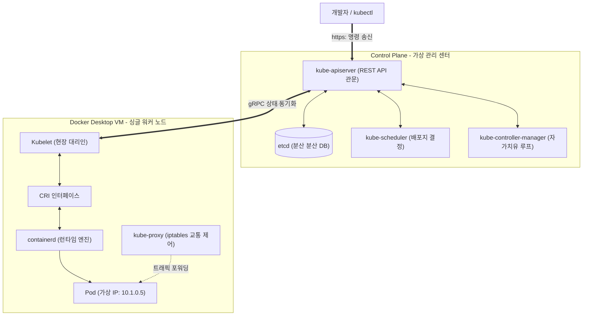

# [Day 1] 이론 강의: Kubernetes 로컬 준비

> 💡 **쉽게 이해하는 비유 (Analogy Box)**
> - **자율 주행 무인 화물선과 중앙 통합 관제센터**
>   - Docker Compose가 단일 부두(내 컴퓨터 한 대) 내에서 작은 화물차 몇 대를 직접 제어하는 현장 지휘관이라면, **Kubernetes**는 거대한 바다 위에 분산되어 떠 있는 수십, 수백 대의 **무인 화물선(물리 서버 노드들)**을 일괄 통제하는 **중앙 통합 관제센터**입니다.
>   - 화물선 한 대가 높은 파도에 휩쓸려 통신 불능(서버 물리 다운)이 되면, 관제센터는 즉시 다른 안전한 예비 화물선으로 화물(컨테이너)을 긴급 이적하고 항로를 자동 조율합니다.
>   - 로컬 Kubernetes를 활성화하는 것은 내 개인 PC(단일 노드) 안에 이 거대한 중앙 관제센터의 미니 컴퓨터용 시뮬레이터를 얹어 모든 관제 조작을 가상 테스트해 보는 것입니다.

---

## 1. 없으면 어떤 점이 불편한가?

애플리케이션 서비스의 트래픽 규모와 가용성 요구치가 높아지면서, 서버 장비가 1대에서 수십 대로 늘어나고 가동되는 컨테이너가 수십~수백 개로 확장되는 시점이 옵니다. 이때 단일 Docker 기반의 환경은 다음과 같은 운영적 장벽에 부딪힙니다.

* **새벽 3시 장애 복구를 위한 원격 수동 터미널 작업**
  - 서비스 중 특정 물리 서버 호스트 장비의 디스크가 뻗거나 메인보드가 다운되면, 해당 서버 위에서 가동 중이던 모든 애플리케이션 컨테이너들이 동시에 사망합니다.
  - 온콜(On-call) 시스템 엔지니어는 새벽에 긴급 호출을 받고 깨어나 직접 각 서버에 SSH로 원격 접속을 시도해야 합니다. 서버의 살아있는 자리를 수동으로 탐색한 후, 터미널을 열고 `docker run` 명령어를 타격하여 컨테이너들을 수동으로 되살려내야 합니다. 복구되는 수십 분 동안 비즈니스 장애로 인한 매출 손실이 즉시 발생합니다.
* **동적 자원 스케줄링의 부재 및 자원 불균형**
  - 특정 서버에는 트래픽이 몰려 CPU가 100%를 찍고 메모리 OOM 에러가 나는데, 옆에 있는 다른 서버는 자원이 90% 이상 텅 비어 노는 현상이 발생합니다.
  - 사람이 개별 서버의 CPU와 메모리 용량을 눈으로 모니터링하며 컨테이너를 수동으로 균등 재배치(Rebalancing)해주는 작업은 실수 가능성이 크고 실시간 대응이 불가능합니다.
* **복잡한 분산 로드밸런싱 설정 갱신**
  - 여러 노드에 동일한 앱 컨테이너 10개를 나누어 올렸을 때, 신규 트래픽을 골고루 분산시켜 주기 위한 외부 로드밸런서(예: L4 스위치 또는 Nginx 리버스 프록시)의 업스트림 IP 주소 목록을 컨테이너가 켜지고 꺼질 때마다 매번 수동으로 동적 편집하고 리로드해 주어야 합니다.

---

## 2. 왜 필요할까?

Docker Compose나 단일 도커 데몬은 **여러 서버 장비의 CPU/메모리 하드웨어 자원을 단일 가상 자원 풀(Pool)로 추상화하여 관리할 수 없으며**, 인프라의 현재 상태를 지속적으로 모니터링하고 목표 상태와 대조하여 고장 시 스스로 정상화해 주는 **상태 조율 Loop(Reconciliation Loop)** 아키텍처가 결여되어 있기 때문입니다.

이를 위해서는 분산 인프라 환경을 총괄 통제할 수 있는 다음과 같은 **오케스트레이션(Orchestration)** 플랫폼이 필요합니다.
1. **분산 스케줄링**: 컨테이너 배포 요청 시, 전체 서버 노드들의 실시간 자원(CPU, RAM) 잔여량을 평가하여 가장 안락하고 여유 있는 최적의 노드로 컨테이너를 자동 이삿짐 나르듯 배치하는 기술이 필요합니다.
2. **선언적 자가 치유(Self-Healing)**: "이 컨테이너의 복제본은 항상 3개여야 한다"고 선언해 두면, 시스템이 스스로 1초 단위로 감시 루프를 돌며 컨테이너 장애 시 즉시 대체 프로세스를 신규 노드에 자동 가동해 주는 지능형 인프라 관리가 필요합니다.

---

## 3. 이것은 무엇인가?

> **핵심 한 줄 요약**:
> *"Kubernetes 로컬 준비는 **다중 분산 컴퓨터 자원을 추상화해 주는 중앙 관제소(Control Plane)와 대리인(Worker Node)**을 내 로컬 환경에 단일 시뮬레이터로 구성해 쿠버네티스 표준 API를 사용할 수 있게 세팅하는 과정이다."*

<details>
<summary><b>🔍 클러스터의 심장: 컨트롤 플레인 (Control Plane) 유기적 메커니즘</b></summary>

컨트롤 플레인은 클러스터의 모든 의사결정을 총괄하는 브레인 영역입니다. 이들은 다음과 같이 고도로 제한된 통신 프로토콜을 통해 작동합니다.

* **Kube-API Server (관문 및 게이트웨이)**:
  - 클러스터의 유일한 RESTful 엔드포인트입니다. 모든 컴포넌트(kubectl, 스케줄러, 컨트롤러, 노드의 Kubelet)는 **오직 API 서버와만 통신**하며, 타 컴포넌트끼리 직접 통신하거나 데이터베이스에 직접 접근하는 행위는 엄격히 금지됩니다.
  - 요청의 권한을 인증(Authentication)하고 정책을 검증(Authorization)한 뒤 적격한 명령만 수락합니다.
* **etcd (신뢰성 있는 저장소)**:
  - 클러스터의 모든 리소스 상태(설계도, 실시간 동작 현황)가 저장되는 고가용성 분산 Key-Value 저장소(Raft 합의 알고리즘 기반)입니다. etcd 데이터가 깨지면 클러스터는 즉시 동작 불능(뇌사) 상태가 됩니다.
  - **etcd Watch API**: API Server는 etcd의 특정 키 값 변경을 감시하고 있다가 변경이 감지되면 관련된 컨트롤러들에게 이벤트를 즉각 비동기 푸시해 줍니다.
* **kube-scheduler (배포 배치 결정자)**:
  - 아직 실행할 물리 장비(Node)가 지정되지 않은 파드(Pod)를 모니터링하다가, 각 노드의 하드웨어 스펙, 리소스 여유 공간, Affinity(선호 노드 제약) 등을 필터링 및 스코어링하여 가장 적절한 노드를 배정하고 API 서버에 기록합니다.
* **kube-controller-manager (루프 제어 순찰대)**:
  - 클러스터 내의 무한 루프 감시 프로세스들의 집합입니다. 예: `Node Controller`(노드 생사 확인), `ReplicaSet Controller`(파드 개수 유지) 등.
  - "실제 상태(Actual State)"와 etcd에 적힌 "목표 상태(Desired State)"를 끊임없이 비교 분석하여 일치시키는 조율 명령을 생성합니다.
</details>

<details>
<summary><b>🔍 각 서버의 현장 요원: 워커 노드 (Worker Node) 와 CRI 표준</b></summary>

워커 노드는 컨트롤 플레인의 명령에 따라 실제 컨테이너들을 호스팅하고 서비스를 구동하는 일꾼 장비들입니다.

* **Kubelet (현장 소장)**:
  - 모든 워커 노드마다 1개씩 떠 있는 초경량 데몬 프로세스입니다.
  - API 서버로부터 전달받은 파드 명세서(PodSpec)를 토대로, 로컬 장비의 컨테이너들이 명세대로 정상 실행되고 있는지 관리합니다.
  - **CRI (Container Runtime Interface) 표준**: 과거 Kubelet은 도커엔진 전용 코드를 품고 있었으나, 현재는 표준화된 CRI 인터페이스 규격을 통해 `containerd`, `CRI-O` 등 다양한 컨테이너 런타임 엔진을 느슨하게 결합하여(Decoupled) 컨테이너 실행을 위임합니다.
* **Kube-proxy (네트워크 교통 경찰)**:
  - 각 노드의 네트워크 트래픽 통제를 담당합니다.
  - 클러스터 내부용 가상 IP와 포트로 들어오는 트래픽을 호스트 커널의 `iptables` 또는 `IPVS` 규칙을 조작하여 실제 목적지 파드 컨테이너의 사설 IP로 포워딩해 주는 분산 로드 밸런서 역할을 수행합니다.
</details>

<details>
<summary><b>🔍 가상 사설 네트워크 스택: CNI (Container Network Interface) 와 Flat IP</b></summary>

쿠버네티스의 모든 파드는 NAT(Network Address Translation) 포트 변환을 거치지 않고, 클러스터 내의 다른 어떤 노드에 있더라도 **고유한 가상 IP로 서로 직접 통신(Flat Network)할 수 있어야 한다**는 매우 엄격한 네트워크 제약을 따릅니다.
- **CNI 플러그인**: Calico, Flannel, Cilium 등 가상 오버레이 네트워크를 생성하여 다중 노드 간의 파드 IP 라우팅 테이블을 자동으로 생성하고 관리해 주는 표준 규격 플러그인입니다.
- Docker Desktop 환경에서는 이 CNI 장비도 내부 싱글 노드 가상 머신 안에 임베디드되어 자동으로 패킷 라우팅을 조율해 줍니다.
</details>

### 📊 로컬 K8s 싱글 노드 내부 통신 및 제어 아키텍처



---

## 4. 장점과 단점

### 1) 장점
* **인프라 자동화와 무중단 고가용성 보장**
  - 특정 서버 장비에 하드웨어 고장이 나면, 10초 이내에 해당 장비 위에서 돌던 Pod들을 건강한 다른 장비로 자동 대피 실행(Rescheduling)시킵니다.
  - 새로운 빌드 버전을 배포할 때, 구버전 파드를 하나씩 순차적으로 내리고 신버전 파드를 띄워 고객 서비스 트래픽이 0.1초도 끊기지 않는 무중단 롤링 업데이트 배포가 기본 내장되어 있습니다.

### 2) 단점과 로컬 리소스 비용
* **압도적인 시스템 리소스 점유 오버헤드**
  - 로컬 PC에서 Kubernetes를 기동하려면 백그라운드 가상 머신(WSL2 내) 위에 API Server, etcd, CoreDNS, kube-proxy, kubelet 등 수많은 관제 에이전트들이 기본적으로 수십 개씩 기동되어 상시 상호 통신을 주고받아야 합니다.
  - 이로 인해 최소 CPU 2~4 코어 및 고정 메모리(RAM) 4GB 이상이 기본 오버헤드로 항시 증발하므로, 저사양 랩톱 환경에서는 컴퓨터가 다소 버벅거리거나 발열이 심해지는 기술적 비용이 수반됩니다.

---

## 5. 어떻게 쓰는가?

로컬 환경(Windows + Docker Desktop)에서 쿠버네티스 기동성을 확인하고 컨트롤 플레인의 상태를 실시간 진단하는 기본 헬스체크 명령어 셋입니다.

```powershell
# 1. 설치된 쿠버네티스 클라이언트 CLI(kubectl) 버전 검증
# (버전 정보가 정상 출력되며 에러가 없어야 합니다)
kubectl version --client

# 2. 로컬 가상 클러스터 노드가 준비 상태(Ready)인지 확인
# (Docker Desktop 단일 노드인 'docker-desktop'이 Ready 상태로 보여야 합니다)
kubectl get nodes

# 3. 클러스터 시스템 관리를 위해 kube-system 네임스페이스 영역에 띄워진 기본 시스템 파드 목록 조회
# (CoreDNS, API Server, etcd, kube-proxy 등이 Running 중인지 감시)
kubectl get pods -n kube-system

# 4. 현재 kubectl CLI가 가리키고 있는 클러스터 접속 정보(Context) 확인
# (정상 연결 시 'docker-desktop' 컨텍스트 정보가 출력됩니다)
kubectl config current-context
```

### 💡 강사 팁: `kubectl get nodes` 실패 및 대기 대처 요령
- 만약 `kubectl` 명령어 실행 시 `The connection to the server localhost:6443 was refused` 메시지가 뜬다면, 아직 백그라운드에서 Kube-API Server가 etcd와의 부팅 싱크를 맞추느라 완전히 활성화되지 못한 상태입니다. 1~2분 정도 대기 후 다시 명령어를 입력해 보고, 계속 실패한다면 Docker Desktop 설정에서 `Reset Kubernetes Cluster`를 수행하십시오.
