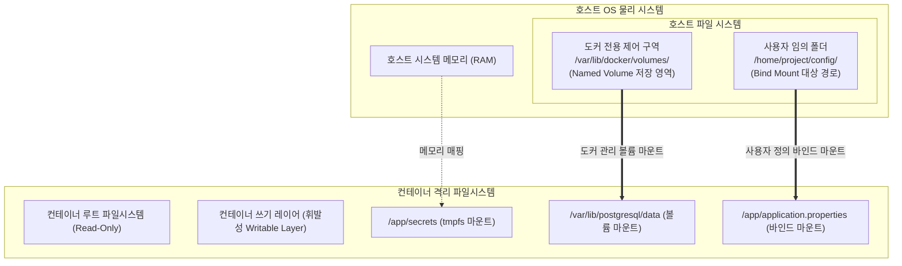

# [Day 1] 이론 강의: 데이터 보존과 볼륨 마운트

> 💡 **쉽게 이해하는 비유 (Analogy Box)**
> - **삭제식 화이트보드와 중요한 메모 포스트잇**
>   - 컨테이너 내부의 파일시스템은 쓰고 지우기 편리하지만 영구 보존은 되지 않는 교실의 '화이트보드'와 같습니다. 컨테이너를 지우고 새로 띄우는 것(`docker rm` 후 다시 `run`)은 화이트보드 지우개로 판서 내용을 싹 지워 새하얗게 리셋하는 것과 같습니다. 화이트보드 위에 열심히 기록했던 중요 데이터(DB 테이블 내용, 소중한 로그, 업로드된 사진 등)도 화이트보드가 지워지면 흔적 없이 날아갑니다.
>   - **볼륨 마운트**는 중요 데이터를 화이트보드판에 직접 쓰지 않고, 교실 벽 뒤에 있는 **안전한 유리 보관함(호스트 실제 디스크)**에 보관한 뒤 화이트보드 앞에는 **포스트잇(마운트)** 형태로 링크해 붙여두는 것입니다. 화이트보드를 아무리 지우개로 닦아내고 칠판 자체를 완전히 신형으로 교체(컨테이너 교체)해도, 벽 뒤 유리 보관함 내부의 오리지널 메모는 영구히 보존되어 새 화이트보드판에 고대로 다시 붙여 연속해서 사용할 수 있습니다.

---

## 1. 없으면 어떤 점이 불편한가?

컨테이너 가상화 기술의 가장 큰 매력은 '쉽고 빠른 재생성 및 폐기'입니다. 하지만 이 편리함의 이면에는 데이터를 안전하게 장기 영속(Persistence)시키지 못한다는 치명적인 위기가 도사리고 있습니다.

* **컨테이너 삭제 시 누적 데이터의 즉각적인 완전 유실**
  - PostgreSQL 데이터베이스 컨테이너를 띄우고 수많은 테이블과 비즈니스 데이터를 축적해 놓았습니다. 
  - 이후 데이터베이스 설정 매개변수를 바꾸거나 컨테이너 버전을 업데이트하기 위해 기존 컨테이너를 삭제(`docker rm`)하는 순간, 컨테이너 내부 가상 쓰기 레이어(Writable Layer)에 작성되었던 모든 물리 데이터가 단 1초 만에 초기화되어 영구 소실됩니다. 데이터 복구가 아예 불가능한 재앙이 일어납니다.
* **설정 동기화 부재로 인한 반복 설정 작업**
  - Nginx나 Spring Boot 설정 파일(예: `nginx.conf`, `application.yml`)을 튜닝하기 위해 작동 중인 컨테이너에 직접 침투해 텍스트 파일을 수정했습니다.
  - 그러나 컨테이너를 교체하거나 재기동하면 컨테이너는 원래 이미지 상태로 돌아가므로 수동 수정했던 모든 설정이 깔끔히 날아가 매번 다시 환경 세팅을 반복해야 합니다.

---

## 2. 왜 필요할까?

도커 컨테이너의 내부 쓰기 레이어(Writable Layer)는 **컨테이너 프로세스의 라이프사이클과 운명을 100% 같이하도록 기본 설계**되어 있기 때문입니다. 컨테이너의 핵심 가치는 "언제든 버릴 수 있는 소모품(Stateless)"이어야 하므로, 데이터 영역은 컨테이너와 분리되어야 합니다.

안전한 데이터 보존과 실무 배포 자동화를 달성하기 위해서는 다음과 같은 기술이 절대적으로 필요합니다.
1. **컨테이너 독립적 영구 저장소**: 컨테이너가 무수히 파괴되고, 재생성되고, 에러로 크래시가 나더라도 물리 하드웨어 디스크의 고정 영역에 바인딩되어 데이터의 연속성을 유지해 주는 persistent layer가 확보되어야 합니다.
2. **실시간 양방향 데이터 미러링(Mounting)**: 호스트 컴퓨터의 특정 파일/디렉터리와 컨테이너 내부의 디렉터리를 1대1로 직접 마운트하여, 양측의 파일 생성 및 수정 이벤트가 실시간으로 상호 전파되도록 만들어주는 가상 드라이브 매핑 기술이 필요합니다.

---

## 3. 이것은 무엇인가?

> **핵심 한 줄 요약**:
> *"볼륨 마운트는 **컨테이너의 소멸과 무관하게 지켜야 할 데이터를 호스트 디스크의 안전한 격리 구역에 따로 떼어놓고 연결**하여, 데이터 영속성을 보장하는 스토리지 연동 기술이다."*

<details>
<summary><b>🔍 도커 스토리지의 3가지 핵심 마운트 방식 비교</b></summary>

도커는 데이터를 컨테이너 외부로 추출하여 영속화하기 위해 다음과 같은 세 가지 구조적 마운트 메커니즘을 지원합니다.

1. **볼륨 (Named Volume - 도커 엔진 권장)**:
   - **구조**: 호스트 OS의 파일시스템 중 도커 엔진이 독점 관리하는 안전한 디렉토리 내부(Linux 기준 `/var/lib/docker/volumes/`)에 볼륨을 생성하고 관리합니다.
   - **특징**: 컨테이너가 호스트의 파일시스템 구조를 몰라도 되며, 호스트의 다른 프로세스가 이 구역을 함부로 난도질하지 못하도록 보호합니다. 이식성이 가장 높으며 프로덕션 환경의 데이터베이스 데이터를 보관할 때 무조건적인 권장 대상입니다.
2. **바인드 마운트 (Bind Mount)**:
   - **구조**: 호스트 OS의 물리적인 절대 경로(예: `g:/workspace/config`)를 컨테이너 내부의 경로로 직접 덮어쓰듯 매핑합니다.
   - **특징**: 호스트 PC에서 IDE로 작성 중인 코드나 환경설정 파일을 실시간으로 컨테이너에 전달하는 개발 및 로컬 디버깅 과정에 극히 적합합니다. 다만, 호스트의 파일시스템 경로 체계에 종속되어 인프라 이식성은 다소 낮아집니다.
3. **tmpfs 마운트 (In-Memory Mount)**:
   - **구조**: 호스트의 디스크 드라이브가 아닌, 호스트의 휘발성 시스템 메모리(RAM) 영역에 임시 파일시스템을 만들어 컨테이너에 마운트합니다.
   - **특징**: 디스크 I/O 없이 메모리에서 직접 쓰기가 일어나므로 속도가 극도로 빠르며, 컨테이너 정지 시 흔적도 남지 않고 자동 증발합니다. 패스워드, 암호화 키 등 민감한 보안 자격 증명을 가두거나 일시적인 초고속 연산 캐시 디렉터리로 적합합니다.
</details>

<details>
<summary><b>🔍 Windows-WSL2 환경 마운트 시의 심각한 권한 및 성능 이슈</b></summary>

로컬 실습 환경(Windows OS)에서 바인드 마운트를 수행할 때 흔히 마주치는 거대한 함정이 있습니다.
- **성능 저하 (I/O 병목)**: 
  - Windows의 포맷 형식인 NTFS 영역(예: `C:\Users\...`)에 위치한 소스 코드를 WSL2 가상 리눅스를 거쳐 컨테이너 내부로 바인드 마운트하면, WSL2 파일 시스템 변환용 9P 프로토콜 레이어를 통과해야 하므로 디스크 읽기/쓰기 속도가 수십 배 이상 느려집니다.
  - 이로 인해 Spring Boot 앱 기동 및 빌드 속도가 처참하게 밀리는 병목 현상이 발생합니다.
- **권한 불일치 (Permission Denied)**:
  - 리눅스의 고유 UID/GID 권한 체계와 Windows의 보안 식별자(ACL)가 일치하지 않아 컨테이너 내부의 비루트(Non-root) 프로세스가 볼륨 폴더에 쓰기를 할 때 권한 오류가 속출합니다.
- **실무 튜닝**: 성능 향상 및 권한 꼬임을 예방하려면, 작업 저장소를 윈도우 경로(`C:\mnt\...`)가 아닌 **WSL2 내부 가상 리눅스 파일 시스템(예: `\\wsl$\Ubuntu\home\username\...`) 영역 안으로 완전히 집어넣고** 도커 볼륨 및 바인드 마운트를 구동시키는 것이 베스트 프랙티스입니다.
</details>

<details>
<summary><b>🔍 자원 격리의 핵심: Cgroups 리소스 제어 및 OOM Killer의 잔혹한 작동 원리</b></summary>

- **리소스 제한과 Cgroups**: 도커 실행 시 `--cpus="1.5"`, `--memory="512m"` 옵션을 추가하면 호스트 커널의 컨트롤 그룹(Cgroups) 테이블에 해당 컨테이너의 프로세스 제한 정책이 강제 적용됩니다.
- **메모리 초과와 OOM(Out of Memory) Killer**:
  - 만약 컨테이너 내부 JVM에서 메모리 누수가 발생하거나 대량의 데이터를 메모리에 적재하여 설정한 임계치(512MB)를 초과하려고 시도하면, 호스트 OS 커널은 컨테이너가 사용 중인 Cgroups 메모리 풀이 고갈되었음을 인지합니다.
  - 커널은 시스템 전체의 붕괴를 막기 위해 내부적인 OOM 점수(OOM Score)를 계산하고, 메모리 한계를 위반한 해당 컨테이너 내부의 PID 1 프로세스를 지목하여 **강제 살해 시그널(`SIGKILL`)**을 즉각 사출합니다.
  - 이로 인해 컨테이너는 어떠한 예외 로그도 남기지 못하고 즉각 사망하며, 도커 엔진은 이를 감지하여 **Exit Code 137**을 남긴 채 정지 상태로 전환시킵니다.
</details>

### 📊 컨테이너의 3가지 마운트 방식 물리적 구조도



---

## 4. 장점과 단점

### 1) 장점
* **데이터 생명주기 격리를 통한 완전한 영속성 확보**
  - 애플리케이션의 버전 변경, 서버의 스케일 아웃, 에러 복구 등을 위해 컨테이너를 몇 번을 삭제하고 새로 띄워도 누적 데이터 및 히스토리 기록은 훼손 없이 보존됩니다.
* **로컬 실시간 개발 생산성 극대화**
  - 소스 코드가 위치한 로컬 폴더를 컨테이너 내의 빌드 실행 경로와 바인드 마운트 해두면, 개발자가 로컬 IDE에서 코드 한 줄을 수정 및 저장하는 즉시 컨테이너에 반영되어 재시작 없이 결과를 확인(Hot Swap)할 수 있습니다.

### 2) 단점과 주의점
* **호스트 의존성 증대로 인한 이식성 저해 (바인드 마운트의 함정)**
  - 바인드 마운트는 특정 호스트 PC의 절대 경로(예: `C:\User\dj500\...`)를 명시하므로, 다른 팀원의 PC나 클라우드 운영 환경으로 이동하여 이미지를 실행하려 할 때 호스트에 해당 경로가 존재하지 않아 에러를 내며 뻗어버립니다. 즉, 환경 이식성을 약화시키는 요인이 될 수 있어 주의가 필요합니다.

---

## 5. 어떻게 쓰는가?

스토리지 볼륨을 설계하고, 컨테이너 리소스의 한계를 정교하게 통제하여 구동하는 실무 핵심 가이드 명령어 모음입니다.

```powershell
# 1. 도커 엔진이 독점 통제하는 가상 Named Volume 영구 저장소 생성
docker volume create todo-db-volume

# 2. 생성한 Named Volume을 PostgreSQL 컨테이너 내부의 데이터 디렉토리와 연동하여 구동
# (컨테이너가 제거되어도 todo-db-volume 내부 파일은 안전하게 보존됩니다)
docker run -d -p 5432:5432 --name todo-db -v todo-db-volume:/var/lib/postgresql/data postgres:15

# 3. 로컬 프로젝트의 설정 파일(application.properties)만 찝어서 컨테이너 내부에 직접 바인드 마운트
docker run -d -p 8080:8080 --name todo-app -v g:/workspace/config/application.properties:/app/config/application.properties todo-app:1.0

# 4. 컨테이너의 메모리 제한을 256MB로 엄격히 제한하고, 제한 위반 시 호스트 커널 OOM Killer에 의해 사살되도록 설정
# (메모리 부족 시 Exit Code 137로 컨테이너가 중단됩니다)
docker run -d --name my-heavy-app --memory="256m" --cpus="1.0" todo-app:1.0

# 5. 등록된 도커 볼륨 리스트 및 특정 볼륨의 호스트 상 물리 디스크 실제 매핑 경로 정보 정밀 진단
docker volume ls
docker volume inspect todo-db-volume
```

### 💡 강사 팁: 볼륨 제거 시 주의사항
- `docker rm <container>` 명령을 날려도 마운트되어 있던 Named Volume(`todo-db-volume`)은 삭제되지 않고 호스트 디스크에 영구 고립되어 남아 있습니다.
- 찌꺼기 스토리지 리소스를 정리하려면 컨테이너 제거 후 `docker volume rm todo-db-volume`을 별도로 수행해 주어야 하며, 만약 더 이상 사용하지 않는 고립된 볼륨 전체를 일괄 청소하려면 `docker volume prune` 명령을 타격하십시오.
