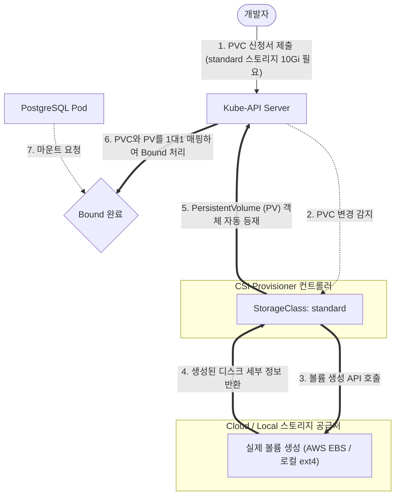

# [Day 2] 이론 강의: 스토리지와 PVC

> 💡 **쉽게 이해하는 비유 (Analogy Box)**
> - **규격화된 아파트 입주 신청서와 실제 아파트 방 할당**
>   - 수동 디스크 매핑(Docker의 호스트 마운트)은 건물의 방(물리 디스크)을 구하기 위해 개발자가 직접 건물의 내부 도면을 열어보고, 빈방의 구체적 동호수 주소(호스트 리눅스의 절대 물리 경로)를 종이에 적어 입주하는 것과 같습니다. 건물의 주인이 바뀌거나 방 구조가 리모델링되면 이 입주 주소는 완전히 엉켜 작동을 멈춥니다.
>   - **PVC(PersistentVolumeClaim)**는 관리사무소에 제출하는 '입주 희망 신청서'입니다. 개발자는 "나 10기가짜리 방(디스크)이 필요해!"라고 신청서만 내밀면, 관리소(Kubernetes)가 실제 단지 내에 비어있는 방 중 규격에 딱 맞는 **실제 아파트 방(PV, PersistentVolume)**을 찾아내어 자동으로 열쇠를 쥐어주는(바인딩) 방식입니다.
>   - 건물이 클라우드에 있든, 로컬에 있든 입주 신청서(PVC) 포맷은 완전히 동일합니다.

---

## 1. 없으면 어떤 점이 불편한가?

쿠버네티스에서 데이터베이스처럼 데이터의 상태가 유지되어야 하는(Stateful) 애플리케이션을 배포할 때, 호스트 서버의 특정 파일 경로를 직접 지정해 마운트(`hostPath` 방식)하면 다음과 같은 심각한 고질적 위험을 겪게 됩니다.

* **물리 하드웨어 종속으로 인한 배포 파일(YAML) 이식성 파괴**
  - 로컬 개발 환경(Docker Desktop Windows)에서는 `C:\postgres\data` 경로에 마운트하여 배포했지만, 사내 온프레미스 리눅스 테스트 서버로 이동하면 `/data/postgres`로 경로를 수정해야 합니다. 
  - 이를 또 다시 AWS 클라우드 환경으로 이전하면 물리 EBS 볼륨 ID(예: `vol-0abcd1234`)를 매니페스트에 직접 하드코딩해서 고쳐주어야 기동됩니다.
  - 배포할 타깃 서버 인프라가 바뀔 때마다 애플리케이션 YAML 파일 내부의 스토리지 코드를 운영자가 수동으로 계속 수정해야 하므로 관리 오버헤드가 막대해집니다.
* **쿠버네티스 자율 이사(Pod Scheduling) 시의 데이터 미아 현상**
  - 파드가 노드 A 서버에서 동작하다가, 노드 A 서버의 CPU 과열 등으로 인해 쿠버네티스가 자동으로 파드를 죽이고 건강한 노드 B 서버로 강제 이주(Rescheduling)시켰습니다.
  - 이때 `hostPath` 마운트를 사용했다면, 노드 B 서버의 물리 디스크에는 기존 노드 A의 로컬 폴더에 있던 DB 파일이 존재하지 않습니다. 결과적으로 데이터베이스는 아무런 테이블도 없는 빈 껍데기로 초기화되거나 마운트 지점 권한 오류로 기동이 즉각 중단됩니다.

---

## 2. 왜 필요할까?

애플리케이션 배포 명세서(YAML)가 **특정 물리 호스트 서버의 디스크 종류 및 파일 경로 정보와 너무 강하게 결합(Tight Coupling)**되어 있기 때문입니다.

이를 해결하고 완전한 스토리지 추상화를 달성하려면 다음과 같은 아키텍처적 장치가 완비되어야 합니다.
1. **스토리지 인터페이스 표준화 (CSI)**: 하부 스토리지 장비(AWS EBS, GCP Persistent Disk, NFS, 로컬 디스크 등)가 무엇이든 관계없이, 공통된 API 프로토콜을 사용해 볼륨을 조작할 수 있는 표준화 구조가 필요합니다.
2. **개발자와 인프라 역할의 완전 분리 (PV & PVC)**:
   - 인프라 관리자는 실제 장치에 기반한 스토리지 자원 풀(**PV**)을 공급 및 관리합니다.
   - 개발자는 하드웨어의 미세한 사양을 몰라도 되며, 오직 필요한 용량과 읽기/쓰기 접근 권한만 담은 요청서(**PVC**)를 선언적으로 제출하면 쿠버네티스 중재 데몬이 실시간으로 이 둘을 바인딩해 주는 느슨한 결합(Decoupling)이 필요합니다.

---

## 3. 이것은 무엇인가?

> **핵심 한 줄 요약**:
> *"PVC는 개발자가 **필요한 스토리지 사양(용량, 모드)만 명시하는 신청서**이고, K8s는 스토리지 클래스(SC)를 통해 **물리 디스크(PV)를 자동으로 동적 생성하여 꽂아주는 스토리지 중재 엔진**이다."*

<details>
<summary><b>🔍 스토리지 표준의 정석: CSI (Container Storage Interface)</b></summary>

과거 초기 쿠버네티스 엔진은 각 클라우드 벤더사(AWS, Azure, OpenStack 등)의 스토리지 드라이버 코드를 쿠버네티스 자체 소스 코드 내부에 직접 포함(In-Tree)하여 개발했습니다.
- 이는 쿠버네티스 코어를 무겁게 만들고 스토리지 버그 발생 시 쿠버네티스 자체를 재배포해야 하는 큰 오버헤드가 있었습니다.
- **CSI (Container Storage Interface)**: 이 문제를 해결하기 위해 도입된 표준 사양입니다.
  - 이제 스토리지 벤더사들은 쿠버네티스 소스를 수정할 필요 없이, 규격화된 CSI 플러그인(Out-of-Tree 방식)을 통해 독립적인 에이전트(DaemonSet 등) 형태로 자신의 드라이버를 클러스터에 손쉽게 연동할 수 있게 되었습니다.
</details>

<details>
<summary><b>🔍 PVC의 3가지 접근 모드 (Access Modes) 와 하드웨어 제약</b></summary>

PVC 선언 시 지정하는 `accessModes`는 물리 스토리지의 입출력 연결 한계를 결정하는 핵심 명세입니다.

1. **ReadWriteOnce (RWO)**:
   - **설명**: 단일 노드(1대의 서버 컴퓨터)에 의해서만 읽기/쓰기 모드로 마운트될 수 있습니다.
   - **물리적 제약**: AWS EBS 같은 블록 스토리지(Block Storage) 장치는 가상 네트워크 구조상 오직 1대의 가상머신(EC2) 인스턴스에만 물리적으로 직결(Attached)될 수 있습니다. 따라서 배포 노드가 다르면 여러 파드가 해당 볼륨을 동시에 마운트할 수 없습니다.
2. **ReadWriteMany (RWX)**:
   - **설명**: 여러 노드들이 동시에 이 볼륨을 공유하여 동시에 읽기/쓰기를 수행할 수 있습니다.
   - **물리적 제약**: NFS(Network File System)나 AWS EFS 같은 네트워크 공유 파일 시스템 아키텍처가 백엔드에 구축되어 있어야만 이 모드가 활성화됩니다.
3. **ReadOnlyMany (ROX)**:
   - **설명**: 여러 노드가 동시에 읽기 전용(Read-Only) 상태로 볼륨을 다중 마운트할 수 있습니다.
   - **활용처**: 여러 웹 서버 파드가 동일한 정적 이미지 리소스나 머신러닝 데이터셋 모델 파일을 공유해서 읽기만 하는 시나리오에 적합합니다.
</details>

<details>
<summary><b>🔍 StorageClass와 동적 프로비저닝 (Dynamic Provisioning)</b></summary>

* **수동 프로비저닝 (Static Provisioning)**:
  - 과거에는 인프라 관리자가 AWS 콘솔에서 10GB, 50GB EBS를 직접 생성하고, 각각 쿠버네티스 PV 리소스로 미리 일일이 다 엮어두어야 했습니다. 개발자가 20GB PVC를 제출하면 K8s는 미리 만들어진 PV 중 20GB짜리를 찾아 바인딩했습니다. 관리 소모가 심각합니다.
* **동적 프로비저닝 (Dynamic Provisioning)**:
  - **StorageClass**라는 디스크 자동 템플릿(SSD, HDD 등 품종 정의)을 지정하여 이 노고를 100% 자동화합니다.
  - 개발자가 PVC에 `storageClassName: standard`라고 지정해 신청서를 쿵 던지면, 쿠버네티스 CSI 컨트롤러가 이를 가로채서 백엔드(예: AWS API 또는 Docker Desktop 로컬 엔진)를 호출하여 **실제 물리 디스크 볼륨을 즉석에서 동적으로 생성(Dynamic Provisioning)**하고, 그 결과물을 PV 객체로 K8s에 자동 등재한 뒤 PVC와 즉시 연결(`Bound`)시킵니다.
</details>

<details>
<summary><b>🔍 볼륨 회수 정책 (Reclaim Policy - Retain vs Delete)</b></summary>

PVC를 더 이상 사용하지 않아 삭제(`kubectl delete pvc`)할 때, 남아있는 물리 PV 데이터의 운명을 처리하는 규칙입니다.
- **Delete**: PVC가 삭제되는 즉시 백엔드의 실제 물리 디스크(AWS EBS 등)와 PV 리소스를 동시에 자동 삭제하여 미사용 스토리지 비용의 발생을 완벽히 방어합니다 (기본값).
- **Retain**: PVC가 소멸하더라도 실물 데이터와 PV 객체는 보존됩니다. PV는 `Released` 상태로 잠겨 다른 PVC가 입주하지 못하게 막아두며, 인프라 관리자가 데이터를 안전하게 백업 및 정제한 뒤 수동으로 볼륨을 반납하도록 통제합니다.
</details>

### 📊 CSI 동적 프로비저닝 및 PV-PVC 라이프사이클 아키텍처



---

## 4. 장점과 단점

### 1) 장점
* **인프라 종속성 탈피를 통한 YAML 재사용성 극대화**
  - 개발자가 만든 배포 YAML 파일은 로컬 미니 클러스터이든, 엔터프라이즈급 AWS EKS이든 단 한 줄의 스토리지 설정 변경 없이 즉각 작동합니다. 클라우드마다 알맞은 CSI 스토리지 클래스가 실물 볼륨을 알아서 대리 생성하기 때문입니다.
* **데이터 라이프사이클의 독립성**
  - 앱 컨테이너(Pod)가 비정상 크래시로 무한 재기동되거나, Deployment 수정으로 파드가 통째로 삭제되더라도 영속 데이터는 PV 영역에 안전히 생존하여 신규 파드 기동 시 즉시 재연결됩니다.

### 2) 단점과 한계
* **다중 노드 공유 쓰기(RWX) 구현의 인프라적 제약**
  - 블록 스토리지의 물리적 한계로 인해, RWO 기반의 볼륨을 쓰는 파드는 반드시 동일한 노드 장비 내에서만 스케줄링되어야 하는 배치 제약이 발생합니다.
  - 여러 노드에 걸쳐 분산된 여러 파드가 동시에 디스크 쓰기를 수행하려면 NFS, Ceph, AWS EFS 같은 네트워크 분산 공유 시스템이 구축되어야 하므로 인프라 세팅 및 권한(UID/GID) 관리가 다소 복잡해집니다.

---

## 5. 어떻게 쓰는가?

PostgreSQL 데이터베이스의 영속 데이터 보관을 위한 실무형 PVC 선언서 예시 및 바인딩 상태 확인 명령어 흐름입니다.

### 1) 실무형 `postgres-pvc.yaml` 신청서 예시
```yaml
apiVersion: v1
kind: PersistentVolumeClaim
metadata:
  name: postgres-pvc
  namespace: todo-app
spec:
  # 클러스터 내의 기본 동적 프로비저닝 스토리지 클래스 사용
  # (생략 시 default StorageClass가 자동 매핑됩니다)
  storageClassName: hostpath
  accessModes:
    - ReadWriteOnce  # 단일 노드 마운트 전용 (데이터베이스 권장)
  resources:
    requests:
      storage: 10Gi  # 10기가바이트 용량 요청
```

### 2) 스토리지 상태 검증 명령어 흐름
```powershell
# 1. 작성된 PVC 선언서 적용 (클라우드/로컬 드라이버가 PV 자동 생성 시작)
kubectl apply -f postgres-pvc.yaml

# 2. 신청서(PVC)의 상태가 'Bound'가 되었는지, 그리고 매핑된 실제 물리 볼륨(PV) 정보 확인
# (STATUS 항목이 반드시 'Bound'여야 정상입니다. Pending 시 볼륨 생성 실패 상태임)
kubectl get pvc,pv -n todo-app

# 3. 현재 쿠버네티스 클러스터에서 지원 중인 스토리지 클래스(SC) 품종 목록 조회
kubectl get storageclass

# 4. 바인딩이 실패(Pending)했을 경우 상세 원인 이벤트 로그 진단
kubectl describe pvc postgres-pvc -n todo-app
```
