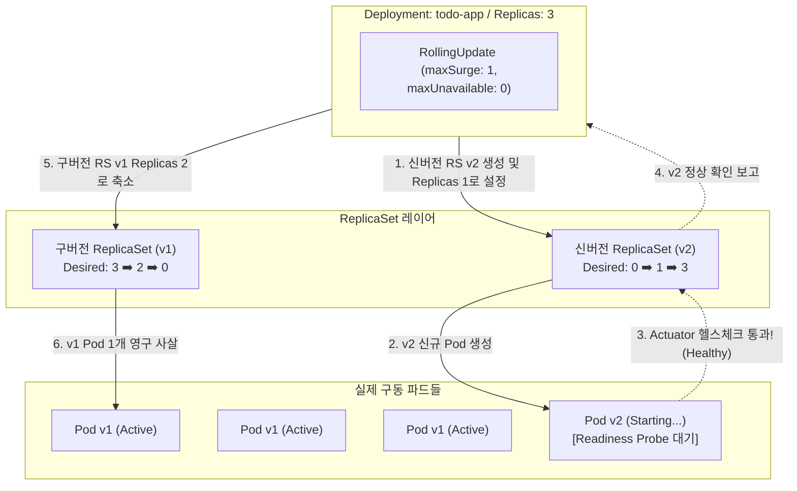

# [Day 2] 이론 강의: Deployment와 고가용성 배포

> 💡 **쉽게 이해하는 비유 (Analogy Box)**
> - **조별 과제에서 펑크 난 조원을 즉시 대체하는 예비 조장**
>   - 파드(Pod) 하나만 단독으로 띄워 배포하는 것은 중요 과제를 담당하는 조원을 딱 한 명만 두고 아무런 비상 연락망도 없는 것과 같습니다. 그 조원이 밤새 아프거나 연락이 두절되면(파드 하드웨어 고장) 조별 과제 발표는 즉시 완전 실패로 끝납니다.
>   - **Deployment**는 든든한 예비 조장입니다. 조장이 "우리 조의 가동 인원은 항상 3명을 유지해야 해!"라고 선언(`replicas: 3`)해 두면, 한 명이 아파서 실신해 나가는 즉시 예비 인력 대기소에서 **사전 검증된 똑같은 조원(파드)을 즉시 새로 가동 노드에 투입**해 3명의 정원을 빈틈없이 채워냅니다.
>   - 또한 조원들을 신형 장비로 교체(버전 업그레이드)할 때도 3명을 한꺼번에 해고하지 않고, 한 명을 교체해 보고 실무를 잘하는지 간을 본 후(롤링 업데이트) 차례대로 한 명씩 교체해 주어, 전체 과제 프로젝트의 진행 흐름이 단 1초도 끊기지 않도록 완벽히 조율합니다.

---

## 1. 없으면 어떤 점이 불편한가?

쿠버네티스 아키텍처 내에서 실제로 컨테이너 프로세스가 담겨 기동되는 최소 실행 단위는 파드(Pod)입니다. 하지만 파드 리소스를 중간 관리자 없이 직접 개별 생성(`kind: Pod`)하여 배포하면 현업에서 다음과 같은 큰 운영적 불이익을 마주하게 됩니다.

* **물리적 노드 크래시 시 자가 치유(Self-healing) 불능**
  - 파드가 실행 중인 물리 워커 노드 장비의 메인보드가 타버리거나 전원이 차단되었습니다. 
  - 쿠버네티스 마스터 노드는 노드의 상태 차단을 인지하지만, 직접 생성된 파드(`kind: Pod`)는 노드와 함께 소멸할 뿐 다른 노드에서 스스로 재생성되지 않습니다. 
  - 관리자가 아침에 출근해 에러 모니터링을 발견하고 수동으로 똑같은 파드 생성 명령어를 칠 때까지 서비스는 계속 죽어있는 상태가 유지됩니다.
* **배포 버전 변경 시의 강제적 중단 시간 (Downtime) 발생**
  - 자바 애플리케이션 코드를 업데이트하여 1.0 이미지에서 2.0 이미지로 교체해야 합니다. 
  - 파드 단독 배포 환경에서는 기존 1.0 파드를 수동 삭제(`kubectl delete pod`)하고, 새 2.0 파드가 생성되어 JVM이 로드될 때까지 꼼짝없이 트래픽을 받지 못하는 수십 초에서 수 분의 배포 공백(Downtime)이 발생하여 고객의 원성을 사게 됩니다.

---

## 2. 왜 필요할까?

파드(Pod) 리소스 자체는 **물리적으로 단일한 생명주기를 가지는 가상 프로세스 샌드박스일 뿐, 여러 대의 복제본 개수를 카운팅하고 통제하거나 서버 노드 장애 시 다른 서버로 대피(Eviction)시키는 제어 기능이 전무하기** 때문입니다.

대규모 마이크로서비스 환경에서 수백 개의 파드를 손수 개별 통제하는 것은 인간의 한계를 벗어납니다. 따라서 다음과 같은 다단계 통제 장치가 필요합니다.
1. **복제본 지휘관 (ReplicaSet)**: 파드에 붙은 인식표(Label)를 기준으로 실시간 개수를 감시하고, 지정한 개수(`replicas`)보다 적거나 많으면 즉시 파드를 창조하거나 파괴하는 기계적 복제 컨트롤러가 필요합니다.
2. **배포 수명주기 지휘관 (Deployment)**: 배포 버전 변경 시 신구 버전의 복제본 지휘관(ReplicaSet)의 크기를 점진적으로 확장 및 축소하여 무중단 교체를 관리하고, 배포 실패 시 과거 이력(Revision)을 토대로 즉각 롤백을 수행하는 최고위급 배포 사령관이 필요합니다.

---

## 3. 이것은 무엇인가?

> **핵심 한 줄 요약**:
> *"Deployment는 **ReplicaSet을 지휘하여 파드의 복제본 개수를 강제 유지**하고, 업그레이드 시 **신구 버전을 점진적으로 교체해 서비스 중단을 예방하는 배포 수명주기 컨트롤러**이다."*

<details>
<summary><b>🔍 ReplicaSet의 느슨한 소유권 규칙: Label Selector 매칭 원리</b></summary>

ReplicaSet은 자신이 거느리는 파드들을 고유 ID나 IP 주소로 기억하지 않습니다. 오직 파드의 메타데이터에 붙은 키-값 형태의 스티커인 **라벨(Label)**과 자신의 **셀렉터(Selector)**를 매칭하여 소유권을 판별합니다.
- **라벨 매칭 동작**: ReplicaSet 셀렉터에 `matchLabels: app: todo-app`이 적혀있다면, 클러스터에 돌고 있는 모든 파드 중 `app: todo-app` 라벨을 가진 파드의 총 개수를 계측합니다. 
- 만약 목표 개수가 3개인데 2개만 조회되면 즉시 1개를 새로 만들어 띄웁니다.
- **라벨 충돌의 위험성**: 만약 어떤 개발자가 실수로 테스트용 독립 파드를 띄우면서 라벨을 `app: todo-app`으로 똑같이 붙여버리면, ReplicaSet은 클러스터에 동일 라벨 파드가 4개로 증가했다고 오인하고, 자신이 관리하던 정상적인 3개 중 1개를 임의로 강제 살해해 버리는 아키텍처적 부작용이 유발됩니다. 따라서 라벨 식별자는 충돌하지 않도록 고도로 설계되어야 합니다.
</details>

<details>
<summary><b>🔍 롤아웃 전략 상세: Recreate vs RollingUpdate</b></summary>

Deployment는 새로운 버전 배포 요청을 받았을 때 두 가지 핵심 교체 전략을 취할 수 있습니다.

1. **Recreate (재생성 배포)**:
   - **동작**: 기존 구버전 파드들을 모조리 한꺼번에 즉시 삭제하여 가동 개수를 0개로 축소한 뒤, 삭제 완료가 확인되면 신버전 파드들을 띄우기 시작합니다.
   - **특징**: 배포 도중 서비스 통신이 완전히 끊기는 다운타임이 불가피하지만, 신구 버전 파드가 동시에 켜져 데이터베이스 스키마나 API 호환성 충돌을 일으킬 걱정이 없는 완전 분리형 배포에 유용합니다.
2. **RollingUpdate (롤링 업데이트 배포 - 기본값)**:
   - **동작**: 구버전 파드를 한 번에 지우지 않고, 신버전 파드를 조금씩 늘려가면서 구버전을 단계별로 잠식하며 지워나갑니다.
   - **핵심 파라미터**:
     - `maxSurge` (임시 초과 생성 비율): 롤링 중 배포 목표치(Replicas)보다 얼마나 더 많은 파드를 임시로 동시에 띄울 수 있는가를 제한합니다. (값이 클수록 고속 배포가 가능하나 CPU/메모리 부하가 일시 증가합니다.)
     - `maxUnavailable` (작동 불능 허용 비율): 배포 중 구버전 파드 중 최대 몇 개까지 동시에 꺼져있어도 되는지를 규정합니다. (0으로 선언하면 배포 중에도 항상 기존 가용성을 100% 보장하도록 통제합니다.)
</details>

<details>
<summary><b>🔍 대참사 시나리오: Readiness Probe가 누락된 롤링 업데이트</b></summary>

- **상황**: 새로 배포한 2.0 스프링 부트 앱 소스에 DB 접속 비밀번호를 잘못 기재해 기동 에러가 터지고 실행되지 않는 상태입니다.
- **Readiness Probe가 없을 때**: 
  - K8s 엔진은 2.0 파드 컨테이너의 프로세스가 켜지자마자 정상 배포된 것으로 간주합니다.
  - 이에 따라 구버전 1.0 파드들을 순차적으로 파괴하기 시작합니다. 
  - 결국 다운타임 없이 배포를 완료했으나, 클러스터에 남은 모든 파드는 기동 에러로 먹통이 되어 서비스 전체가 다운되는 파멸적 장애가 일어납니다.
- **해결책**: 애플리케이션의 헬스 엔드포인트(예: `/actuator/health`)가 완전히 OK 신호를 뿜을 때까지 네트워크 트래픽 인입과 구버전 삭제를 홀딩시키는 **Readiness Probe** 설정이 실무 롤링 배포에 절대적으로 동반되어야 합니다.
</details>

<details>
<summary><b>🔍 etcd 내부의 롤백 구조: Revision 히스토리 백업</b></summary>

- Deployment가 이미지를 업데이트하면, 기존에 사용하던 구버전 ReplicaSet을 지우지 않고 `spec.replicas` 값을 `0`으로 바꾼 상태로 etcd 데이터베이스에 박제해 둡니다.
- 이 박제본에 `deployment.kubernetes.io/revision: 1` 같은 리비전 메타 번호가 차례대로 기록됩니다.
- 만약 배포 직후 장애를 인지하고 `kubectl rollout undo` 명령을 타격하면, K8s는 etcd를 뒤져 이전 리비전의 ReplicaSet의 복제 요구 개수(replicas)를 다시 `3`으로 증설하고, 장애가 난 신버전의 ReplicaSet replicas를 `0`으로 강제 수축시키며 단 수 초 만에 완벽한 롤백을 수행합니다.
</details>

### 📊 Deployment 롤링 업데이트 시 신구 ReplicaSet 조율 과정



---

## 4. 장점과 단점

### 1) 장점
* **무중단 롤링 배포 및 초고속 원클릭 롤백**
  - 서비스 인입 트래픽을 안전하게 유지한 채 새 버전 배포가 가능하며, 배포 실패 시 수 초 내에 안전한 직전 시점으로 인프라를 복구할 수 있는 완벽한 가용성 제어 장치를 얻게 됩니다.
* **선언적 고가용성 유지**
  - `replicas` 제어문 수정만으로 클러스터 전체에 분산된 컨테이너 복제 대수를 즉각 선언적으로 증감하여 손쉽게 트래픽 부하에 신축성 대응이 가능합니다.

### 2) 단점과 한계
* **자원 점유 상승 및 배포 시간 지연 (보수적 옵션 적용 시)**
  - `maxUnavailable`을 0으로 꽉 묶어두면 무중단 가용성은 완벽하지만, 배포 중 항상 추가 파드가 뜬 상태여야 하므로 호스트 노드의 CPU/메모리 자원이 일시적으로 더 많이 소요됩니다. 
  - 또한 신버전의 기동 검증(Readiness Probe 대기 시간)이 완료될 때까지 대기하므로 배포 완료까지 걸리는 전체 절대 시간이 다소 늘어납니다.

---

## 5. 어떻게 쓰는가?

무중단 배포를 위한 롤링 업데이트 전략과 Readiness Probe 헬스체크가 견고하게 설계된 Spring Boot Deployment 매니페스트 예시 및 제어 명령어입니다.

### 1) 실무형 `app-deployment.yaml` 명세 예시
```yaml
apiVersion: apps/v1
kind: Deployment
metadata:
  name: todo-app
  namespace: todo-app
spec:
  replicas: 3
  strategy:
    type: RollingUpdate
    rollingUpdate:
      maxSurge: 1        # 배포 중 임시로 목표값 대비 1개 더 생성 허용
      maxUnavailable: 0  # 배포 도중 구버전 파드는 최소 3개 유지 보장 (무중단)
  selector:
    matchLabels:
      app: todo-app      # ReplicaSet이 매칭할 라벨 셀렉터
  template:
    metadata:
      labels:
        app: todo-app    # 생성할 파드에 부착되는 식별 라벨
    spec:
      containers:
        - name: app
          image: social-archive/todo-app:1.0
          ports:
            - containerPort: 8080
          # 신버전 기동 확인을 위한 헬스체크 (대참사 방어벽)
          readinessProbe:
            httpGet:
              path: /actuator/health
              port: 8080
            initialDelaySeconds: 15  # JVM 부팅 대기를 위해 15초 후 검증 시작
            periodSeconds: 5         # 5초 주기로 헬스 체크
```

### 2) 롤아웃 및 배포 관리 명령어
```powershell
# 1. 작성된 Deployment 및 롤링 배포 명세 적용
kubectl apply -f app-deployment.yml

# 2. Deployment에 의해 생성된 ReplicaSet의 리비전 상태 및 파드들의 헬스체크 기동 상황 조회
kubectl get deployment,replicaset,pods -n todo-app

# 3. 신버전 배포 시, 롤링 업데이트가 무중단으로 진행되는 실시간 상황 모니터링
kubectl rollout status deployment/todo-app -n todo-app

# 4. 배포한 버전에 치명적 오류 발견 시, 배포 이력(Revision) 리스트 확인
kubectl rollout history deployment/todo-app -n todo-app

# 5. 배포를 즉각 취소하고 바로 직전의 정상 리비전 상태로 1초 만에 강제 롤백 실행
kubectl rollout undo deployment/todo-app -n todo-app
```
