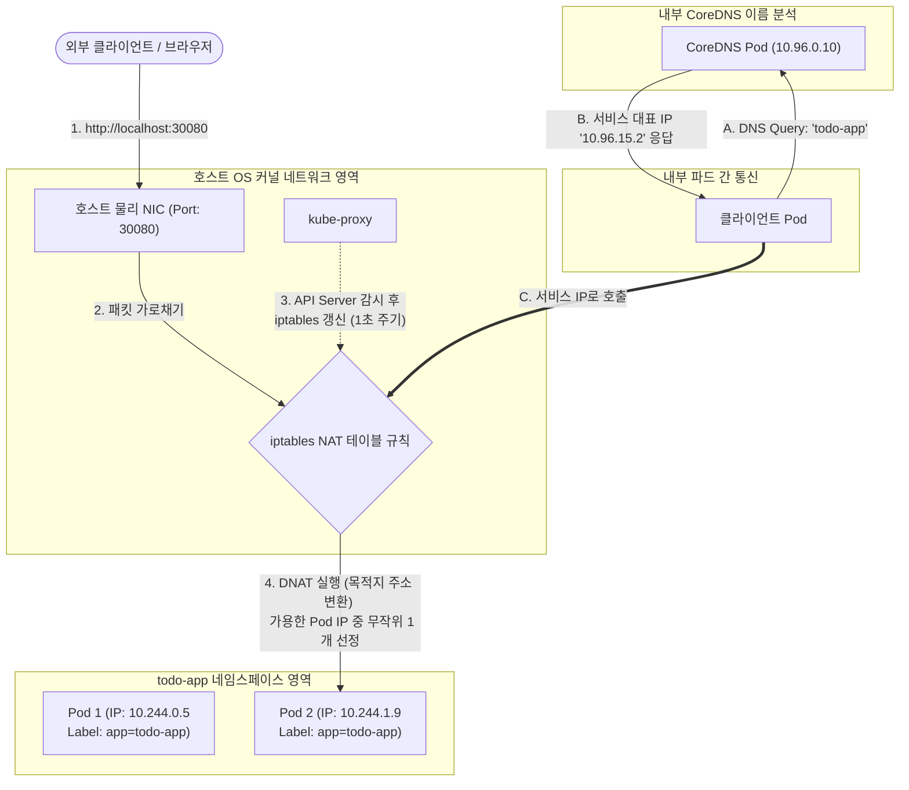

# [Day 2] 이론 강의: 네트워크 서비스와 로드밸런싱

> 💡 **쉽게 이해하는 비유 (Analogy Box)**
> - **상담원 자리가 맨날 바뀌는 고객센터의 대표번호**
>   - 파드 IP로 직접 소통하는 것은 고객센터 상담원 개별 전화번호(사설 IP)를 고객에게 직접 노출하여 전화를 받게 하는 것과 같습니다. 상담원이 자리를 비우거나 퇴사하여 번호가 바뀌면 고객은 영문도 모른 채 전화를 걸 방법이 없어집니다.
>   - **Kubernetes 서비스(Service)**는 고객센터의 **'영구 불변 대표전화번호'**입니다. 상담원(파드)들의 이름표(라벨)를 기반으로 작동하며, 상담원이 교체되어 자리가 바뀌고 내선 번호가 변경되더라도, 대표번호로 들어온 전화는 시스템이 현재 근무 중인 상담원에게 안전하게 분산 연결(로드밸런싱)해 줍니다.
>   - **NodePort**는 회사 바깥 건물 외벽에 대형 연결 구멍을 뚫어, 외부 일반 손님(클러스터 밖 클라이언트)도 전용 외부 채널 포트번호(`30080` 등)를 누르면 이 대표번호 상담망으로 즉각 접근할 수 있게 게이트를 개방해주는 장치입니다.

---

## 1. 없으면 어떤 점이 불편한가?

쿠버네티스 내부에서 구동되는 파드(Pod)들은 독립된 네트워크 가상 인터페이스를 통해 개별 고유 IP를 할당받습니다. 하지만 이 주소를 서비스 호출 주소로 직접 지정하면 다음과 같은 치명적인 장애 시나리오에 노출됩니다.

* **파드 롤링 배포 및 재생성 시의 접속 대상 파괴**
  - 스프링 백엔드 파드가 데이터베이스 커넥션 풀을 맺거나, 프론트엔드가 백엔드 파드 IP(`10.244.0.12`)를 고정해서 호출하고 있는 상태를 가정해 봅시다.
  - 백엔드가 배포 업데이트로 인해 재생성되면 기존 IP는 즉시 삭제되고, 전혀 다른 무작위 가상 IP(예: `10.244.1.88`)를 할당받습니다.
  - 이 경우 호출자 측의 소스 코드나 환경 변수 내의 IP 설정을 매번 수정하고 컨테이너를 재시작해야 통신이 복구되는 처참한 수작업 갱신 루프에 빠집니다.
* **클러스터 외부 네트워크에서의 접근 완전 차단**
  - 파드가 할당받는 IP(예: `10.244.x.x`)는 쿠버네티스 CNI 가상 네트워크 브리지 내부에서만 라우팅할 수 있는 내부 전용 주소입니다.
  - 따라서 클러스터 외부망에 존재하는 일반 인터넷 사용자나 호스트 PC(Windows) 브라우저에서는 이 가상 IP 주소로 통신 패킷을 보낼 방법이 전혀 존재하지 않습니다.

---

## 2. 왜 필요할까?

파드가 지닌 가상 IP의 **일시적(Ephemeral)이고 휘발성 강한 특성**과, 클러스터 내부망의 **보안적인 차단 장벽** 때문입니다.

이를 해결하고 안정적인 분산 통신을 구축하려면 다음과 같은 기술적 토대가 뒷받침되어야 합니다.
1. **가상 서비스 레이어 (ClusterIP)**: 파드들이 생성되고 소멸하며 IP가 끊임없이 바뀌더라도, 이들 복제본 전체를 아우르고 대표해 주는 **영구 불변의 대표 가상 IP**가 필요합니다.
2. **트래픽 부하 분산 (Load Balancing)**: 고정된 대표 IP로 유입되는 대규모 요청 패킷을, 실시간으로 정상 기동 중인 파드들에게 고르게 골고루 안배하여 분산 유입시키는 프록시 메커니즘이 수반되어야 합니다.
3. **외부 노출 게이트 (NodePort / LoadBalancer)**: 외부 트래픽을 안전하게 받아들일 수 있도록 호스트 물리 서버의 네트워크 카드 포트와 클러스터 내부의 가상 서비스를 1대1 매핑하여 뚫어주는 인프라적 전송 창구가 필요합니다.

---

## 3. 이것은 무엇인가?

> **핵심 한 줄 요약**:
> *"Kubernetes 서비스는 **수시로 바뀌는 파드 IP들을 고유 라벨로 실시간 추적하고**, 변하지 않는 **단 하나의 가상 대표 IP(ClusterIP)를 통해 패픽을 골고루 분산 전달하는 L4 가상 로드밸런서**이다."*

<details>
<summary><b>🔍 포트 매핑의 3총사: port vs targetPort vs nodePort 완벽 분석</b></summary>

쿠버네티스 서비스 매니페스트를 작성할 때 포트 관련 설정이 3개나 등장하여 매우 헷갈리기 쉽습니다. 이들의 계층 구조는 다음과 같습니다.

1. **port (서비스 대표 포트)**:
   - **위치**: 서비스 리소스 자체의 대표 가상 IP(`ClusterIP`)가 수신 대기하는 포트입니다.
   - **역할**: 클러스터 내부의 다른 파드가 이 서비스를 호출할 때 목적지로 적어야 하는 포트 번호입니다 (예: `http://todo-app:8080`).
2. **targetPort (파드 내부 포트)**:
   - **위치**: 파드 컨테이너 내부에서 구동되는 실제 애플리케이션(예: 톰캣 엔진)이 리스닝 중인 포트입니다.
   - **역할**: 서비스로 들어온 트래픽이 최종 포워딩되어 도달해야 하는 실제 목적지 포트입니다.
3. **nodePort (외부 접속용 포트)**:
   - **위치**: 모든 워커 노드(물리 호스트 서버)의 실제 네트워크 카드 외부 인터페이스 포트입니다.
   - **역할**: 외부 사용자가 이 포트 번호(기본 대역: `30000~32767`)를 통해 노드 IP로 치고 들어오면, 노드의 물리 포트가 이를 감지하여 내부 가상 서비스로 패킷을 쏘아 올려 줍니다.
</details>

<details>
<summary><b>🔍 Kube-proxy의 iptables vs IPVS 로드밸런싱 원리</b></summary>

쿠버네티스의 가상 IP(`ClusterIP`)는 실제 네트워크 스위치 장비가 아닌 가상의 주소입니다. 이 주소로 들어온 패킷을 조작하여 실제 파드 IP로 꺾어주는 마술은 각 노드의 **kube-proxy**가 리눅스 커널 방화벽 및 네트워크 필터 체인을 조작함으로써 실행됩니다.

* **iptables 모드 (전통적 방식)**:
  - **원리**: API Server의 Endpoints가 바뀌면 kube-proxy가 노드 커널의 `iptables` 방화벽 룰 테이블을 실시간으로 갱신합니다.
  - **한계**: 패킷이 들어올 때마다 iptables의 방화벽 규칙을 위에서부터 차례대로 순차 탐색($O(N)$)합니다. 서비스와 파드 개수가 수만 개를 넘어서면 방화벽 규칙 탐색 오버헤드가 극심해져 패킷 전송 성능이 크게 악화됩니다.
* **IPVS 모드 (대규모 실무 권장)**:
  - **원리**: 리눅스 커널의 L4 로드밸런싱 모듈인 IPVS를 직접 사용합니다.
  - **이점**: 내부적으로 **해시 테이블($O(1)$)**을 사용하여 규칙이 수만 개여도 딜레이 없이 찰나의 순간에 트래픽을 처리하며, 라운드 로빈(Round Robin) 외에도 최소 연결(Least Connection) 등 지능형 로드밸런싱 알고리즘을 수행할 수 있습니다.
</details>

<details>
<summary><b>🔍 내부 DNS (CoreDNS) 와 FQDN 도메인 이름 해석 원리</b></summary>

쿠버네티스 클러스터가 구축되면 `kube-system` 네임스페이스에 **CoreDNS**라는 분산 DNS 시스템 파드가 자동으로 가동됩니다.
- Kube-API Server에 새로운 서비스(`kind: Service`, name: `todo-app`)가 생성되면, CoreDNS는 이를 감지하여 자신의 DNS 레코드 장부에 **`todo-app.todo-app.svc.cluster.local`** (포맷: `<서비스명>.<네임스페이스>.<리소스타입>.<클러스터도메인>`) 이라는 FQDN(Fully Qualified Domain Name) 레코드를 즉시 등록합니다.
- 파드 내부에서 `todo-app`이라는 이름으로 HTTP 통신을 요청하면, 파드 내 resolv.conf 설정을 타고 CoreDNS가 이 가상 대표 IP(`ClusterIP`)를 즉시 해석해서 반환해 줍니다. 
- 이로써 소스코드에 IP 주소를 완전히 제거하고 도메인 네임 기반의 완전한 서비스 디스커버리가 이루어집니다.
</details>

<details>
<summary><b>🔍 L4 로드밸런서의 한계와 L7 Ingress 게이트웨이의 필요성</b></summary>

- **L4 서비스(NodePort/LoadBalancer)의 한계**: TCP/UDP 포트 번호 레이어에서만 라우팅을 수행하므로, 사용자가 유입시키는 HTTP 요청의 세부 경로(예: `/api/v1/...`과 `/static/...`을 서로 다른 서버 파드로 전송)에 따른 정밀 분기가 원천적으로 불가능합니다.
- 또한 개별 서비스마다 NodePort 포트나 LoadBalancer IP를 할당받아야 하므로 포트 관리 비용 및 퍼블릭 IP 비용이 낭비됩니다.
- **L7 Ingress**: 클러스터 전면에 단 하나의 80/443 포트 진입 장벽(Ingress Controller)을 세우고, HTTP 헤더의 호스트 네임(도메인)이나 URL 경로 설정을 뜯어보고 내부의 다양한 서비스로 적절히 분류 라우팅해주는 L7 애플리케이션 프록시 게이트웨이 역할을 수행하여 유연한 네트워크 구조를 만들어줍니다.
</details>

### 📊 NodePort 외부 접속 및 kube-proxy iptables 분산 라우팅 상세 패킷 흐름



---

## 4. 장점과 단점

### 1) 장점
* **가변 IP의 완벽한 추상화**
  - 개별 애플리케이션 파드들이 장애 복구나 업데이트로 인해 수십 번 재기동되어 가상 IP가 바뀌더라도, 서비스의 FQDN 주소(`http://todo-app`)는 불변으로 고정되므로 통신 불안정성이 완벽히 제거됩니다.
* **네이티브 커널 수준의 로드밸런싱**
  - 무거운 로드밸런서 소프트웨어를 추가로 띄우는 것이 아닌, OS 커널 자체의 최적화된 패킷 포워딩(iptables/IPVS) 레이어를 활용하므로 리소스 소모가 극소화됩니다.

### 2) 단점과 한계
* **포트 낭비 및 외부 노출 보안 위협 (NodePort의 한계)**
  - 서비스가 20~30개로 증가하면 각 서비스마다 3만번대 포트를 하나씩 독점 선점하여 낭비가 심해지고, 모든 노드의 물리 포트를 외부 인터넷망에 그대로 오픈해야 하므로 인프라 보안 공격 노출 면적(Attack Surface)이 지나치게 넓어집니다.

---

## 5. 어떻게 쓰는가?

스프링 부트 애플리케이션 서비스 포워딩을 위해 작성된 실무형 NodePort `Service` 매니페스트 예시 및 엔드포인트 헬스체크 확인 명령어 흐름입니다.

### 1) 실무형 `app-service.yaml` 매니페스트 예시
```yaml
apiVersion: v1
kind: Service
metadata:
  name: todo-app
  namespace: todo-app
spec:
  type: NodePort  # 외부 클라이언트 노출 모드
  selector:
    app: todo-app  # 이 라벨을 가진 파드들을 주소록(Endpoints)에 동적 등록
  ports:
    - name: http
      port: 8080      # 서비스 대표 ClusterIP의 가상 포트 (클러스터 내부 호출용)
      targetPort: 8080 # 실제 파드 컨테이너 내부 톰캣의 포트
      nodePort: 30080  # 외부에서 모든 노드 IP로 찌르고 들어올 물리 포트
```

### 2) 서비스 검증 명령어 흐름
```powershell
# 1. 서비스 매니페스트 파일 적용
kubectl apply -f app-service.yml

# 2. 클러스터 내부용 CLUSTER-IP 주소와 NodePort 포트 매핑 현황 확인
# (PORT(S) 항목에서 8080:30080/TCP 매핑을 검증합니다)
kubectl get service todo-app -n todo-app

# 3. 서비스가 셀렉터를 통해 실시간으로 찾아낸 정상 파드 IP 주소록(Endpoints) 상세 확인
# (이 주소록이 비어있다면 Pod 라벨이 불일치하거나 Pod가 꺼져있는 상태입니다)
kubectl get endpoints todo-app -n todo-app

# 4. 외부 호스트(Windows) 웹 브라우저 또는 CLI에서 API 요청을 전송해 최종 연동 검증
curl.exe http://localhost:30080/todos
```
