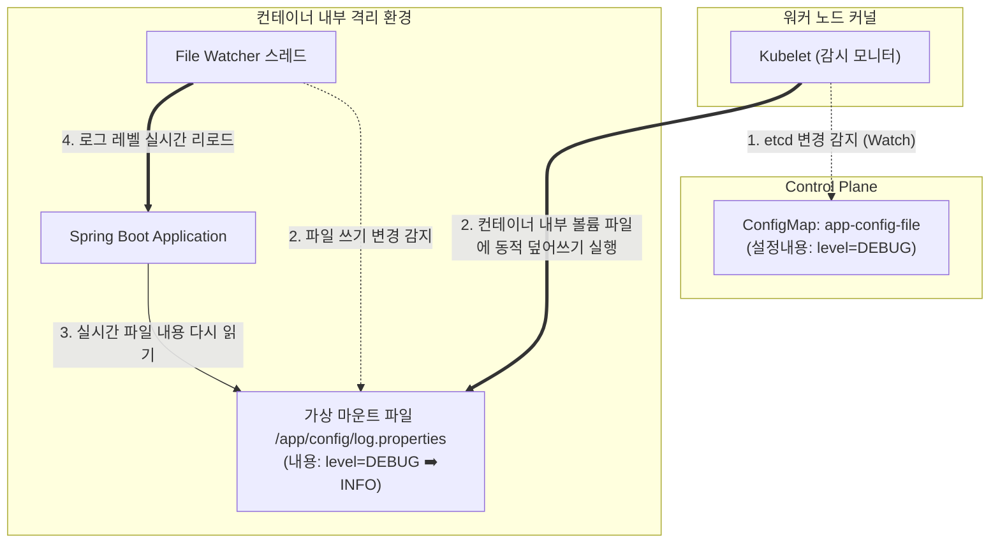

# [Day 2] 이론 강의: 설정 분리와 ConfigMap/Secret

> 💡 **쉽게 이해하는 비유 (Analogy Box)**
> - **스마트폰 본체와 충전용 범용 케이블 및 특수 케이스**
>   - 수동 결합 방식은 스마트폰을 만들 때 내부에 충전용 케이블과 전용 가죽 케이스를 공장 용접으로 고정해 버리는 것과 같습니다. 회사(개발망)에서 쓸 때와 해외 출장(운영망)을 갈 때 전원 콘센트 구멍 규격이 바뀌면, 스마트폰 자체를 분해해 내부 전기 회로를 다 뜯어고쳐 새로 제조(이미지 재빌드)해야 합니다.
>   - **ConfigMap과 Secret**은 분리형 범용 케이블과 탈부착형 외장 케이스입니다. 스마트폰 본체(애플리케이션 이미지)는 단 하나만 100% 동일하게 유지하고, 꽂는 콘센트(환경변수)에 맞춰 **일반 설정 케이블(ConfigMap)**을 꽂거나, 중요 생체 정보 보안 칩이 든 **특수 암호 키 케이스(Secret)**를 외부에 결합해 주어 하나의 이미지로 여러 환경에 완벽하게 적응하도록 만드는 기법입니다.

---

## 1. 없으면 어떤 점이 불편한가?

애플리케이션을 로컬 개발 환경에서 테스트하고, 실 서버 환경으로 순차 승격(Promotion) 배포하는 전체 수명주기에서 인프라 설정 정보(Configuration)를 코드와 결합하여 관리하면 다음과 같은 치명적인 병목 현상을 겪게 됩니다.

* **사소한 환경 설정값 변경을 위한 무겁고 낭비적인 빌드-배포 반복**
  - 개발용 DB 비밀번호(`dev1234`)를 운영용 DB 비밀번호(`prod9999`)로 변경하기 위해 자바 설정 파일(`application.yml`)의 패스워드 라인을 고쳐 적고, Git Commit을 날리고, Gradle 컴파일 빌드를 돌린 후, 무거운 도커 이미지를 새로 구워(Build) 이미지 레포지토리에 푸시해야 합니다. 
  - 단순히 텍스트 단 한 줄의 값 변경을 위해 기가바이트 단위의 하드웨어 리소스와 수십 분의 소중한 개발 및 파이프라인 시간이 낭비됩니다.
* **비밀번호 유출로 인한 기업의 전방위적 보안 사고 발생**
  - 개발의 편의성을 위해 데이터베이스 암호, AWS IAM 액세스 키, 타사 API 인증 토큰을 코드 저장소 소스 파일에 그대로 하드코딩해 두었습니다. 
  - 이 프로젝트의 깃 저장소가 실수로 외부 퍼블릭(GitHub 등)으로 공개로 전환되거나, 협력 업체 개발자에게 공유되는 순간 중요 자격 증명이 1초 만에 전 세계로 해킹 크롤러 봇에 수집되어 클라우드 서버 자원 탈취 및 데이터 도난 등의 대형 비즈니스 파산 리스크를 유발합니다.

---

## 2. 왜 필요할까?

애플리케이션의 **코드/바이너리(실행 파일)와 인프라에 의존적인 환경 설정 정보(Config)가 물리적으로 하나의 결합체로 패키징**되어 있기 때문입니다.

현대적인 클라우드 네이티브 아키텍처의 바이블인 **12-Factor App (Config 팩터)** 사상에 따라, 빌드된 이미지는 **환경에 무관하게 단 하나만 불변(Immutable) 상태로 생성**되어야 하며, 실행(Run)되는 시점에 타깃 클러스터(개발/스테이징/운영)에 알맞은 설정 매개변수를 외부에서 주입해 주는 **코드와 설정의 완벽한 격리(Decoupling)**가 실현되어야 합니다.
- **빌드(Build) ➡️ 릴리즈(Release) ➡️ 실행(Run)의 단계적 분리**:
  - `빌드`: 컴파일되어 구워진 순수 이미지 생성 단계.
  - `릴리즈`: 컴파일된 이미지와 타깃 환경에 맞는 설정 값(ConfigMap/Secret)을 결합하여 가동 준비 상태로 엮는 단계.
  - `실행`: 릴리즈된 패키지를 실제 메모리에 올려 컨테이너로 기동하는 단계.

---

## 3. 이것은 무엇인가?

> **핵심 한 줄 요약**:
> *"ConfigMap과 Secret은 **앱 이미지는 철저히 불변의 껍데기로 유지**하고, 실행되는 클러스터 환경에 알맞은 **일반 변수와 중요 암호 키를 컨테이너 내부에 외부 주입해 주는 리소스 주입 장치**이다."*

<details>
<summary><b>🔍 환경변수 방식 vs 볼륨 마운트 주입 방식의 장단점 및 핫리로드(Hot-Reload) 원리</b></summary>

쿠버네티스는 ConfigMap과 Secret 데이터를 파드 컨테이너 내부에 주입할 때 두 가지 대표적인 마운트 채널을 제공합니다.

1. **환경변수 주입 (`env`, `envFrom`)**:
   - **원리**: 컨테이너 OS의 시스템 환경변수(System Environment Variables)로 키-값을 직접 매핑하여 밀어 넣습니다.
   - **이점**: 소스 코드나 프레임워크(Spring Boot 등)에서 `System.getenv("DB_HOST")` 또는 `${DB_HOST}` 문법을 통해 리소스 코드를 읽기 쉬워 가장 보편적으로 애용됩니다.
   - **한계 (핫리로드 불가)**: 파드가 기동된 후 ConfigMap의 설정을 수정하더라도, 이미 떠 있는 컨테이너의 프로세스 환경변수 영역은 실시간 갱신되지 않습니다. 새로운 설정을 반영하려면 반드시 파드를 재생성(`kubectl rollout restart`)하여 환경변수를 재바인딩해야 합니다.
2. **볼륨 마운트 주입 (`volumes`, `volumeMounts`)**:
   - **원리**: ConfigMap/Secret의 키-값 데이터를 텍스트 파일로 자동 변환하여 컨테이너 내부의 가상 디렉토리 경로에 물리 파일로 마운트합니다.
   - **이점 (실시간 핫리로드 가능)**: 외부에서 ConfigMap/Secret을 업데이트하면, 노드의 Kubelet 에이전트가 이를 실시간 감지하여 **컨테이너의 재시작 없이도 컨테이너 내부의 마운트된 텍스트 파일 내용을 실시간으로 갱신**해 줍니다. 
   - **조건**: 다만, 애플리케이션 프레임워크(Spring Cloud Config 등) 단에서 이 파일 변경 이벤트를 실시간 감시(Watch)하고 설정을 동적 갱신해 주는 복잡한 리로딩 핸들러를 별도로 개발해야 작동합니다.
</details>

<details>
<summary><b>🔍 Base64 인코딩의 수학적 오해와 깃허브 보안 리스크</b></summary>

쿠버네티스 Secret YAML 작성 시 패스워드를 적을 때 흔히 `Base64` 포맷 형태로 인코딩해서 저장합니다.
- **인코딩의 오해**: 수많은 초보 엔지니어들이 Base64로 인코딩된 비밀번호를 보며 "암호화되어 안전하다"고 크게 오인합니다.
- **진실**: Base64는 암호화(Encryption)가 아닙니다. 3바이트의 이진(Binary) 데이터를 4바이트의 아스키 문자(영문 대소문자, 숫자, `+`, `/`) 64글자군으로 단순히 가독성 있게 표현을 변환(인코딩)한 것에 불과합니다. 비밀 키가 전혀 없이 누구나 온라인 해독기나 터미널 명령어 한 줄(`base64 --decode`)로 0.1초 만에 원문 비밀번호를 즉시 복구해 볼 수 있습니다.
- 따라서 Secret YAML 선언서 파일을 Git 저장소에 절대 평문이나 Base64 문자열 그대로 노출하여 커밋하면 안 됩니다.
</details>

<details>
<summary><b>🔍 실무 GitOps 환경에서의 Secret 암호화 관리 설계 모델</b></summary>

Git 저장소를 배포 설계도로 삼는 GitOps 파이프라인에서 시크릿을 처리하기 위한 2가지 대표 프레임워크입니다.

1. **Sealed Secrets (비대칭 키 클러스터 디코딩 방식)**:
   - **구조**: Bitnami 사에서 제공하는 보안 오퍼레이터입니다.
   - **원리**: 개발자는 클러스터 내부의 공개키(Public Key)를 받아와 로컬에서 시크릿 값을 완전 암호화하여 `SealedSecret` 이라는 특수 커스텀 리소스로 생성합니다. 
   - 이 암호화된 파일은 깃허브에 안심하고 보관할 수 있으며, 배포 파이프라인을 타고 클러스터에 주입되면 오직 클러스터 내부에만 존재하는 개인키(Private Key) 컨트롤러가 이를 안전하게 평문 `Secret` 리소스로 자율 해독하여 동작시킵니다.
2. **External Secrets Operator (ESO - 외부 보안 금고 연동 방식)**:
   - **구조**: 인프라 외부에 별도의 보안 저장소(HashiCorp Vault, AWS Secrets Manager 등)를 구축합니다.
   - **원리**: 클러스터 내부에 배포된 ESO 에이전트가 API를 타고 외부 금고와 안전한 토큰 통신을 수행하여, 실시간으로 비밀번호를 동적 조회 및 복사해와서 클러스터 메모리 상에 `Secret` 객체로 등재시키는 고성능 클라우드 보안 연동 아키텍처입니다.
</details>

### 📊 ConfigMap / Secret 볼륨 마운트 시 실시간 갱신(Hot-Reload) 아키텍처



---

## 4. 장점과 단점

### 1) 장점
* **동일 이미지 기반 멀티 테넌트 이식성 확보**
  - 빌드 파이프라인이 단 한번 구워낸 `todo-app:1.0` 이미지를 손끝 하나 대지 않고, 오직 설정 파일인 ConfigMap/Secret의 환경 스펙만 교체(Binding)하여 개발/스테이징/운영 전 인프라에 논리적 안정 배포가 가능해집니다.
* **보안 사고의 원천 차단**
  - 민감한 데이터베이스 암호나 API 권한 키를 Git 저장소 외부로 격리하여 안전한 가상 클러스터 메모리 및 클라우드 보안 장벽 내부에서만 유기적으로 활용할 수 있습니다.

### 2) 단점과 주의점
* **참조 누락에 따른 컨테이너 생성 거부 에러 (CreateContainerConfigError)**
  - Deployment의 `valueFrom` 등에서 지정한 ConfigMap의 이름을 타이핑 오타를 내거나, 사전에 해당 설정 맵 리소스를 클러스터에 배포해 두지 않은 채 Pod 배포를 감행하면, 컨테이너 엔진은 환경 변수 바인딩 단계에서 뻗어버리며 `CreateContainerConfigError` 에러와 함께 기동 자체가 전면 중단됩니다.

---

## 5. 어떻게 쓰는가?

일반 설정 정보와 데이터베이스 민감 자격 증명을 분리하여 설계한 ConfigMap, Secret 매니페스트 및 디코딩 검증 명령어 사용법입니다.

### 1) 실무형 설정 및 보안 선언서 예시
```yaml
# app-configmap.yaml
apiVersion: v1
kind: ConfigMap
metadata:
  name: app-config
  namespace: todo-app
data:
  SPRING_DATASOURCE_URL: "jdbc:postgresql://postgres:5432/tododb"
  LOGGING_LEVEL_ORG_HIBERNATE: "SQL"

---

# app-secret.yaml
apiVersion: v1
kind: Secret
metadata:
  name: db-secret
  namespace: todo-app
type: Opaque
data:
  # 'todo-user' 문자를 Base64로 인코딩한 값
  SPRING_DATASOURCE_USERNAME: dG9kby11c2Vy
  # 'todo-password' 문자를 Base64로 인코딩한 값
  SPRING_DATASOURCE_PASSWORD: dG9kby1wYXNzd29yZA==
```

### 2) 설정 제어 및 디코딩 검증 명령어
```powershell
# 1. 설정맵 및 시크릿 선언서 리소스 일괄 적용
kubectl apply -f app-configmap.yaml
kubectl apply -f app-secret.yml

# 2. 배포 완료된 설정 및 보안 비밀 리소스 목록 상태 조회
kubectl get configmap,secret -n todo-app

# 3. Base64로 봉인된 시크릿 값을 PowerShell 환경에서 평문 디코딩하여 정상 바인딩 값 확인하기
# (Base64는 암호화가 아닌 단순 변환 포맷임을 직접 실증하는 검증 명령어)
kubectl get secret db-secret -n todo-app -o jsonpath="{.data.SPRING_DATASOURCE_PASSWORD}" | %{[System.Text.Encoding]::UTF8.GetString([System.Convert]::FromBase64String($_))}
```
