# [Day 2] 이론 강의: 장애 진단과 모니터링

> 💡 **쉽게 이해하는 비유 (Analogy Box)**
> - **종합병원 3단계 정밀 환자 검진**
>   - 파드(Pod)가 아파서 안 뜰 때 무작정 리부팅을 수행하는 것은 열이 펄펄 끓는 환자에게 정밀 진단도 없이 해열제(재시작)만 계속 들이부어 병을 더 악화시키는 돌팔이 처방과 같습니다.
>   - **`describe`**는 '환자 진료 차트'를 정독하는 것입니다. 환자의 키와 몸무게, 뼈대가 잘 조립되었는지, 외관상 어떤 상처(Status)가 나 있는지 겉모습과 하드웨어 스펙을 상세히 봅니다.
>   - **`logs`**는 '환자의 속마음(심리 상담)'을 직접 듣는 것입니다. 외관상 뼈대는 멀쩡한데 가슴속 깊은 내면(자바 코드 예외, 데이터베이스 연결 실패 등)에서 어떤 아픔이 소용돌이치고 있는지 컨테이너 입(표준 출력 로그)으로 말하는 음성을 직접 경청합니다.
>   - **`events`**는 '병원 주변의 CCTV 블랙박스'를 뒤지는 것입니다. 환자 본인 외에 주변 간호사나 의사(스케줄러, Kubelet 등 시스템 에이전트)들이 환자에게 언제 주사(배포 명령)를 놨고, 휠체어를 타고 어디로 옮겼으며, 어떤 에러를 일으켰는지 정황 기록을 대조해 숨겨진 외부 요인을 찾아냅니다.

---

## 1. 없으면 어떤 점이 불편한가?

쿠버네티스 환경에서 배포한 파드가 정상적으로 가동되지 않고 `Pending`, `CrashLoopBackOff`, `ImagePullBackOff` 등의 불길한 상태 코드를 내뿜으며 뻗었을 때, 체계적인 진단 루틴을 모르는 개발자는 심각한 어둠 속의 디버깅 삽질을 시작하게 됩니다.

* **원인을 모른 채 일단 쑤셔보는 무작정 복구 시도와 시간 낭비**
  - 에러가 발생하면 원인을 찾기보다 "일단 YAML 파일의 들여쓰기를 지웠다 썼다 해보고", "혹시 모르니 소스코드를 처음부터 끝까지 한 줄씩 읽어보거나", "결국 최후에는 컴퓨터 전체를 재부팅하고 미니쿠베 클러스터를 지웠다 깔아보는" 등의 비체계적이고 소모적인 복구 도박을 감행합니다.
  - 이로 인해 단순 오타나 권한 에러 하나를 해결하는 데 소중한 반나절 이상의 업무 시간이 허무하게 증발하며, 실운영 환경이라면 회사 전체의 서비스 중단 시간이 하염없이 늘어나 파멸적인 손실을 야기합니다.

---

## 2. 왜 필요할까?

쿠버네티스 분산 환경에서의 장애는 단일 자바 프로그램 내부의 버그 외에도 **컨테이너 가상화의 한계, 노드 장비 자원(CPU/메모리) 부족, 네임스페이스 간의 설정 누락, CNI 네트워크 스택의 통신 차단 등 다차원적인 레이어에서 동시 다발적으로 발생**하기 때문입니다.

장애가 발생했을 때 범인을 10초 이내에 정확히 포착하여 문제 해결 시간을 최소화(MTTR 단축)하려면 다음과 같은 체계적인 프로세스가 확립되어야 합니다.
- **진단 레이어의 단계적 축소**: 문제의 원인을 '클러스터 하드웨어' ➡️ '컨테이너 오케스트레이션' ➡️ '애플리케이션 소스 코드' 순서대로 계층을 쪼개어 가며 범위를 신속히 좁혀가는 **표준 3단계 진단 루틴**이 몸에 배어있어야 합니다.

---

## 3. 이것은 무엇인가?

> **핵심 한 줄 요약**:
> *"장애 진단 루틴은 **설계사양(describe), 실행로그(logs), 사건기록(events)이라는 3대 인프라 소스를 순차 대조**하여, 장애 원인(RCA)을 신속하게 좁혀나가는 체계적인 디버깅 기술이다."*

<details>
<summary><b>🔍 CrashLoopBackOff 상황의 핵심 단서: Exit Code 심층 분석</b></summary>

파드가 `CrashLoopBackOff` 상태로 계속 재시작을 반복할 때, `kubectl describe pod` 명령의 `Last State` 항목에 표시되는 **Exit Code(종료 코드)**는 문제 해결의 결정적 단서입니다.

1. **Exit Code 137 (OOMKilled)**:
   - **원인**: 컨테이너 프로세스가 사용할 수 있는 물리 메모리가 Deployment에 설정된 제한치(`resources.limits.memory`)를 초과했습니다. 호스트 커널 OOM Killer가 프로세스에 `SIGKILL` 시그널을 강제 주입해 사살한 상태입니다.
   - **증상**: 스프링 부트 콘솔 로그에는 아무런 예외(Exception)도 찍히지 않고 중간에 로그가 뚝 끊겨 있습니다.
   - **조치**: 메모리 제한치를 늘려주거나 자바 Heap 메모리(`-Xmx`) 설정을 조정해야 합니다.
2. **Exit Code 1 (일반 애플리케이션 에러)**:
   - **원인**: 자바 소스 코드 내에서 예외가 발생했거나 데이터베이스 접속 정보 불일치, 포트 충돌 등으로 인해 프로그램 스스로 비정상 종료를 선언한 상태입니다.
   - **조치**: 이 코드가 보이면 즉시 `kubectl logs` 명령어를 쳐서 스프링 내부 로그의 Java Stack Trace(예: `ConnectionRefusedException`)를 파헤쳐야 합니다.
3. **Exit Code 127 (Command Not Found)**:
   - **원인**: 컨테이너 이미지 내부의 작동 시작 명령어(`CMD` 또는 `ENTRYPOINT` 바이너리)를 실행하려고 했으나 해당 파일이 경로에 아예 존재하지 않는 상태입니다.
   - **조치**: Dockerfile의 작업 디렉토리 설정(`WORKDIR`)이나 파일 복사(`COPY`) 경로 설정을 검증해야 합니다.
</details>

<details>
<summary><b>🔍 자율 진단 3형제: Startup, Liveness, Readiness Probe 상세 매커니즘</b></summary>

쿠버네티스가 파드의 건강 상태를 자율 진단하기 위해 제공하는 세 가지 프로브(Probe)의 역할 차이점입니다.

* **Startup Probe (시작 진단 - 부팅 검사기)**:
  - **역할**: 애플리케이션이 최초로 완전히 부팅을 마쳤는가만 검사합니다.
  - **당위성**: 무거운 JVM 기반의 Spring Boot 앱은 부팅에 수십 초 이상 걸립니다. 만약 이 프로브가 없다면 기동되는 중간에 Liveness Probe가 작동하여 "앱이 응답하지 않네? 고장 났구나!"라고 착각해 기동 중인 파드를 강제로 재시작시키는 **무한 기동 킬 루프**에 빠지게 됩니다.
  - **동작**: Startup Probe가 성공 신호를 보낼 때까지 Liveness, Readiness 두 프로브의 검사 행위는 완전히 잠시 홀딩됩니다.
* **Liveness Probe (활성 진단 - 생사 검사기)**:
  - **역할**: 애플리케이션이 켜진 후 데드락(Deadlock) 등에 걸려 완전히 좀비 상태가 되었는지 상시 감시합니다.
  - **행동**: 이 검사가 실패하면 Kubelet은 앱이 회생 불능인 것으로 간주하고 **파드를 강제 재시작(Restart)** 시켜 자가 치유를 도모합니다.
* **Readiness Probe (준비 진단 - 손님 맞이 검사기)**:
  - **역할**: 파드가 현재 사용자 요청(트래픽)을 받아들일 정상 컨디션(DB 연결 등 완료)인지 검사합니다.
  - **행동**: 실패 시 파드를 죽이지는 않지만, 서비스 대표 IP의 Endpoints 주소록에서 해당 파드의 IP를 즉시 격리(트래픽 차단)하여 사용자에게 에러 페이지가 노출되는 것을 철저히 예방합니다.
</details>

<details>
<summary><b>🔍 k9s 대시보드를 활용한 실무 초고속 디버깅 테크닉</b></summary>

실무 엔지니어들은 타이핑 속도와 번거로움을 덜기 위해 k9s 터미널 대시보드의 단축키를 몸에 익혀 사용합니다.
- k9s를 켜고 에러가 난 파드 위에 커서를 올린 뒤:
  - **`d` (Describe)**: 단 1초 만에 파드의 하드웨어 명세와 이벤트 차트를 조회합니다.
  - **`l` (Logs)**: 즉시 실시간 로그 뷰어로 진입하여 에러 예외 트레이스를 스크롤 추적합니다.
  - **`y` (YAML)**: 현재 배포된 리소스의 원본 선언서 명세를 즉시 열어봅니다.
  - **`ctrl+d` (Delete)**: 아픈 파드를 즉시 살해하고 조정 루프가 대체 파드를 새로 띄우는 복구 과정을 한눈에 지켜봅니다.
</details>

### 📊 쿠버네티스 3대 헬스체크 프로브(Probe) 상호작용 타임라인

```mermaid
gantt
    title K8s 헬스체크 프로브 구동 타임라인
    dateFormat  X
    axisFormat %s
    
    section 앱 부팅 상태
    JVM 부팅 및 초기화 (0~15s)   :active, boot, 0, 15
    실제 서비스 가동 상태 (15s~) :after boot, 45
    
    section Startup Probe
    부팅 검사 (실패 가능 대역)   :crit, startup_check, 0, 15
    최종 헬스 통과 (성공)         :done, startup_ok, 15, 16
    
    section Liveness Probe
    작동 대기 (부팅 중 작동 안함) :active, live_wait, 0, 15
    생사 상시 감시 (실패 시 Pod 재시작) :live_run, 15, 45
    
    section Readiness Probe
    작동 대기 (부팅 중 작동 안함) :active, ready_wait, 0, 15
    준비 상태 상시 검증 (실패 시 트래픽 격리) :ready_run, 15, 45
```



---

## 4. 장점과 단점

### 1) 장점
* **인프라 블랙박스 제거를 통한 신속한 장애 복구**
  - 인프라 에러가 발생했을 때 이 명령어 저 명령어 찔러보지 않고, 정립된 3단계(describe ➡️ logs ➡️ events) 루틴을 따라감으로써 평균 장애 복구 시간(MTTR)을 분 단위에서 초 단위로 비약적으로 단축시킵니다.

### 2) 단점과 인지 과부하
* **방대한 텍스트 스크롤의 시각적 피로도**
  - `describe`와 `logs` 명령어는 수백 라인의 원시 텍스트를 터미널 창에 일시에 쏟아내므로 숙련되지 않은 주니어 엔지니어들은 에러의 진짜 본체(예: 스프링 예외 줄)를 발견하지 못하고 텍스트 속에서 헤매기 쉽습니다. 
  - 이를 보완하기 위해 터미널 가독성 향상 도구(grep 파이프라인 결합)나 **k9s** 도구를 반드시 연동 숙달해야 합니다.

---

## 5. 어떻게 쓰는가?

파드가 기동에 실패했거나 실행 중 에러가 나서 멈춘 긴급 상황에서, 원인 분석을 위해 수행해야 하는 실무 3단계 진단 명령어 가이드라인입니다.

```powershell
# ==========================================
# 1단계: 설계지표 및 에러 코드 분석 (describe)
# ==========================================
# (하단의 State, Last State, Exit Code 및 Events 에러 메시지를 정독합니다)
kubectl describe pod <아픈-파드-이름> -n todo-app

# ==========================================
# 2단계: 애플리케이션 콘솔 출력 추적 (logs)
# ==========================================
# (최신 로그 100줄을 출력하고 자바/스프링 단의 런타임 익셉션을 파헤칩니다)
kubectl logs <아픈-파드-이름> -n todo-app --tail=100

# ==========================================
# 3단계: 클러스터의 주변 사건 블랙박스 역추적 (events)
# ==========================================
# (이벤트 기록을 최근에 발생한 사건 순서대로 정렬하여 시스템 활동 실패 원인을 검거합니다)
kubectl get events -n todo-app --sort-by=.lastTimestamp

# ==========================================
# 💡 팁: 에러가 나는 파드 이름만 빠르게 추려내는 쉘 명령어
# ==========================================
kubectl get pods -n todo-app | findstr /V "Running"
```
