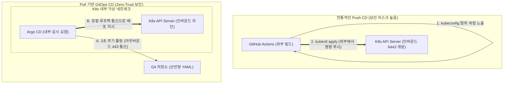

# [Day 3] 이론 강의: CI/CD 구조와 GitOps 이해

> 💡 **쉽게 이해하는 비유 (Analogy Box)**
> - **수동으로 레버를 돌려 작동시키는 공장 vs 설계도 기반 스마트 로봇 공장**
>   - 수동 배포(Push 방식)는 사람이 완성된 기계 부품(빌드 파일)을 들고 소음이 가득한 공장 내부 기계실(운영 서버)에 직접 손수 들어가, 수동으로 압력 밸브를 열고 레버(배포 명령어)를 끙끙대며 조작해 공장을 가동하는 것과 같습니다. 레버 조작 도중 단 하나만 오판하거나, 이전 공정 버전과 꼬이면 공장 전체가 멈추는 대형 폭발 사고(배포 장애)가 터집니다.
>   - **GitOps(Pull 방식)**는 공장 기계실 내부에 **'설계도 인식 자동 조율 로봇(Argo CD)'**을 떡하니 상주시키는 것입니다. 사람은 이제 기계실에 발도 들이지 않고, 오직 안전하고 쾌적한 통제실 내부의 설계도 보관함(Git)에 **새로운 공장 설계도(YAML)**를 꽂아두기만 합니다.
>   - 그러면 감시 로봇이 3초마다 보관함을 스캔하다가 설계도가 바뀐 것을 감지하는 즉시, 기계실 밸브들을 로봇 팔로 정교하게 조율하여 새 설계도와 100% 일치하게 자동 변환 가동시킵니다.

---

## 1. 없으면 어떤 점이 불편한가?

개발팀과 인프라 운영팀 간의 배포 파이프라인이 사람의 수작업이나 전통적인 명령형 배포 명령어(Push 방식)에 의존하고 있을 때, 비즈니스는 다음과 같은 치명적인 위험을 상시 마주하게 됩니다.

* **수동 배포 조작 실수에 의한 덮어쓰기 대참사**
  - 개발자가 로컬 IDE에서 수동 빌드한 Java jar 패키지 파일을 FTP나 SCP 도구로 원격 서버에 직접 전송하여 덮어쓰는 배포를 수행합니다.
  - 전송 과정에서 실수로 개발계 빌드 파일을 운영계 서버 폴더에 잘못 덮어씌우거나, 환경 변수 파일의 오타를 그대로 업로드하여 전체 실운영 웹 서비스가 즉시 중단되는 배포 중단 사고가 만성적으로 발생합니다.
* **실행 중인 서버 실시간 소스 버전의 암흑 상태 (Black-box Server)**
  - 현재 실제 상용 서버 노드에서 돌아가고 있는 백엔드 애플리케이션 코드가 어떤 개발자의 몇 번째 깃 커밋(Commit) 버전인지, 누가 언제 배포 명령어를 쳐서 적용했는지 이력 추적이 아예 안 됩니다.
  - 장애가 터져 로그 분석을 하려 해도 실제 돌아가고 있는 바이너리의 소스 형상을 정확히 짚어내기 힘들어, 디버깅 범위를 좁히는 데에만 수 시간에서 며칠의 대기 시간이 지연됩니다.

---

## 2. 왜 필요할까?

배포를 실행하는 주체(개발자 랩톱 또는 Jenkins/GitHub Actions 같은 빌드 도구)가 **외부에서 보안 방화벽을 뚫고 운영 클러스터 API를 호출하여 상태를 강제 주입하는 Push 기반 배포 모델**을 채택하고 있어, 저장소의 설계 명세서와 클러스터의 실제 형상 간의 싱크율을 100% 강제 관리할 방법이 없기 때문입니다.

이를 극복하고 완벽한 배포 안정성과 추적성을 확보하려면 다음과 같은 아키텍처적 도약이 필요합니다.
1. **Pull 기반 배포 모델 (Pull-based CD)**: 외부에서 클러스터를 향해 명령을 쏘는 것을 차단하고, 클러스터 내부에 주도적 에이전트(Argo CD)를 심어놓고 이 에이전트가 바깥의 Git 배포 저장소를 직접 읽어와 스스로를 지속 업데이트하는 구조로 전환해야 합니다.
2. **단일 진실 공급원 (SSOT - Single Source of Truth)**: 클러스터의 이상적인 물리 배치 형상이 담긴 쿠버네티스 YAML 선언 파일 일체를 오직 Git 저장소라는 단 한 곳에서만 관리하고, 모든 인프라 변경은 Git 커밋 이력(Commit Log)을 거치도록 강제 통제해야 합니다.

---

## 3. 이것은 무엇인가?

> **핵심 한 줄 요약**:
> *"GitOps는 **인프라 설계 명세서(YAML)를 오직 Git으로만 버전 관리**하고, 클러스터 내부의 **Argo CD 로봇이 이를 자율 획득(Pull)하여 현실과 100% 동기화하는 자동 배포 아키텍처**이다."*

<details>
<summary><b>🔍 Push 방식 CD vs Pull 방식 CD의 심층 보안/방화벽 비교</b></summary>

* **Push 방식 배포 (Jenkins, GitHub Actions 직접 배포)**:
  - **작동**: 빌드 서버가 빌드를 끝마친 뒤, 원격 클러스터 API Server에 접속(예: `kubectl apply`)하여 패킷을 쏘아 배포합니다.
  - **보안 위협**: 빌드 서버(GitHub, Jenkins)가 **클러스터 관리자 마스터 토큰(`kubeconfig` 자격증명)**을 상시 보관하고 있어야 합니다. 만약 외부 빌드 서버가 해킹당하면, 회사 내부의 전체 인프라 클러스터 통제권이 해커에게 통째로 털리는 재앙이 발생합니다.
  - **방화벽**: 클러스터 마스터 노드가 외부 빌드 도구의 API 인입 트래픽을 허용하도록 인바운드 방화벽 포트(6443 등)를 활짝 열어두어야 하므로 공격 노출 경로가 발생합니다.
* **Pull 방식 배포 (Argo CD, Flux)**:
  - **작동**: Argo CD가 클러스터 안에서 바깥에 있는 Git 저장소를 폴링(Polling)해 오거나 Webhook으로 변경을 받아와, 클러스터 로컬 API Server에 자율 배포합니다.
  - **보안 이점**: 클러스터 마스터 권한 토큰이 클러스터 외부망으로 나갈 필요가 전혀 없어 자격 증명 유출 경로가 원천 차단됩니다.
  - **방화벽**: 클러스터 내부에서 외부 Git 저장소 및 이미지 저장소(GHCR 등)로의 **아웃바운드(Outbound) 인터넷 트래픽만 허용**하고, 외부에서 내부로 들어오는 모든 인바운드(Inbound) 통신을 철저히 거부(Zero-Trust Network)할 수 있어 대단히 안전합니다.
</details>

<details>
<summary><b>🔍 상태 표류(Configuration Drift) 방어전: Argo CD Self-Heal 원리</b></summary>

- **상태 표류 (Configuration Drift)**:
  - 개발자나 운영자가 Git 설계를 통하지 않고, 장애가 났다는 핑계로 서버에 몰래 접속하여 `kubectl edit` 이나 `kubectl scale` 명령어로 파드 개수나 설정을 야매로 긴급 수정해 버리는 현상입니다.
  - 이 행위는 일시적으로 에러를 우회하게 해 줄 수는 있으나, 나중에 타 개발자가 Git 설계도를 보고 빌드 배포를 돌렸을 때 임시 조치 내용이 다 덮어쓰여 재발 장애를 일으키는 원인이 됩니다.
- **Argo CD의 탐지 및 자동 보정**:
  - Argo CD는 3초 주기로 Git 저장소와 클러스터의 실시간 상태를 대조합니다.
  - 임의의 수동 조작으로 인해 차이(Drift)가 발생하는 즉시 화면에 경고색인 **`OutOfSync`** 상태를 점등합니다.
  - 만약 **Self-Heal(자동 자가 복구)** 옵션이 활성화되어 있다면, Argo CD는 1초 만에 클러스터에 수동으로 수정된 야매 설정을 완전히 깔아뭉개고, Git 저장소에 선언된 정석 명세서대로 강제 원복(Reconciliation) 시켜 설계의 무결성을 철저하게 보장합니다.
</details>

<details>
<summary><b>🔍 단일 진실 공급원(SSOT)의 비즈니스적 감사 가치 (Audit Trail)</b></summary>

인프라의 모든 변경 사항(스케일 아웃, 환경변수 변경, 이미지 업그레이드 등)이 반드시 Git의 Pull Request 승인과 Commit 이력을 거치도록 단일 진실 공급원을 구축하면 다음과 같은 강력한 관리적 강점을 얻게 됩니다.
- **감사 추적성 (Audit Trail)**: 
  - "누가, 언제, 어떤 이유(Commit Message)로, 어떤 설정을 변경하여 배포했는지"가 깃 허브 커밋 로그로 100% 박제되어 남습니다. 별도의 번거로운 배포 보고 시스템이 필요하지 않으며, 보안 감사 적격성을 즉각 통과합니다.
- **초고속 롤백**:
  - 배포된 설정에 대형 사고가 터졌을 때, `git revert <CommitID>` 명령어 한 줄을 치고 깃에 푸시하면 Argo CD가 과거의 완벽한 설계도대로 클러스터 리소스를 자율적으로 전원 복원해 냅니다.

</details>

### 📊 전통적인 Push 기반 CD vs Pull 기반 GitOps CD 아키텍처 비교



---

## 4. 장점과 단점

### 1) 장점
* **극대화된 클러스터 보안성**
  - 클러스터 관리자 권한(`kubeconfig`) 토큰을 로컬 PC나 외부 서드파티 SaaS 클라우드 빌드 툴에 절대 등록할 필요가 없어 크레덴셜 해킹 위험을 전면 제거합니다.
* **완벽한 상태 복구력과 재해 대응**
  - 클러스터 전체가 통째로 날아가는 재난 상황이 발생하더라도, 신규 클러스터를 준비하고 Argo CD에 기존 Git 저장소 주소만 연결하면 단 5분 만에 수십 개의 서비스 명세가 과거 상태 그대로 자율 복원됩니다.

### 2) 단점과 극복 비용 (Git 중심 운영의 허들)
* **로컬 수동 디버깅 및 테스트의 속도 저하**
  - 개발자가 긴급하게 환경 변수 하나를 바꾸어 잘 되는지 클러스터 현장에서 테스트해 보고 싶어도, 모든 변경은 무조건 `git commit` -> `git push` -> `Argo CD Sync` 과정을 타야 하므로 단발성 디버깅 사이클이 다소 길어지는 관리적 공수가 발생합니다. 
  - 이를 해결하기 위해 개발용 네임스페이스에 한해서만 임시로 Argo CD의 자동 동기화를 정지해두는 유연한 운영 프로토콜이 수반되어야 합니다.

---

## 5. 어떻게 쓰는가?

CI(지속적 통합)와 CD(지속적 배포)의 역할 경계를 명확히 구분하고, GitOps 배포를 기획하기 위한 파이프라인 설계 아웃라인입니다.

### 1) 실무형 배포 파이프라인 흐름 정의
- **CI 단계 (개발 저장소)**:
  - 개발자가 소스 코드 수정 후 Push ➡️ GitHub Actions 실행 ➡️ 코드 검증 및 Gradle 빌드 ➡️ 도커 이미지 패키징 ➡️ 컨테이너 레지스트리(GHCR)에 고유 태그(Short SHA)를 달아 보관함에 입고 완료.
- **CD 단계 (배포 저장소)**:
  - 배포 YAML 설계도(Helm Chart) 내부의 이미지 태그 번호를 새 이미지 번호로 업데이트하여 커밋 ➡️ Argo CD가 변경 사항을 감지하여 클러스터에 안전하게 자율 반영.

### 2) GitOps 상태 점검을 위한 기본 확인 흐름
```powershell
# 1. 3일차 실습 시작 전, Argo CD가 감시하고 조율할 대상인 K8s 네임스페이스 정상 유무 점검
kubectl get namespace

# 2. 2일차에서 다듬었던 기본 환경 설정용 ConfigMap과 Secret 리소스 정상 상태 확인
# (이들이 존재해야 Argo CD가 배포에 성공했을 때 DB 커넥션이 정상 완료됩니다)
kubectl get configmap app-config -n todo-app
kubectl get secret db-secret -n todo-app
```
