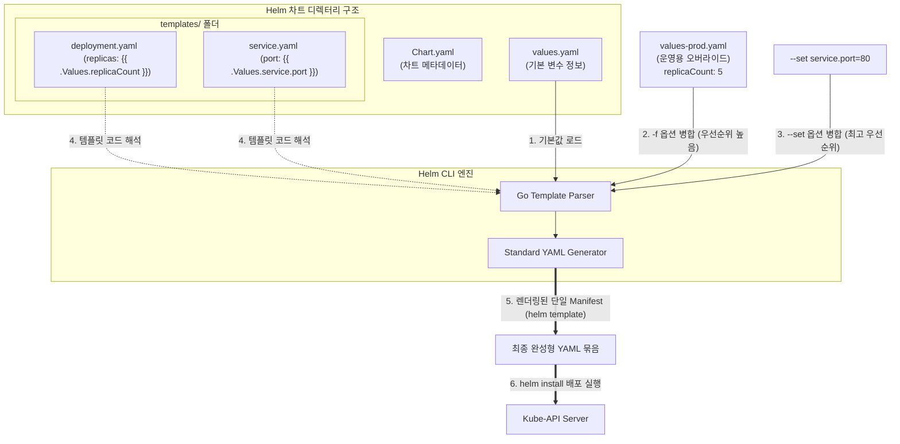

# [Day 3] 이론 강의: Helm 기본과 차트 구조

> 💡 **쉽게 이해하는 비유 (Analogy Box)**
> - **이케아(IKEA) 가구 조립 도면과 고객 맞춤 주문 옵션서**
>   - 수동 YAML 복사 방식은 빨간색 책상, 파란색 책상, 하얀색 책상을 배포할 때마다 99% 똑같이 생긴 실제 책상 완성 설계도 3장(환경별 YAML 복사본)을 각각 따로 복사 보관하는 것과 같습니다. 책상 다리 길이를 10cm 늘리는 수정 사항이 생기면 설계도 3장을 일일이 찾아다니며 고쳐 적어야 합니다.
>   - **Helm**은 책상의 기본 골격과 조립 순서만 묘사해 둔 **'공용 이케아 조립 도면(템플릿)'** 단 한 장만 제작합니다. 그리고 고객이 원하는 스펙을 적어내는 **'한 장짜리 맞춤 옵션 주문서(values.yaml)'**를 엮어둡니다.
>   - 주문서에 "색상: 파란색, 다리길이: 50cm"라고 기재하여 렌더링 기계(`helm template`)에 집어넣는 순간, 공용 조립 도면의 뚫려있는 구멍 속으로 이 옵션 수치들이 즉시 합성되어 완벽한 파란색 책상 조립 명세서(최종 완성 YAML)가 콘솔에 뚝딱 인쇄됩니다.

---

## 1. 없으면 어떤 점이 불편한가?

쿠버네티스 인프라 환경이 확장되면서 다수의 서버 환경(개발계, 테스트계, 스테이징계, 운영계)에 동일한 마이크로서비스 애플리케이션을 배포해야 할 때, 가공되지 않은 순수 매니페스트(Raw YAML) 파일 뭉치들을 그대로 복사해 사용하면 심각한 관리 비효율과 배포 실수를 겪게 됩니다.

* **인프라 설정의 복사-붙여넣기 파편화에 따른 Configuration 표류**
  - 거의 모든 내용이 동일하고 환경 변수 몇 줄만 다른 `deployment.yaml` 파일들을 `k8s-dev/`, `k8s-stage/`, `k8s-prod/` 디렉터리에 각각 물리적으로 복사해 두고 독자 수동 관리합니다.
  - 파드의 리소스 제한 메모리 크기(`resources.limits.memory`)를 512Mi에서 1024Mi로 증설해야 하는 인프라 변경이 생겼을 때, 각 폴더를 수동으로 순회하며 파일들을 일일이 눈으로 직접 대조해 가며 한 줄 한 줄 고쳐 적어야 합니다. 
  - 한 곳이라도 수정 단계를 누락하면 각 환경별 스펙 불일치(Drift)로 인해 운영 환경에서만 알 수 없는 컨테이너 다운 장애가 터집니다.
* **수많은 리소스의 파편화된 배포 및 회수 관리**
  - 스프링 백엔드 앱 1개를 클러스터에 띄우기 위해 Deployment, Service, ConfigMap, Secret, PVC 등 최소 5개 이상의 YAML 파일이 동시 가동되어야 합니다.
  - 배포를 완료하려면 `kubectl apply -f` 명령어를 5번 쳐야 하고, 서비스를 영구 철거(삭제)할 때도 리소스 목록을 일일이 나열하거나 삭제 누락을 방지하기 위해 파일명을 대조해가며 명령을 쳐야 하는 관리 노고가 따릅니다.

---

## 2. 왜 필요할까?

쿠버네티스의 순수 매니페스트 파일(YAML)은 **내부에 변수(Variables)를 선언하여 런타임에 값을 치환하거나, 환경에 따라 특정 리소스를 생성하고 제외하는 조건문/반복문 등의 동적 제어가 불가능한 단순 100% 정적 파일**이기 때문입니다.

이를 보완하고 단일화된 템플릿 중심의 운영을 이루기 위해서는 다음과 같은 패키지 아키텍처가 필요합니다.
1. **인프라 템플릿화 (Go Template)**: 리소스의 핵심 스펙 구조(뼈대)는 단 한 번만 명작으로 작성하고, 환경마다 다르게 꽂아줄 파라미터 값(복제수, 이미지 주소, 포트 번호 등)은 주입 변수 공간으로 뚫어두어야 합니다.
2. **패키지 단위의 라이프사이클 통제 (Helm Chart)**: 여러 개의 YAML 리소스 군집을 '차트(Chart)'라는 논리적 패키지 하나의 단위로 패키징하여, 버전 관리 및 일괄 설치(install)·일괄 철거(uninstall)를 지원하는 **쿠버네티스 전용 패키지 관리 도구**가 필수적으로 동반되어야 합니다.

---

## 3. 이것은 무엇인가?

> **핵심 한 줄 요약**:
> *"Helm은 **Kubernetes YAML 파일들을 하나의 공용 조립 템플릿(Chart)으로 단일화**하고, 달라지는 설정값만 **주문서(values.yaml)로 오버라이드하여 일괄 배포하는 패키지 매니저**이다."*

<details>
<summary><b>🔍 Helm의 3대 핵심 기둥 개념 (Chart, Repository, Release)</b></summary>

Helm 아키텍처를 구성하는 세 가지 기둥 개념입니다.

1. **Chart (차트)**:
   - **설명**: 쿠버네티스 애플리케이션을 구동하기 위한 모든 템플릿 파일과 메타데이터 설정(`Chart.yaml`)을 규격화된 폴더 트리 구조로 묶어놓은 **설계 패키지 상자**입니다.
2. **Repository (저장소)**:
   - **설명**: 완성된 차트 패키지들을 저장하고 다른 개발팀들과 공유할 수 있도록 배포하는 **중앙 웹 서버 저장소**입니다 (마치 자바의 Maven Central 또는 Node.js의 npm Registry와 유사합니다).
3. **Release (릴리스)**:
   - **설명**: 클러스터 내에 실제로 설치되어 동작하고 있는 구체적인 **차트 인스턴스**입니다. 동일한 하나의 `todo-app` 차트 패키지를 이용하여 클러스터 내부에 `todo-dev` 릴리스와 `todo-prod` 릴리스라는 두 개의 독립된 실행 인스턴스를 격리 가동할 수 있습니다.
</details>

<details>
<summary><b>🔍 Go Template 문법과 Indentation 공백 제어의 특수 기호 매직</b></summary>

Helm은 Go 언어의 내장 템플릿 문법을 확장해 사용합니다.

* **`toYaml` 과 `nindent` 의 필수 결합 원리**:
  - `{{ .Values.resources }}` 처럼 오브젝트 데이터를 그냥 템플릿에 출력하면 한 줄의 평문 텍스트로 풀어져 나와 YAML 문법을 완전히 깨버립니다.
  - 이를 해결하기 위해 객체 전체를 YAML 포맷으로 렌더링하는 `toYaml` 함수와, 이를 파이프라인(`|`)으로 엮어 줄바꿈 후 정확히 $N$칸만큼의 들여쓰기 공백을 삽입해 주는 `nindent` 함수를 엮어줍니다. (예: `{{ toYaml .Values.resources | nindent 10 }}`)
* **공백 트리밍 기호 (`{{-` 및 `-}}`)**:
  - 템플릿 내에 `{{ if ... }}` 같은 제어문 블록을 삽입하면, 렌더링 결과에 텅 빈 공백 라인(Empty Line)이 그대로 적층되어 출력됩니다.
  - 이 빈 줄들이 누적되면 K8s API 서버가 YAML 해석 시 에러를 뿜게 됩니다. 지시어 중괄호 좌우측에 마이너스 기호(`-`)를 추가해 주면, 렌더링 시 **제어문 주위에 남아있던 모든 불필요한 줄바꿈과 공백 문자를 말끔히 잘라내어(Trimming)** 깔끔한 고품질 YAML을 사출합니다.
</details>

<details>
<summary><b>🔍 환경별 변수 파일 분리 및 값 머지(Value Merge)의 작동 구조</b></summary>

- **환경별 values 분리**: 
  - 기본 뼈대 차트는 저장소에 고정해 두고, 각 타깃 환경별 변수 파일인 `values-dev.yaml`(소용량 개발 스펙), `values-prod.yaml`(고가용성 운영 스펙)을 독자 분리 설계합니다.
- **오버라이딩 우선순위 (Value Merge)**:
  - Helm 배포 시 주입되는 변수 값들은 다음과 같은 계층적 우선순위에 의해 실시간 병합(Merge) 및 덮어쓰기 처리됩니다.
  1. **최고 존엄 (`--set` 파라미터)**: 명령줄에서 직접 입력한 단발성 오버라이드. (예: `--set image.tag=prod-version`)
  2. **상위 권한 (`-f <file>` 옵션)**: 명시적으로 지정하여 오버라이드할 환경 변수 파일. (예: `-f values-prod.yaml`)
  3. **디폴트 기저 (`values.yaml`)**: 차트 폴더 내부에 위치한 기본 디폴트 변수 파일.
</details>

### 📊 Helm 템플릿 엔진 렌더링 및 클러스터 릴리스 배포 흐름



---

## 4. 장점과 단점

### 1) 장점
* **인프라 중복 코드의 완벽한 박멸**
  - 여러 대칭적 환경을 단 한 세트의 템플릿 폴더로 관리하고 변경이 있을 때 values 파일만 수정함으로써, 인프라 코드의 유지보수 효율을 극대화합니다.
* **Release 단위의 단일 생명주기 관리**
  - 복잡하게 연동된 5~6개의 K8s 자원들을 'Release'라는 단 하나의 개념적 패키지로 취급하여 `helm install`, `helm upgrade`, `helm rollback` 명령 한 줄로 라이프사이클을 깔끔하게 통제합니다.

### 2) 단점과 극복 방안 (렌더링 디버깅의 중요성)
* **템플릿 블랙박스 오류 리스크**
  - 템플릿 내부가 제어 문법(`{{ if }}`)으로 도배되어 있을 경우, 눈으로 코드만 봐서는 실제 어떤 모습의 YAML이 생성되어 K8s에 주입되는지 예측하기 대단히 어렵습니다.
* **디버깅 가이드**: 배포를 수행하기 전, 반드시 **`helm template`** 또는 **`helm install --dry-run --debug`** 명령어를 가동하여 렌더링되는 가상의 최종 YAML 명세 전체를 터미널 콘솔로 사전 육안 검증하는 것이 실무 배포 실패율을 낮추는 최고의 노하우입니다.

---

## 5. 어떻게 쓰는가?

템플릿 변수가 Go 문법으로 설계된 Helm 차트 구조 분석 및 렌더링 디버깅 명령어 사용법입니다.

### 1) 실무형 Helm `templates/deployment.yaml` 템플릿 예시
```yaml
apiVersion: apps/v1
kind: Deployment
metadata:
  name: {{ .Release.Name }}-app  # 릴리스 이름에 맞게 가변 생성
  namespace: {{ .Values.namespace | default "todo-app" }}
spec:
  # values.yaml에 선언된 replicaCount 변수를 동적 주입
  replicas: {{ .Values.replicaCount }}
  selector:
    matchLabels:
      app: {{ .Release.Name }}-app
  template:
    metadata:
      labels:
        app: {{ .Release.Name }}-app
    spec:
      containers:
        - name: app
          image: "{{ .Values.image.repository }}:${{ .Values.image.tag }}"
          # resources 하위 객체를 인덴트 10칸 줄바꿈 형태로 안전하게 출력
          resources:
            {{- toYaml .Values.resources | nindent 12 }}
```

### 2) Helm 템플릿 검증 및 디버깅 명령어
```powershell
# 1. 설치된 Helm CLI 바이너리 헬스체크 및 버전 검증
helm version

# 2. 클러스터 배포를 수행하기 전, 로컬 템플릿과 values.yaml을 합성하여 최종 YAML 빌드 상태 사전 검증
# (실제 배포는 진행하지 않으며 렌더링 결과만 터미널 화면에 출력합니다)
helm template todo-app day3/k8s/helm

# 3. 렌더링된 결과물 중 이미지 태그 명세만 필터링하여 values 값이 제대로 치환되었는지 핵심 체크
helm template todo-app day3/k8s/helm | findstr image:

# 4. 특정 운영 설정 파일(-f)과 명령줄 변수(--set)를 즉석에서 조합하여 가상 빌드 결과 검증
helm template todo-app day3/k8s/helm -f day3/k8s/helm/values.yaml --set replicaCount=5
```
