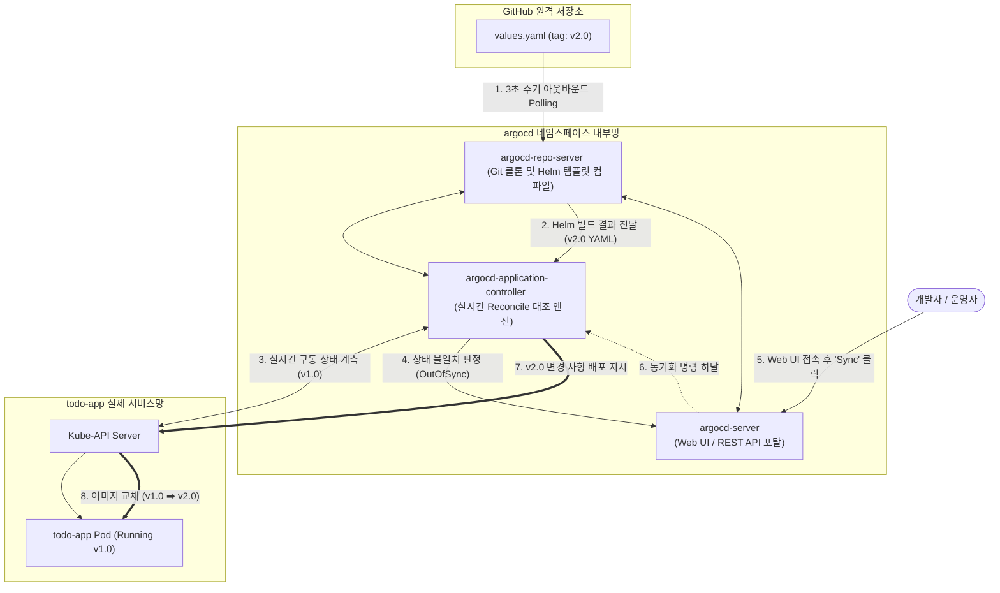

# [Day 3] 이론 강의: Argo CD 설치 및 앱 등록

> 💡 **쉽게 이해하는 비유 (Analogy Box)**
> - **뇌의 생각과 몸의 움직임을 실시간 맞추는 도플갱어 싱크 로봇**
>   - 수동 배포 방식은 머릿속 생각(Git 설계도)이 바뀌었을 때, 손가락 발가락(클러스터 파드)에 "움직여라!" 하고 사람이 직접 신경 신호 명령어(`kubectl apply`)를 뇌에서 근육으로 수동으로 발송해 줘야 몸이 마지못해 움직이는 것과 같습니다. 때로는 뇌는 "움직였다"고 착각하는데 몸은 마비되어 그대로 멈춰있는(설계와 현실의 불일치) 불안정한 현상이 유발됩니다.
>   - **Argo CD**는 뇌(Git 저장소)와 몸(클러스터) 사이에 연결된 **'실시간 신경망 동기화 센서 로봇'**입니다. 3초마다 뇌를 스캔하여 뇌의 생각과 실제 몸의 상태가 100% 싱크로율을 이루는지 감시합니다.
>   - 뇌의 생각(Git)이 수정되었는데 몸(클러스터)이 그대로 정체되어 있다면 즉시 **'뇌와 몸의 싱크가 깨짐 (OutOfSync)'** 경보등을 붉게 점등합니다. 그리고 사람이 동기화(`Sync`) 버튼을 누르거나 자동 조율 설정을 켜두는 순간, 뇌의 설계도 그대로 몸의 근육을 강제 구동해 일치시켜 줍니다.

---

## 1. 없으면 어떤 점이 불편한가?

개발자가 빌드 파이프라인(GitHub Actions)을 무사히 성공시키고 배포 설정 저장소의 파일(`values.yaml`)을 고쳐서 Git에 Push했더라도, 수동적인 배포 상태에서는 실제 운영 클러스터에 아무런 변화가 즉각 일어나지 않습니다.

* **배포 실행 시 매번 동반되는 터미널 수동 명령 조작 노고**
  - 변경 사항을 최종 배포하기 위해 담당 엔지니어는 직접 로컬 터미널을 열고 클러스터 관리자 권한 토큰(`kubeconfig`)을 로드한 뒤, `helm upgrade` 또는 `kubectl apply` 명령을 수동 타격해 주어야 합니다.
  - 이 과정에서 만약 여러 대의 다른 스테이징/운영용 클러스터 접속 정보가 꼬여있다면, 개발계로 쏘아야 할 명령을 실수로 운영망 클러스터로 정조준해 날려버리는 파멸적인 인프라 덮어쓰기 배포 사고가 심심치 않게 터집니다.
* **설계도와 실물 간의 무단 불일치(Drift) 방치 및 인프라 신뢰성 파괴**
  - 특정 개발자나 임시 장애 조치 담당자가 깃 설계도에 기록하지 않은 채, 서버에 몰래 기습 접속하여 임시 땜질식으로 파드의 환경변수나 스케일을 강제 조작했습니다.
  - 이 경우 Git 저장소에 적힌 설계 장부와 실제 가동되고 있는 물리 서버의 구성 스펙이 완전히 다르게 표류하는 **Configuration Drift**가 방치되어, 추후 정식 배포 시 이전 땜질 설정이 무참히 덮어쓰여 재발성 미스터리 장애를 끊임없이 일으킵니다.

---

## 2. 왜 필요할까?

Git 저장소의 목표 형상과 쿠버네티스 클러스터의 실제 상태를 지속적으로 상호 대조하고 보정해 주는 **동적 Reconcile(조정) 에이전트가 클러스터 내부에 부재하기** 때문입니다.

인프라가 인간의 실수를 차단하고 완벽하게 자율적으로 상태를 동기화하기 위해서는 다음과 같은 기술적 토대가 필요합니다.
1. **커스텀 API 명세 (Application CRD)**: "어떤 원격 Git 저장소 주소의 어느 폴더 경로(`Source`)를 바라보고, 이를 내 클러스터의 어느 Namespace(`Destination`)에 동기화할지"를 선언한 상위 개념의 GitOps 연동 명세가 수립되어야 합니다.
2. **지속적 감시 및 자동 배포 엔진 (Argo CD Controller)**: 24시간 내내 Git의 변경 이벤트와 클러스터의 리소스 라이프사이클을 동시에 트래킹하며, 둘 사이의 오차를 0으로 강제 보정하는 선언형 상태 동기화 로봇이 필요합니다.

---

## 3. 이것은 무엇인가?

> **핵심 한 줄 요약**:
> *"Argo CD는 **Git(Source)에 기록된 선언형 설계도를 K8s(Destination)에 100% 일치하도록 자동 렌더링하고 동기화**해주는 고성능 GitOps 오퍼레이터이다."*

<details>
<summary><b>🔍 K8s 확장 리소스: Application CRD (Custom Resource Definition) 명세 구조</b></summary>

쿠버네티스는 사용자가 자체적인 커스텀 API 리소스를 정의할 수 있는 **CRD(Custom Resource Definition)** 기술을 지원합니다. Argo CD는 이를 활용해 `kind: Application` 이라는 가상의 리소스를 클러스터에 주입하여 연동을 통제합니다.

*   **`spec.source` (설계도 소스 위치)**:
    - `repoURL`: 감시할 원격 Git 저장소 주소.
    - `targetRevision`: 대상 브랜치 명세 (예: `main` 또는 특정 배포 태그).
    - `path`: 저장소 내부에서 K8s YAML 또는 Helm 차트 파일이 위치한 세부 폴더 경로 (예: `day3/k8s/helm`).
*   **`spec.destination` (배포 목적지)**:
    - `server`: 타깃 쿠버네티스 API Server 주소 (로컬일 경우 `https://kubernetes.default.svc` 루프백 내부 도메인 적용).
    - `namespace`: 리소스를 배포해 넣을 대상 네임스페이스 (예: `todo-app`).
*   **`spec.syncPolicy` (동기화 작동 정책)**:
    - `automated`: 자동 동기화 활성화 여부.
    - `prune`: Git에서 특정 YAML 리소스(예: ConfigMap) 파일이 삭제되었을 때, 클러스터에 가동 중인 실물 리소스도 똑같이 자동 파괴하여 정리할지 여부 (자원 찌꺼기 방지용 권장).
    - `selfHeal`: 임의의 수동 조작으로 클러스터 리소스가 임의 수정되었을 때, 3초 만에 무조건 Git 설계도 상태로 강제 복구(원복)시킬지 여부 (Configuration Drift 철통 방어용 권장).
</details>

<details>
<summary><b>🔍 Argo CD 내부 동작 원리: Repo Server와 Application Controller 의 유기적 작동</b></summary>

Argo CD 설치 시 다수의 분산 마이크로 서비스 파드들이 구동됩니다. 이들의 상세 역할 분담은 다음과 같습니다.

*   **argocd-repo-server (설계도 컴파일러)**:
    - 지정된 원격 Git 저장소를 내부 로컬 캐시 디렉터리로 복제(Clone)하여 관리합니다.
    - 감시 중인 Git의 커밋 번호가 바뀌거나 동기화 명령이 내려지면, 지정된 경로의 파일 타입(Helm, Kustomize 등)을 판별하여 내부적으로 **`helm template`** 컴파일 연산을 수행한 뒤, 순수한 표준 Kubernetes YAML 명세서 형태로 변환하여 Controller에게 전달합니다.
*   **argocd-application-controller (조정 대조 엔진)**:
    - Repo Server가 전달해 준 최종 표준 YAML 설계도 형상과, 실제 노드에 배포되어 실행 중인 리소스들의 실시간 etcd 상태 정보를 메모리 상에서 대조(`Diff`)합니다.
    - 불일치가 식별되면 `OutOfSync` 이벤트를 호출하고, Sync 명령 접수 시 `kubectl apply`에 상응하는 멱등성 배포를 수행해 실제 클러스터 상태를 강제 보정합니다.
</details>

<details>
<summary><b>🔍 Git 저장소 보안 연동: HTTPS vs SSH Deploy Key 설정</b></summary>

- **HTTPS 연동**: Public 오픈소스 저장소의 경우 별도의 토큰 없이 HTTPS 주소 입력만으로 안전하게 Read-only 스캔이 가능합니다.
- **SSH Deploy Key 연동**: 기업의 자산인 Private 비밀 저장소의 경우 외부 스캔을 허용하지 않습니다. 
  - 이를 위해 Argo CD는 공개키(Public Key)와 개인키(Private Key) 비대칭 암호 암호키 연동을 지원합니다.
  - Argo CD 관리자 메뉴에 SSH 개인키를 보관하고, 해당 짝꿍 공개키를 GitHub 저장소의 `Deploy Keys` 탭에 등록해 두면 패스워드나 인증 토큰 유출 위험 없이 암호학적으로 안전하게 저장소를 감시할 수 있습니다.
</details>

### 📊 Argo CD 내부 아키텍처와 Git ➡️ K8s 자율 Reconcile 조정 흐름



---

## 4. 장점과 단점

### 1) 장점
* **Drift 현상의 완벽한 자동 소멸**
  - 클러스터 내에 무단으로 수정된 수동 설정이 침투하더라도 3초 만에 Git의 정석 명세서 상태로 자율 원상 복구(`Self-Heal`)시킴으로써 인프라의 투명성과 무결성을 100% 수호합니다.
* **압도적인 비주얼 관제 편의성**
  - 웹 GUI를 통해 파드, 서비스, PV/PVC, ConfigMap의 트리형 상호 연결도와 각 자원의 헬스 상태, 리소스 세부 텍스트, 과거 롤링 배포 단계를 마우스 클릭 몇 번으로 직관적 모니터링할 수 있습니다.

### 2) 단점과 인프라 자원 점유
* **로컬 클러스터 내부의 기동 오버헤드**
  - Argo CD는 내부적으로 API Server, Repo Server, Dex(인증 서버), Controller, Redis(캐싱 데이터베이스) 등 무거운 고성능 마이크로서비스 컴포넌트들을 무려 5~6개씩 띄워야 하므로 로컬 PC 환경에 고정 메모리(RAM) 약 1.5GB 이상의 리소스 비용을 청구합니다.

---

## 5. 어떻게 쓰는가?

로컬 환경에 Argo CD를 구축하고, 포트 포워딩을 통해 웹 UI 게이트웨이를 뚫어내는 실무 가이드 및 자율 점검 명령어 셋입니다.

```powershell
# 1. Argo CD 전용 격리 네임스페이스 공간 신설
kubectl create namespace argocd

# 2. Argo CD 공식 검증 릴리스 매니페스트 일괄 다운로드 및 설치 가동
# (etcd 상에 Argo CD 제어 파드들이 조립되기 시작합니다)
kubectl apply -n argocd -f https://raw.githubusercontent.com/argoproj/argo-cd/stable/manifests/install.yaml

# 3. 로컬 윈도우 환경에서 Argo CD 웹 콘솔로 진입하기 위해 백그라운드 포트 포워딩 실행
# (실행 후 이 터미널 창은 닫지 않고 항시 유지합니다. 브라우저로 https://localhost:8443 접속 가능)
kubectl port-forward svc/argocd-server -n argocd 8443:443

# 4. 최초 로그인 시 필요한 admin 계정의 임시 초기 비밀번호 복호화 조회 (PowerShell 명령어)
# (K8s Secret에서 base64 해독을 거쳐 평문 텍스트 패스워드를 1초 만에 반환합니다)
kubectl get secret argocd-initial-admin-secret -n argocd `
  -o jsonpath="{.data.password}" | %{[System.Text.Encoding]::UTF8.GetString([System.Convert]::FromBase64String($_))}

# 5. Argo CD에 등록된 자율 관리 애플리케이션 리스트 및 실시간 싱크 상태 CLI 일괄 진단
argocd app list
```
