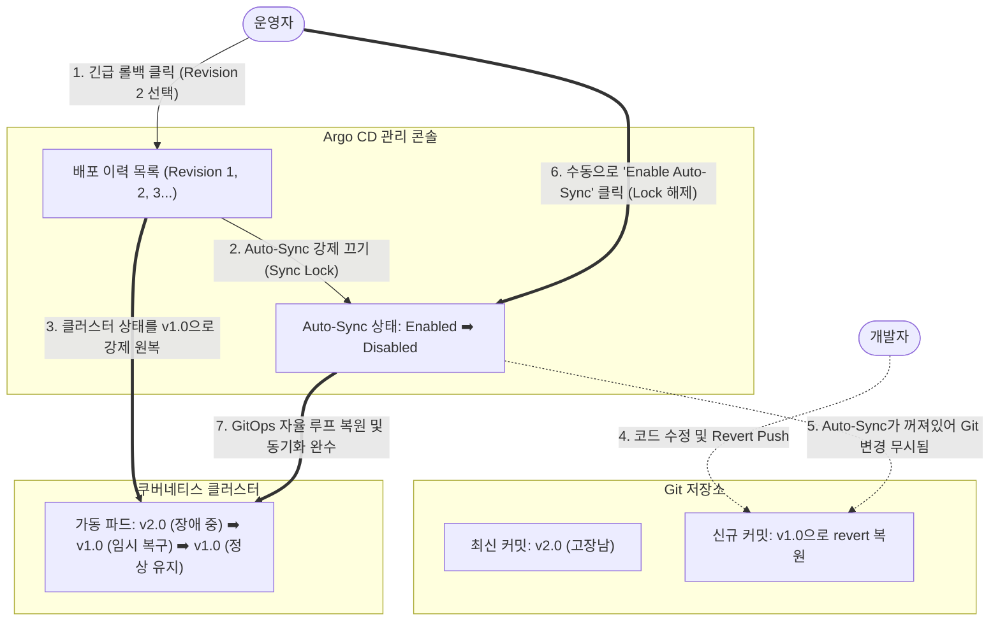

# [Day 3] 이론 강의: Sync, 롤백, 운영 체크리스트

> 💡 **쉽게 이해하는 비유 (Analogy Box)**
> - **건물이 붕괴했을 때 현장 땜질 복구 vs 안전한 과거 설계도로 재건축**
>   - 수동 장애 복구(명령형 조작)는 완공된 건물 벽에 심각한 균열이 가고 무너지려 할 때, 안전모도 쓰지 않고 붕괴 현장 속으로 직접 무모하게 뛰어들어가 시멘트를 바르고 지지대를 덧대어 억지로 버티게 하는 것과 같습니다. 이는 일시적인 땜질일 뿐, 강한 바람이 불어와 파드가 재시작되거나 새로운 건설 자재가 배달되면(다음 배포) 다시 와르르 무너져 내립니다.
>   - **GitOps 기반 롤백**은 붕괴 사고 현장을 직접 조작하여 고치지 않습니다. 오직 설계소로 달려가 어제 안전하게 잘 사용했던 **이전 정상 설계도(Git Revert Commit)**를 꺼내어 보관함에 다시 꽂아둡니다.
>   - 그러면 숙련된 건설 로봇(Argo CD)이 알아서 현재 부서진 위험한 건물을 안전하게 밀어버리고, 어제 설계도대로 한 치의 오차도 없이 튼튼하게 새 건물(정상 가동 파드)을 신속하게 완벽 재건축해 줍니다.

---

## 1. 없으면 어떤 점이 불편한가?

새로운 서비스 버전을 릴리스하는 도중, 텍스트 설정이나 이미지 버그로 인해 운영망 전체가 불통이 되는 심각한 배포 장애가 터졌을 때, 수동 명령형 복구 방식을 사용하면 다음과 같은 추가적인 운영 실패의 악순환을 겪게 됩니다.

* **2차 장애를 유발하는 현장 땜질 조작 (Configuration Drift의 부작용)**
  - 서비스가 마비되자 당황한 시스템 관리자가 다급히 서버에 직접 SSH로 원격 접속하여, 작동 불능이 된 파드의 환경 변수를 `kubectl edit` 명령으로 수동 변경하거나 마운트된 디스크 파일 내용을 억지로 수정합니다.
  - 이 긴급 패치는 일시적으로 에러를 우회해 주는 듯 보이지만, 파드가 메모리 오버플로우(OOM)나 노드 장애로 인해 재부팅되는 순간 수동 수정했던 정보가 흔적도 없이 소멸하고 원래의 고장 났던 초기 이미지 상태로 리셋되어 장애가 다시 재발합니다.
* **장부에 기입되지 않은 유령 핫픽스로 인한 협업 공백**
  - 새벽 장애 복구 도중 누가 서버에 들어와 어떤 가상 리소스 설정을 고쳤는지 깃(Git) 장부나 변경 이력 로그에 기록되지 않습니다.
  - 다음 날 교대 근무를 위해 출근한 동료 엔지니어들은 서버의 상태를 파악하지 못한 채 신규 코드 배포를 실행하고, 수동 패치본이 다 덮어쓰여 장애가 재차 번지는 리스크에 무방비 노출됩니다.

---

## 2. 왜 필요할까?

실제 가동 중인 런타임 클러스터를 임시방편으로 직접 수정하는 행위는 **영속성이 보장되지 않으며 인프라의 변경 추적성(Traceability)을 완전히 파괴**하기 때문입니다.

인프라 복구 파이프라인의 안전성을 담보하려면 다음과 같은 복구 원칙이 준수되어야 합니다.
1. **복구의 선언성**: 장애 상태에서 정상 상태로의 원복 과정 역시 배포 단계와 완전히 동일하게 "안전한 설계도(Git)"를 기준으로 수행되어야 합니다.
2. **복구 이력의 영구 보존**: 복구를 위한 모든 행위(Revert)가 Git Commit Log 상에 박제되어 팀원 전체에 실시간 동기화되어야 하며, 롤백을 수행하는 도중 GitOps 파이프라인 전체가 엉켜 잠겨버리는 데드락 현상을 설계상 차단해야 합니다.

---

## 3. 이것은 무엇인가?

> **핵심 한 줄 요약**:
> *"GitOps 기반 롤백은 **클러스터를 직접 만지지 않고 설계도(Git)를 안전했던 커밋으로 Revert** 하여, Argo CD가 클러스터를 **과거 정상 상태로 100% 자율 재건축하도록 명령하는 선언형 복구 기법**이다."*

<details>
<summary><b>🔍 Git Reset 대 Git Revert: 선언형 버전 보존의 수학적 원리</b></summary>

장애가 났을 때 Git의 히스토리를 되돌리는 두 가지 방법의 차이입니다.

*   **`git reset` (히스토리 파괴 방식 - GitOps 금지)**:
    - **동작**: 특정 시점 이후의 모든 커밋 이력을 완전히 지우고 시간을 과거로 강제 되돌립니다 (Force-Push 동반).
    - **한계**: 이미 다른 동료 개발자들이 로컬에 풀(Pull) 받아둔 Git 히스토리와 충돌을 일으켜 로컬 Git 전체가 깨지는 대혼란을 야기합니다.
*   **`git revert` (신규 커밋 추가 방식 - GitOps 표준)**:
    - **동작**: 기존의 고장 난 커밋 역사는 그대로 보존한 채, **그 커밋의 변경 내용만 정확히 반대로 뒤집는 새로운 커밋(Revert Commit)**을 이력 맨 위에 추가합니다.
    - **이점**: 히스토리 선형성이 깨지지 않고 충돌이 없으므로, Argo CD는 이 신규 Revert 커밋을 정상적인 최신 설계 버전으로 인지하여 딜레이 없이 즉시 클러스터에 안전 동기화를 수행합니다.
</details>

<details>
<summary><b>🔍 Argo CD UI 롤백(Rollback) 시 발생하는 Auto-Sync Lock 현상 분석</b></summary>

Argo CD 웹 대시보드에는 클릭 한 번으로 과거 배포 이력으로 되돌리는 `Rollback` 버튼이 존재합니다. 이 편리한 기능의 백엔드 동작 메커니즘을 알아두어야 합니다.

*   **자동 동기화의 강제 비활성화 (Sync Lock)**:
    - Argo CD UI를 통해 과거 리비전(예: Revision 3)으로 강제 롤백을 실행하면, Argo CD 엔진은 스스로 **`Auto-Sync (자동 동기화)` 기능을 강제로 꺼(Disable)** 버립니다.
    - 그 이유는 자동 동기화가 계속 켜져 있으면, 롤백을 수행하자마자 3초 뒤에 Git 저장소의 최신 버전(장애가 난 고장 난 버전)과 대조되어 다시 고장 난 상태로 원상 동기화되어 버리기 때문입니다.
*   **Drift 데드락(Lock)의 리스크**:
    - 이렇게 롤백이 활성화되면 클러스터 상태는 과거 리비전으로 임시 고정되지만, Git 저장소와의 실시간 동기화 루프가 전면 차단됩니다.
    - 이후 개발팀이 정신을 차리고 Git에 에러를 수정한 '진짜 해결 버전'을 Push 하더라도, Argo CD는 Auto-Sync Lock이 걸려있기 때문에 신버전을 배포하지 못하는 **동기화 교착 상태**에 봉착합니다.
*   **해결책**:
    - 긴급 롤백을 UI로 단행했다면 즉시 Git 저장소에도 `git revert`를 밀어 넣어 설계도를 일치시켜야 합니다.
    - 이후 Argo CD 설정창으로 다시 들어가 **`Enable Auto-Sync`** 버튼을 수동 클릭해 주어야 락이 해제되고 정상적인 자율 GitOps 루프가 복원됩니다.
</details>

<details>
<summary><b>🔍 운영 릴리즈 전 실무 점검 체크리스트 (RCA Checklist)</b></summary>

배포 파이프라인 가동 및 GitOps 이관 전, 인프라의 가용성을 최종 보장하기 위한 4대 핵심 영역 점검 기준입니다.

1. **상태 무관(Stateless) 검증**: 앱 컨테이너 내부에 영속되어야 하는 정적 파일이나 사용자 업로드 폴더가 마운트 없이 적재되어 있는지 확인 (컨테이너 재생성 시 데이터 증발 방지).
2. **헬스체크 프로브 결합도**: `Readiness Probe`가 `/actuator/health` 엔드포인트를 정상 지시하고 있는지 확인 (롤링 업데이트 시 서비스 무중단 보장).
3. **자원 임계치 최적화**: Cgroups 메모리 제한 설정(`resources.limits.memory`)이 자바 JVM 힙 크기(`-Xmx`)보다 최소 30% 이상 크게 여유 공간을 확보했는지 검증 (Exit Code 137 OOMKilled 강제사살 예방).
4. **암호화 분리 수준**: 데이터베이스 접속 패스워드 원문이 raw YAML 매니페스트에 노출되어 깃허브로 Push될 위험이 없는지 Secret 분리 상태 검증.
</details>

### 📊 Argo CD UI Rollback 시의 Auto-Sync 차단 및 락(Lock) 해제 프로세스



---

## 4. 장점과 단점

### 1) 장점
* **선언적 무결성 롤백의 보장**
  - 사람이 수동으로 리소스를 복구하는 과정에서 저지를 수 있는 설정 유실 등의 2차 인적 장애를 완벽 차단하며, 이전 100% 정상 작동했던 YAML 형상 그대로 클러스터를 정밀 복원해 냅니다.
* **완벽한 소급 감사 추적성**
  - 모든 복구 과정이 Git Commit Log로 보존되므로 인프라 장애 극복 대응사가 코드 기록으로 투명하게 남습니다.

### 2) 단점
* **네트워크 딜레이에 따른 수십 초의 롤백 대기 지연**
  - 깃 커밋과 푸시 및 Argo CD 폴링 주기가 겹칠 때 최대 수십 초의 롤백 지연 시간이 발생합니다. 
  - 이를 우회하기 위해 장애 시에는 먼저 Argo CD 콘솔의 `Rollback` 기능을 가동하여 1초 만에 긴급 우회 복구한 뒤, 사후에 Git 커밋 형상을 되돌리고 Auto-Sync 락을 해제하는 복합 릴리즈 프로토콜이 운영 관점에서 수반되어야 합니다.

---

## 5. 어떻게 쓰는가?

배포 장애 상황(예: 잘못된 이미지 태그 입력 등)에서, 선언형 Revert 기법 또는 Argo CD 대안형 롤백 기능을 활용하여 복구를 완수하는 실무 제어 절차입니다.

```powershell
# ==========================================
# A안. 선호 방식: Git Revert 선언형 롤백 (가장 안전함)
# ==========================================
# 1. 직전에 실행한 에러 유발 커밋 변경 사항을 반대로 뒤집는 Revert 커밋 생성
# (커밋 히스토리를 훼손하지 않고 새로운 복구 버전을 이력 상단에 추가합니다)
git revert HEAD --no-edit

# 2. Revert된 복구 설계도를 원격 저장소에 Push
git push origin main

# 3. Argo CD 앱 상태가 OutOfSync로 전환되면 수동 Sync를 날려 안전한 구버전으로 파드 자동 재건축
argocd app sync todo-app

# ==========================================
# B안. 비상 대응: Argo CD 임시 명령형 롤백 (초긴급 1초 복구용)
# ==========================================
# 1. Argo CD가 보유한 과거 정상 배포 성공 릴리스의 리비전 번호 조회
argocd app history todo-app

# 2. 확인한 정상 리비전 번호(예: 3)로 클러스터 강제 롤백 단행
# (이 즉시 Auto-Sync는 강제 비활성화(Disabled)되며 잠금 상태가 됩니다)
argocd app rollback todo-app 3

# 3. [⚠️필수 사후 조치] Git 저장소도 revert 커밋으로 맞춘 뒤, Argo CD Auto-Sync 잠금 해제
# (해제해 주어야 향후 신규 기능 배포 시 동기화 교착 상태에 빠지지 않습니다)
# (Argo CD Settings UI 또는 아래 CLI로 다시 자동 동기화 활성화)
# argocd app set todo-app --sync-policy automated
```
